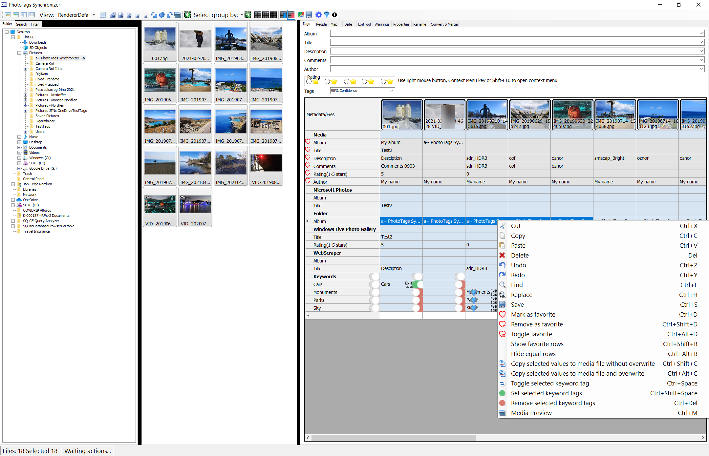
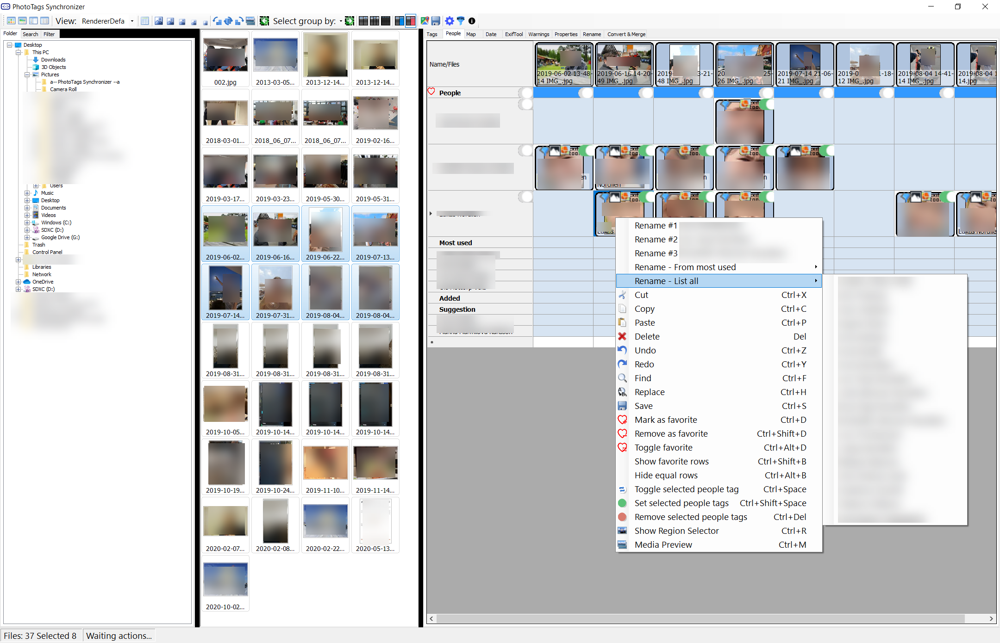
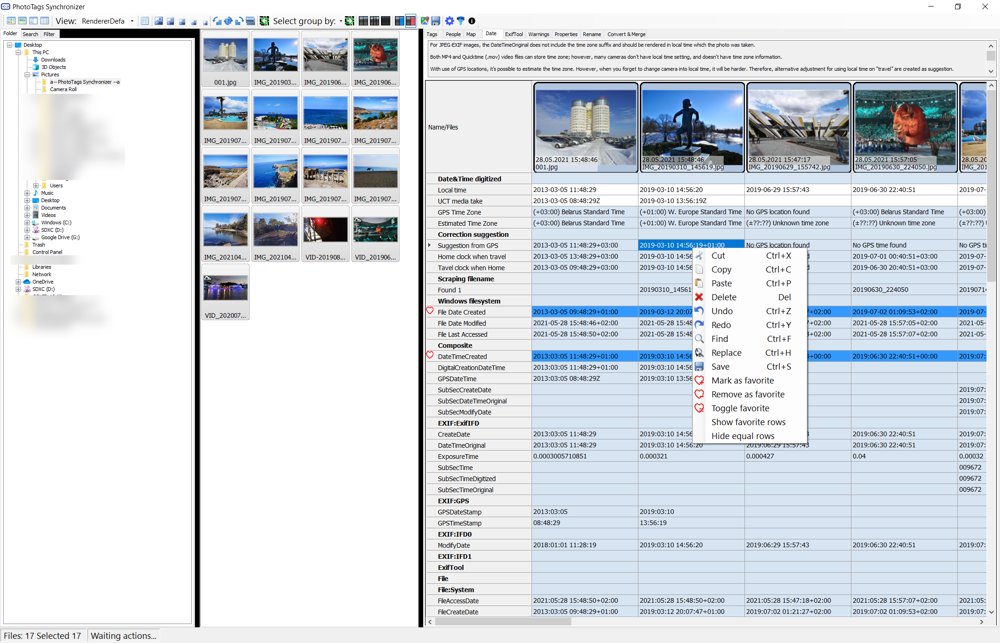
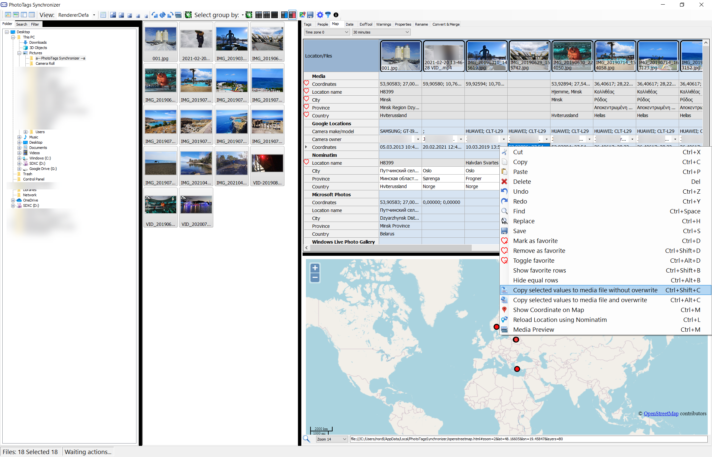
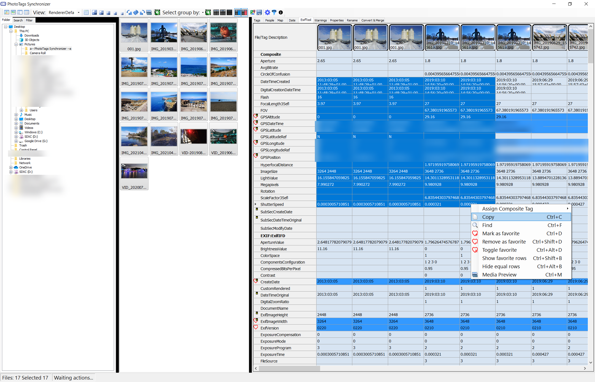
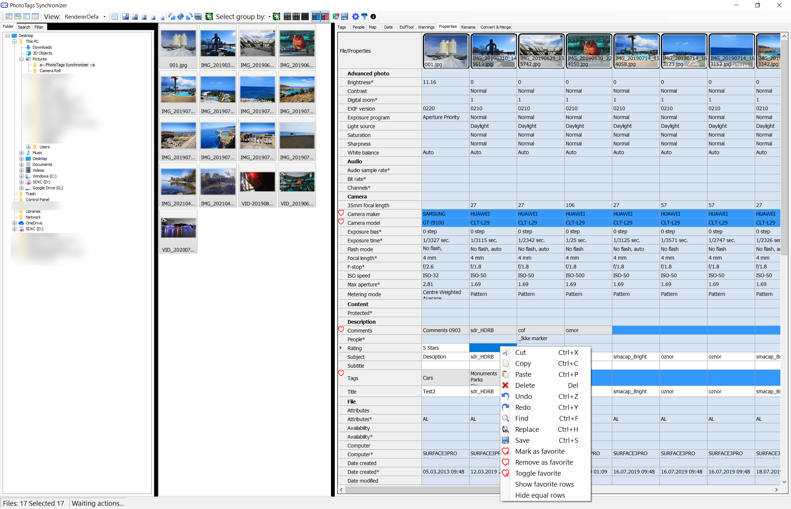
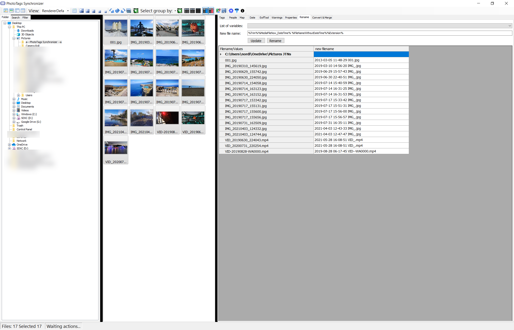
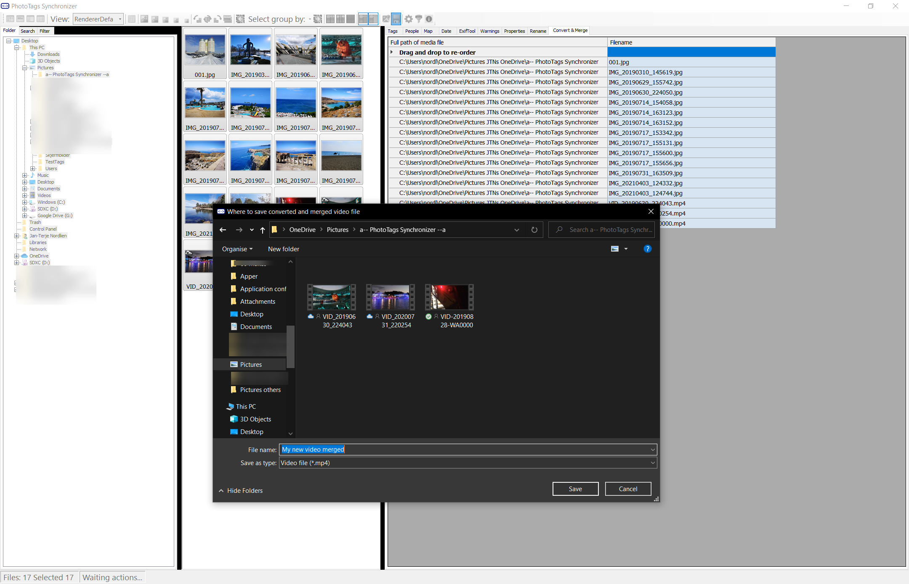
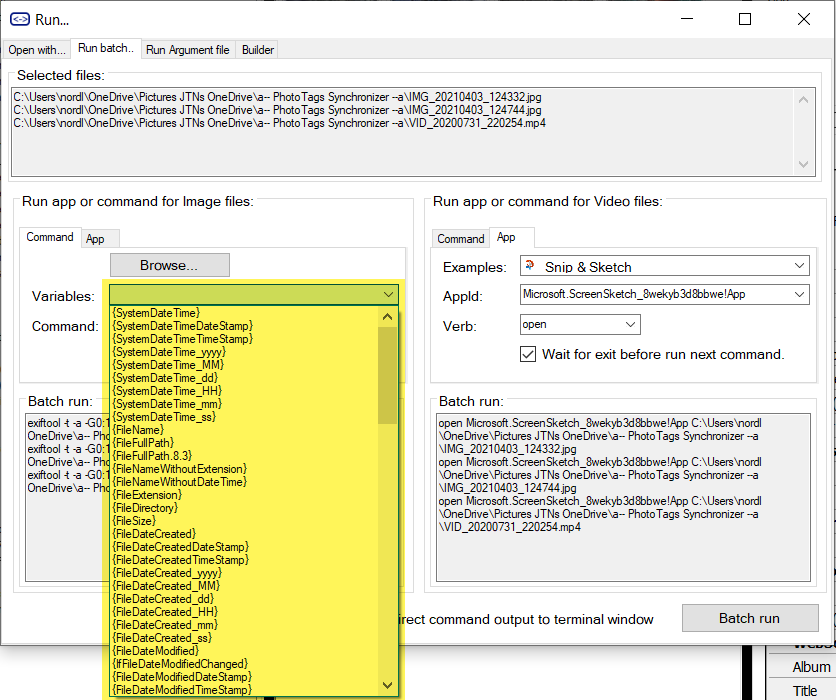
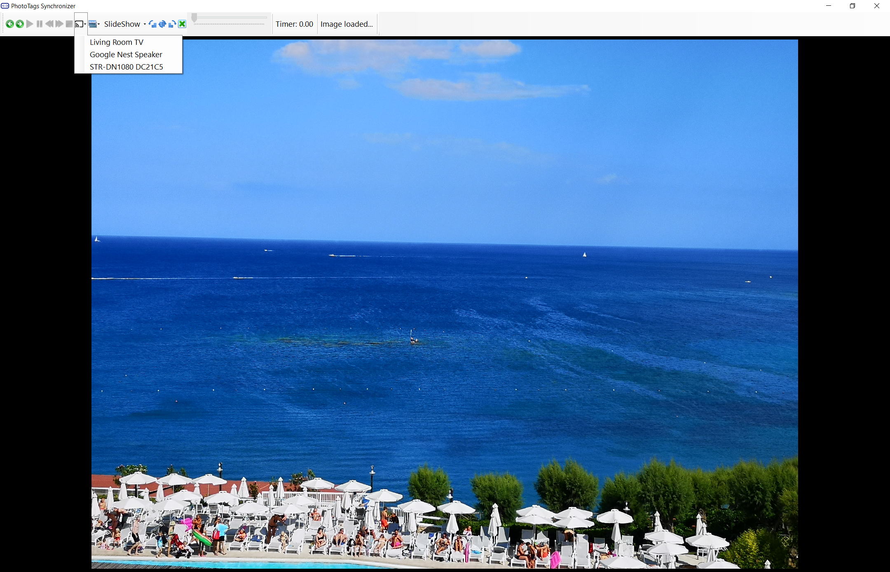



# Welcome to PhotoTags Synchronizer
Keep the tags where it belongs.

## Userguide
[Userguide][11247b8f]

  [11247b8f]: userguide "Userguide"

## Key features

- Keyword tagging
  - See user guide for [Keywords][3737e4b0]
  - Fast and easy editing meta information in a wide variety of files.
  - [Keywords](userguide/keywords), [People and  Region](userguide/people), [GEOtagging](userguide/map) and [Dates](userguide/date)
  - Easy edit and tag many files at once
  - Copy and Paste from every Gridview into Clipboard and paste where you want (E.g. Microsoft Excel or Google Spreadsheets)
  - Unlimited Redo and Undo
  - Keep track of changes. Store all meta history
- Synchronizer
  - From Windows Live Photo Gallery
  - From Microsoft Photos
  - Using a Powerful customizable web scraping tool in countries was allowed (PS: Use at your own risk, don't break the law).
- Powerful Exiftool GUI
  - Able to see all meta information provided by Exiftool
  - Able to see change history of meta information during updates
  - Compare meta information between files. Easily find changes done in meta information by comparing Files or previous change history in media files or between files and history previous saved information.
  - See more information in the user guide for [Exiftool tool GUI](userguide/exiftool)
  - See warning when tags mismatch, See more in user guide for [Warnings](userguide/warnings)
  - Can also write Microsoft Atoms back to files
- Powerful rename tool.
  - See user guide for [Rename tool](userguide/renametool)
- Powerful run command tool
  - A helping tool for Convert, Update, Change and/or Update Photo and Video Files in Bulk using your favorite tool.
  - See user guide for [Run batch](userguide/runbatch)
- GEOtagging and Map
  - Import from Google History
  - Import from JSON and KML files
  - GEO tag using map
  - Lock up location name, region, city and country
- Chromecast
  - Support casting of video and pictures directly from PC with build-in webserver
- Media files support
  - Exif and metadata
    - Read and Write to around 200 [Media File formats using exiftool][750832c4]
  - Image formats:
    - Display and Chromecast 100 [Image File Formats supported by ImageMagick][c491c138]
  - Video formats:
    - Display and Chromecast over 30 types of [Video File Codecs using VLClib][d9d46493]
    - Convert around 200 [Video File Codecs using ffmpeg][e2a8453e]

  [3737e4b0]: userguide\keywords\ "Keywords"

## Key problems to solve
[More details][fbe6f277]
- Don't lose your work and meta information.  When meta information are stored in cloud, your are not able to change provider without losing your tagging work. When data is stored in local database, you will lose your tagging when change computer.  
  - Microsoft Windows Live Gallery
    - Store most of meta information in Media Files
    - Problem 1: But not all meta information will be saved, example, e.g. on many video files.
    - Problem 2: Save meta information using Microsoft Atoms not using international standards.
    - Problem 3: Many other tools, Exiftool can only read but can not save Microsoft Xtra Atoms
    - Problem 4: When moving media files from old computer to new computer, you lose meta information, because a lot of meta information is saved only in a local database and not in the media file.
  - Microsoft Photos
    - Problem 1: Store some information only in a local database and some information in cloud.
    - Problem 2: There are no synchronization between data store locally and between other computers
  - Google Photos and most likely all other cloud storage providers
    - Problem 1: All data is stored in the cloud. If you want to move to another provider, all your tags are gone. According to GDPR this data is yours, but you are not able to download it.

[fbe6f277]: problems "More details"
[750832c4]: https://exiftool.org/#supported "Media File formats using Exiftool"
[c491c138]: https://imagemagick.org/script/formats.php "Image File Formats using ImageMagick"
[e2a8453e]: https://www.ffmpeg.org/general.html#File-Formats "Video File Codecs"
[d9d46493]: https://wiki.videolan.org/VLC_Features_Formats/ "Video File Codecs using VLClib"

## Keyword tagging

See and edit multiple meta information in multiple media files at once.

See what meta information has been saved about your media file in other applications. See what's been saved in the media file or what's only saved in the database or in the cloud.

See also User Guide for [Keywords](userguide/keywords)

## Region name and people tagging

See and edit multiple regions like faces and people in multiple media files at once.

See what regions have been saved about your media file using other applications. See what's been saved in the media file or what's only saved in the database or in the cloud.

See also User Guide for [People](userguide/people)

## Date and time

A set of useful tools that will help you finding and setting correct date and time for your media file.

See also User Guide for [Date](userguide/date)

## GEO tagging with Map, GPS tracker, Google Location History

A set of useful tools that will help you finding and setting correct GEOtagging for your media file.

You can see media files location on a map, and set new location for your media file on the map.

You can find your media files location based on KML or json files with a GPS locations history / GPS tracking file.

See also User Guide for [Map](userguide/map)

## Powerful Exiftool GUI
- Show all meta information the ExifTool provides.
- Compare meta infomration between files
- Compare meta information before and after changes in the media file(s)

See also User Guide for [Exiftool GUI](userguide/exiftool)

## Give Warning when Tags mismatch

Show what fields are mismatched between different standards, when they should contain the same information.

See also User Guide for [Warnings](userguide/warnings)

## Windows Properties

Show and edit using Windows Properties

See also User Guide for [Properties](userguide/properties)

## Powerful Rename Tool

Rename files with information from the media file

See also User Guide for [Rename tool](userguide/renametool)

## Convert and merge media files
- Combine multiple images and videos into a slideshow video
- Use the power of [ffmeg.exe](https://www.ffmpeg.org/) (or others tools) to convert videos

See also User Guide for [Convert & Merge](userguide/convert-and-merge)

## Powerful tool for Convert, Update, Change and/or Update Photo and Video Files in Bulk

Easy start your favorite tool for selected media file and start your favorite tool for each media file with your agruments and use parameter varibales. parameter variables is meta information values from the media file.

See also User Guide for [Run batch](userguide/runbatch)

## Show and Chromecast videos and photos

- View images
- View videos
- Create Slideshow
- Chromecast picture
- Chromecast videos
- Create slideshow on Chromecast

See also User Guide for [Media preview and Chromecast](userguide\mediapreview-chromecast)


