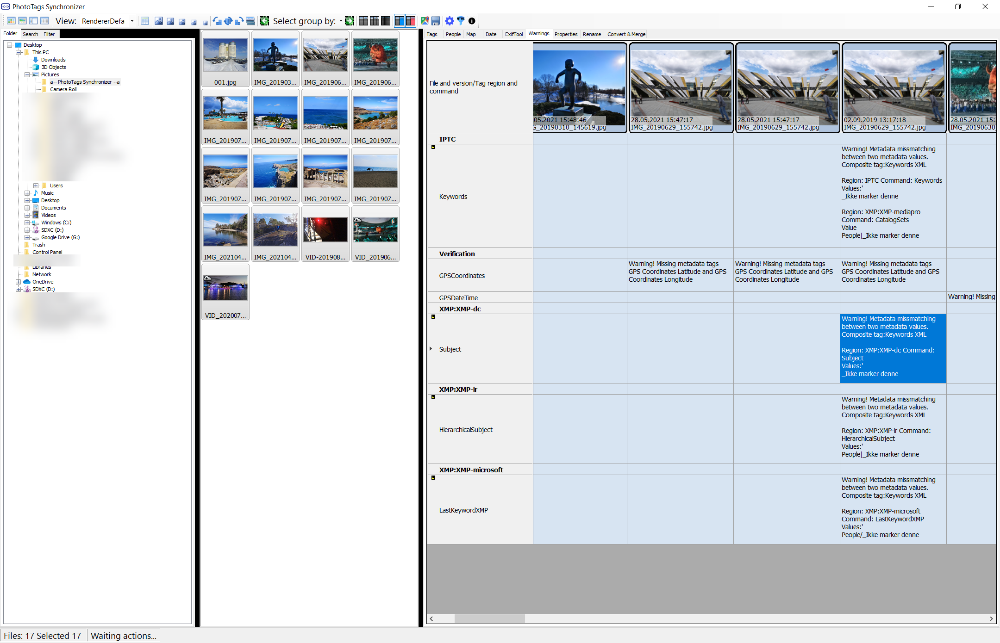

# Welcome to PhotoTags Synchronizer
Keep the tags where it belongs.

## Key features

- Keyword tagging
  - Fast and easy editing meta information in a wide variety of files
  - Tag many files at once
  - Copy and Paste from every Gridview into Clipboard and paste where you want (E.g. Microsoft Excel or Google Spreadsheets)
  - Unlimited Redo and Undo
  - Keep track of changes. Store all meta history
  - Easily find changes done in meta information by comparing Files or previous change history in media file or even both.
- Synchronizer
  - From Microsoft Windows Photo Gallery
  - From Microsoft Photos
  - Using a Powerful customizable web scraping tool in countries was allowed (PS: Use at your own risk, don't break the law).
- Powerful Exiftool GUI
  - See Exif history
  - See warning when tags mismatch
  - Can also write Microsoft Atoms back to files
- GEOtagging
  - Import from Google History
  - Import from JSON and KML files
  - GEO tag using map
  - Lock up name, region, city and country
- Chromecast
  - Support casting of video and pictures directly from PC with build-in webserver
- Media files support
  - Exif and metadata
    - Read and Write to around 200 [Media File formats using exiftool][750832c4]
  - Image formats:
    - Display and Chromecast 100 [Image File Formats supported by ImageMagick][c491c138]
  - Video formats:
    - Display and Chromecast over 30 types of [Video File Codecs using VLClib][d9d46493]
    - Convert around 200 [Video File Codecs using ffmpeg][e2a8453e]

## Key problems to solve

- Don't lose your work / meta information.  When meta information are stored in cloud, your are not able to change provider without losing your tagging work. When data is stored in local database, you will lose your tagging when change computer.  
  - Microsoft Windows Live Gallery
    - Store most of meta information in Media Files
    - Problem 1: But not all meta information, e.g. on lot video formats
    - Problem 2: Save meta information using Microsoft Atoms not using international standards
    - Problem 3: Many other tools, also Exiftool can only read but not updated Microsoft Atoms
    - Problem 4: When moving media files from old computer to new computer, you lose tagging, because a lot of tags stored in database and not in the media file.
  - Microsoft Photos
    - Problem 1: Store some information only in local database and some information in cloud.
    - Problem 2: There are no synchronization between data store locally and between local computers
  - Google Photos and most likely all other cloud storage providers
    - Problem 1: All data is stored in the cloud. If you want to move to another provider, all your tags are gone. According to GDPR this data is yours, but you are not able to download it.

[750832c4]: https://exiftool.org/#supported "Media File formats using Exiftool"
[c491c138]: https://imagemagick.org/script/formats.php "Image File Formats using ImageMagick"
[e2a8453e]: https://www.ffmpeg.org/general.html#File-Formats "Video File Codecs"
[d9d46493]: https://wiki.videolan.org/VLC_Features_Formats/ "Video File Codecs using VLClib"

## Keyword tagging

## Region name and people tagging

## Date and time

## GEO tagging with Map

## Exiftool GUI

## Give Warning when Tags mismatch

## Windows Properties

## Powerful Rename Tool

## Convert and merge media files

