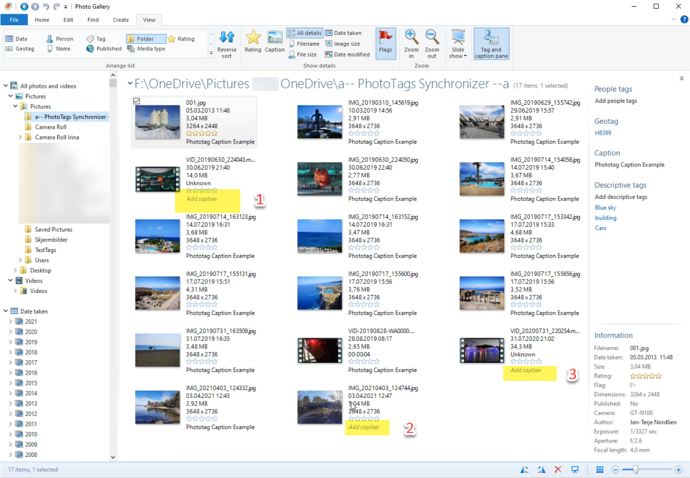
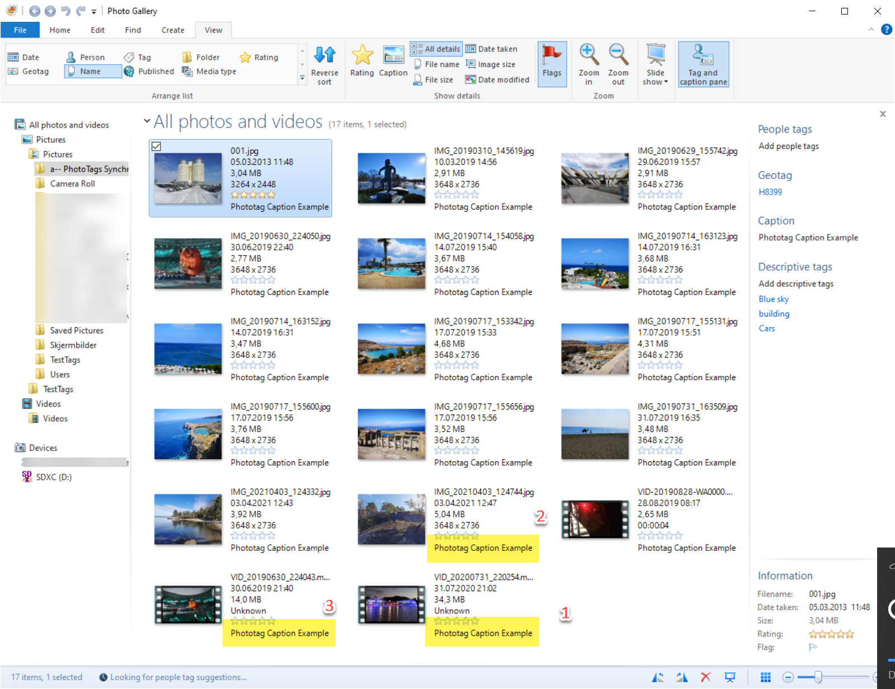
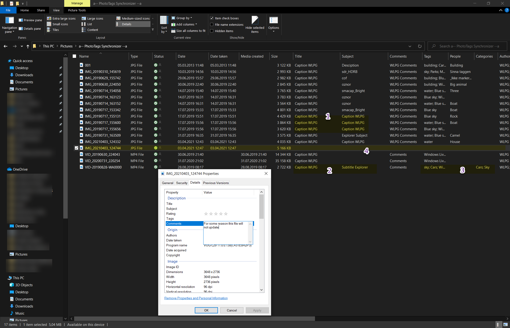
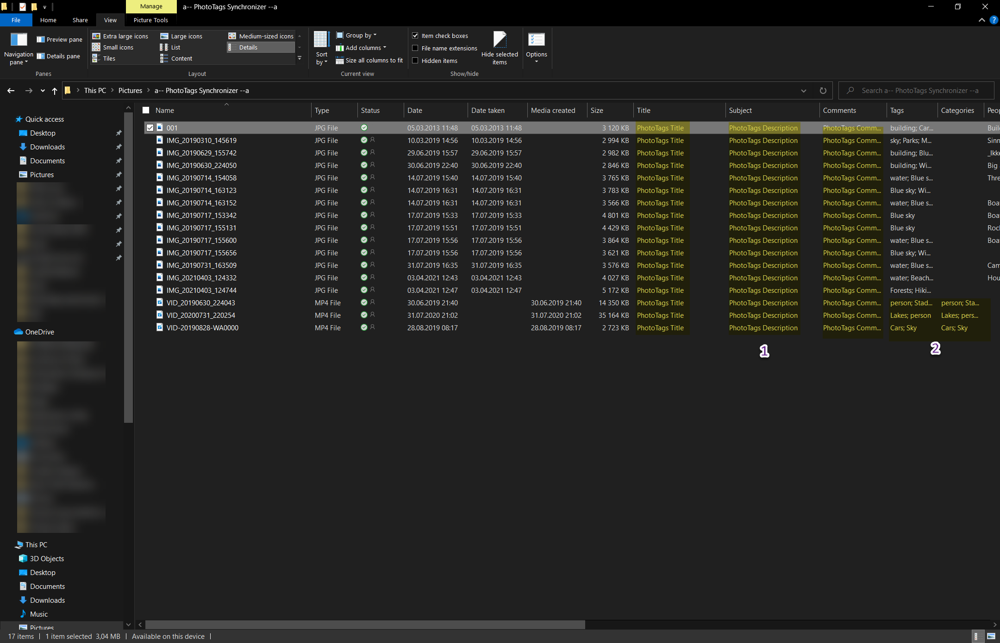



# What problems PhotoTags Synchronizer aim to solve

## Windows Live Photo Gallery

### Windows Live Photo Gallery - Don't save all meta information
Windows Live Photo Gallery is saving most of the meta information into the media files. That's good, however, we never know when it is saved or not. If Windows Live Photo Gallery fails to save the meta information it only stores it on the local database.

PC 1   Windows Live Photo Gallery  | PC 2   Windows Live Photo Gallery
--|--
Looks as all meta information for 'Captions' is saved properly on PC 1  | However, when open on PC 2, the meta information for 'Captions' is not there. This is because data is only stored in a local database. 

### Windows Live Photo Gallery - inconsistent use of fields

1. Windows Live Photo Gallery is not consistent where the field "Caption" is written back. In File Exporter you will sometimes see saved in the "Title" and "subject" fields.
2. Sometimes "Caption" filed from Windows Live Photo Gallery are stored "only" on "Title" field
3. "Tags" and "Categories" fields are unsync.
4. Sometimes it's never stored in the media file, but only in a local database.

1. The meta information is saved where you want it. Yes, where you want, if you want it differently, just change in the [Config](../userguide/config/).
2. Meta information is kept in sync how you like it. Also, how you want it in the [Config](../userguide/config/).

## Microsoft Xtra Atoms
Microsoft Xtra Atoms is Microsoft's own standard to write additional information to the media file. Some applications are able to read it, but almost none are able to write it back to Microsoft Xtra Atoms. It’s almost only Microsoft own Windows Live Photo Gallery and File Explorer that are able to so.

Exiftool does not support write back Microsoft Xtra Atoms, with good reason. However, PhotoTags Synchronizer allows you to do so, if you want.

## Cloud Photo and Video Galleries
It's great having photos and videos automatically saved in the cloud. Also to be able to tag the photos and videos. The problem occurs when you want to change your cloud provider. Then most likely you will be able to download your photos and videos without getting the information you added.

## No standards tags
Because of several different standards for store meta information such as Exif, IPTC and XMP plus a lot of camera manufacturers and software has created their own tags and it has become a pain for the users.

[IPTC.org - Support of IPTC Photo Metadata by Software ][7ef25ee4]
- ACDSee Pro 10
- Adobe Photoshop CC 2020
- Adobe Photoshop Lightroom CC 9.x
- Caption Pro
- Cortex Quebec
- Daminion 4.6
- DigiKam 5.0
- ExifTool 12.00
- FastPictureViewer Professional 1.9
- FotoStation 8
- Image Relay 5.0
- ImageSnippets
- Imatch 5.5
- Photo Mechanic 6
- Photo Supreme 5.4
- PhotoGem 1.0
- Portfolio 2.5.3
- STOCKBOX PHOTO 5.40
- WPMeta 1.3
- XnViewMP 0.97

  [7ef25ee4]: https://iptc.org/standards/photo-metadata/software-support/ "IPTC.org - Support of IPTC Photo Metadata by Software"

## Mismatch between Meta information
Because there are a lot of standards, it will also create mismatches between meta information. For example when Exif, IPTC and XMP have their own place to store the same type of information, then in theory all this meta information should be equal. But often they are not equal, because some applications don't support all standards, or don’t sync the meta information between the standards, and so on.

## Date, Time and Timezones
This problem has become less and less, but still exists.
Lot of digital cameras don't have GPS, and some only have date and time, without knowing about time zone. If you only take pictures and videos in one time zone and do not travel, it’s not a big issue. But when you travel for example on a holiday, and cross time zones, your media files will lose their chronological order. For example: you take a picture at the airport, 08:32 and travel for 30 minutes, time at home will be 09:02, but local time is -1 hour, 08:02.

Some digital cameras have the possibility to set the time zone and daylight saving etc. Given the example above. Who remembers to change the time zone when you land on your holiday destination.

If the media file contains Longitude and Latitude the application will use [Nominatim.API](https://nominatim.org/) and look up the Time Zone. Then you have the following options.
After moving to a new time zone and you did change your digital camera with local date and time, the UTC time will be added.
After moving to a new time zone and you forgot to change your digital camera with local date and time, local time will be calculated and date taken will be updated and the UTC time added.

## Longitude and Latitude
Old digital cameras don’t have GPS but all modern camera phones have, however, on many phones saving the Longitude and Latitude into the media file is by default turned off, because of GDPR or other reasons of protection.

If you have a GPS tracker that saves GPS history in KML or json format, you can import this history into the applications. If you have turned on Google Maps to store GPS history, then you should be able to download it as KML and json file(s).

Google this:
- How do I download Google Location History?
-How do I download my location history on my iPhone?

The GPS tracking history contains UTC date and time and Longitude and Latitude. The PhotoTags Synchronizer will use the UTC time that is closest to the date and time when photo or video was taken. (The accepted range between date taken and UTC time in GPS history is configurable).

If UTC date and time doesn’t exist an algorithm will calculate the UTC date and time. Doing so by trying to guess the time zone based on GPS history, when estimated what time zone media files were taken, then calculate the UTC time based on information we have and estimated.


