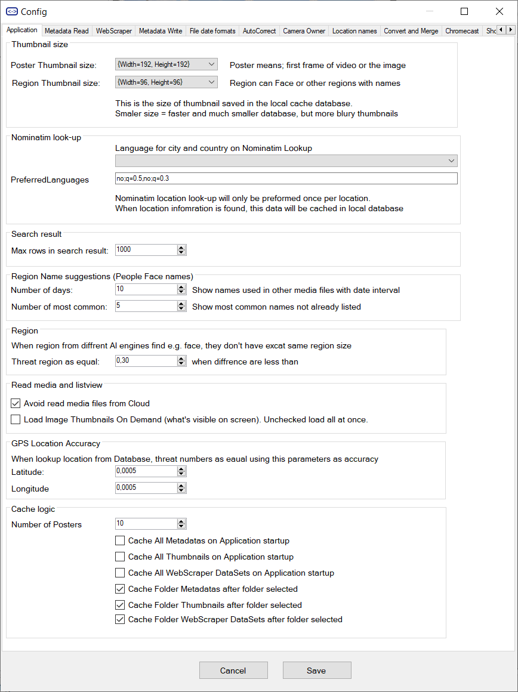
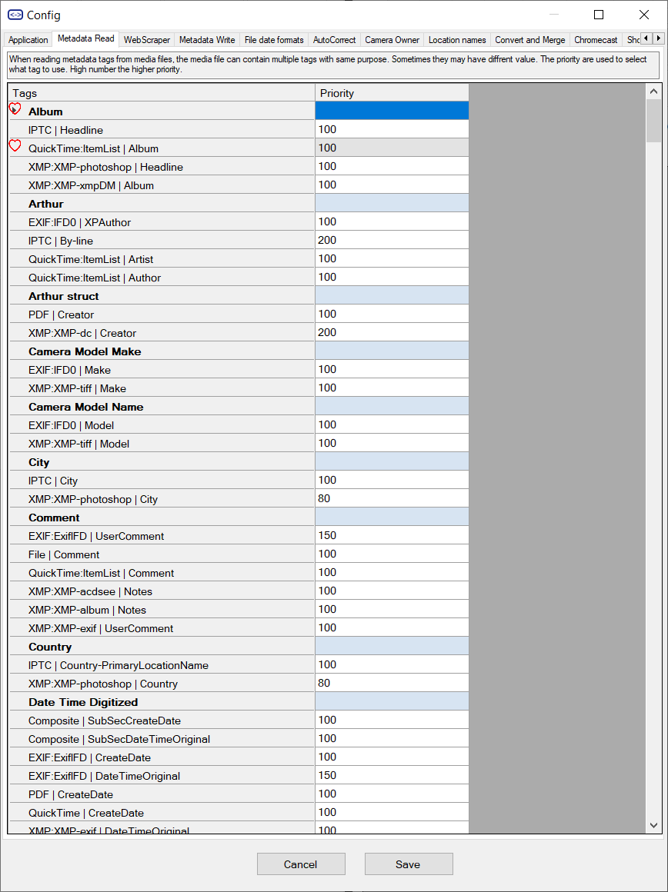
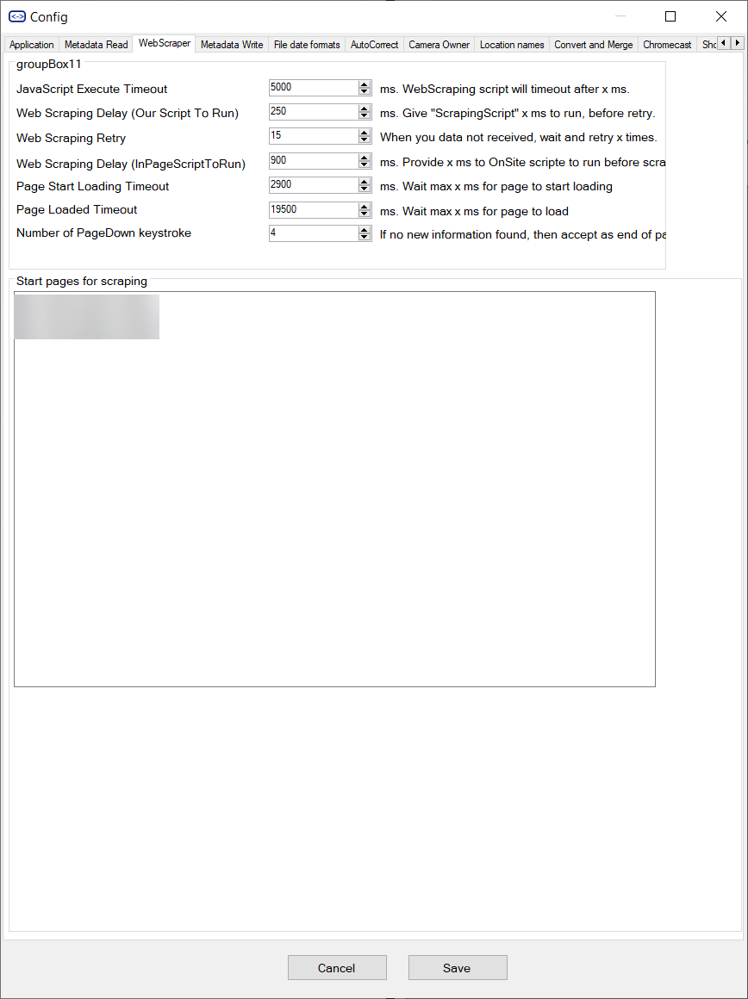
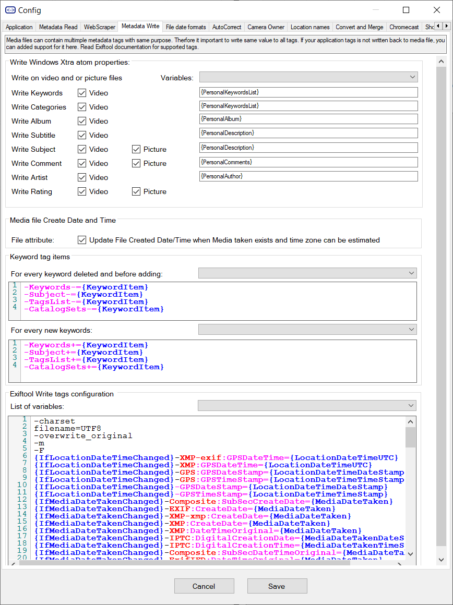
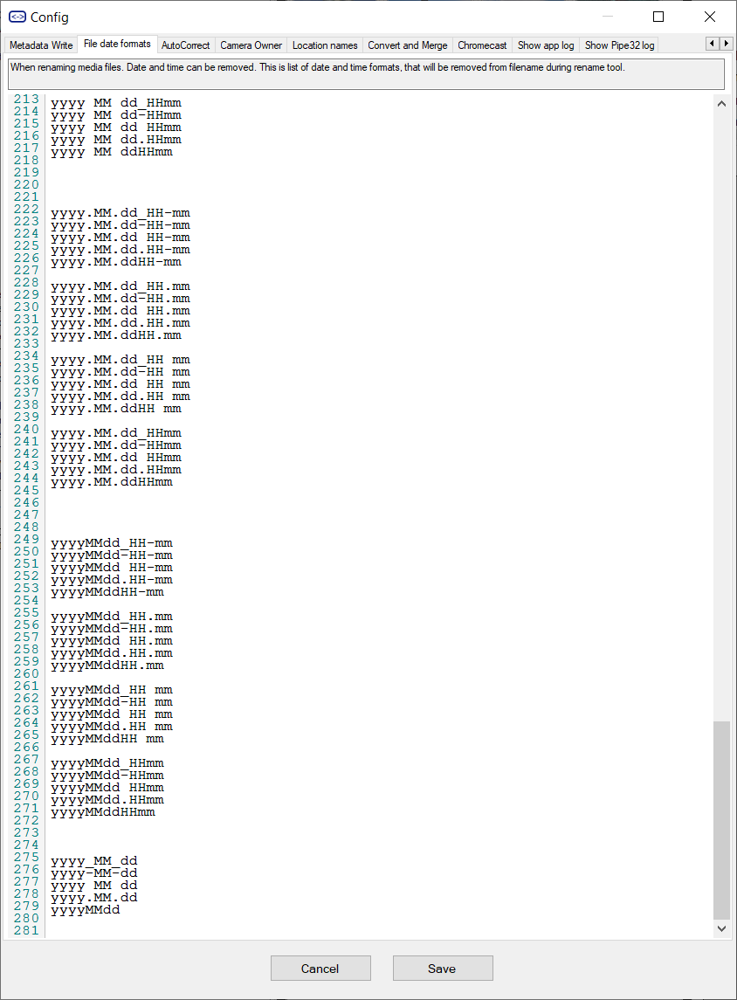
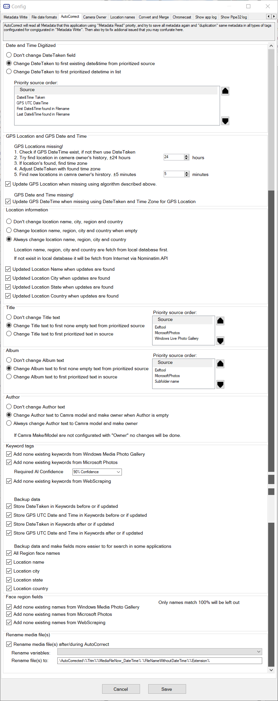
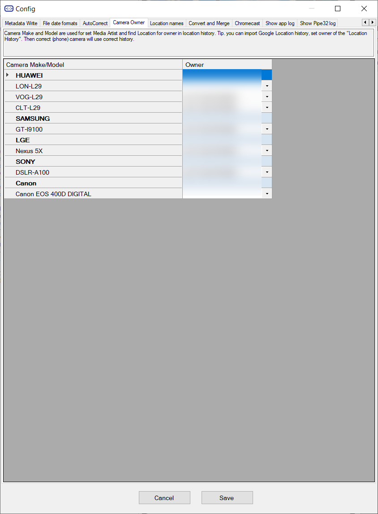
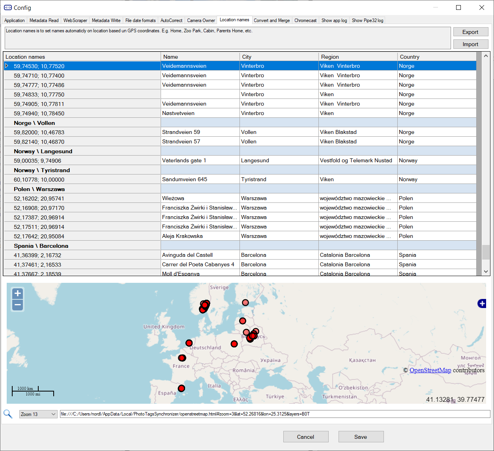
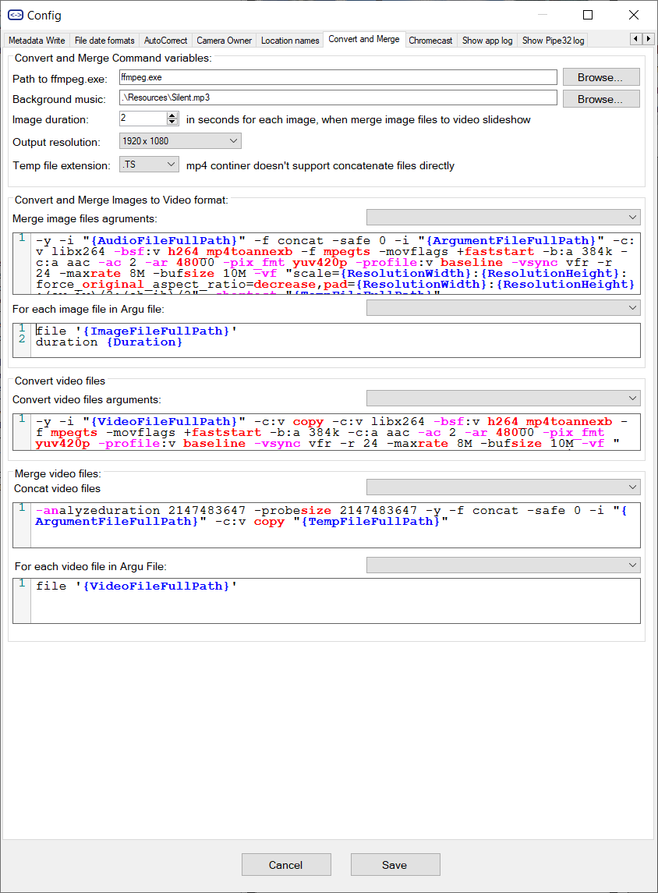
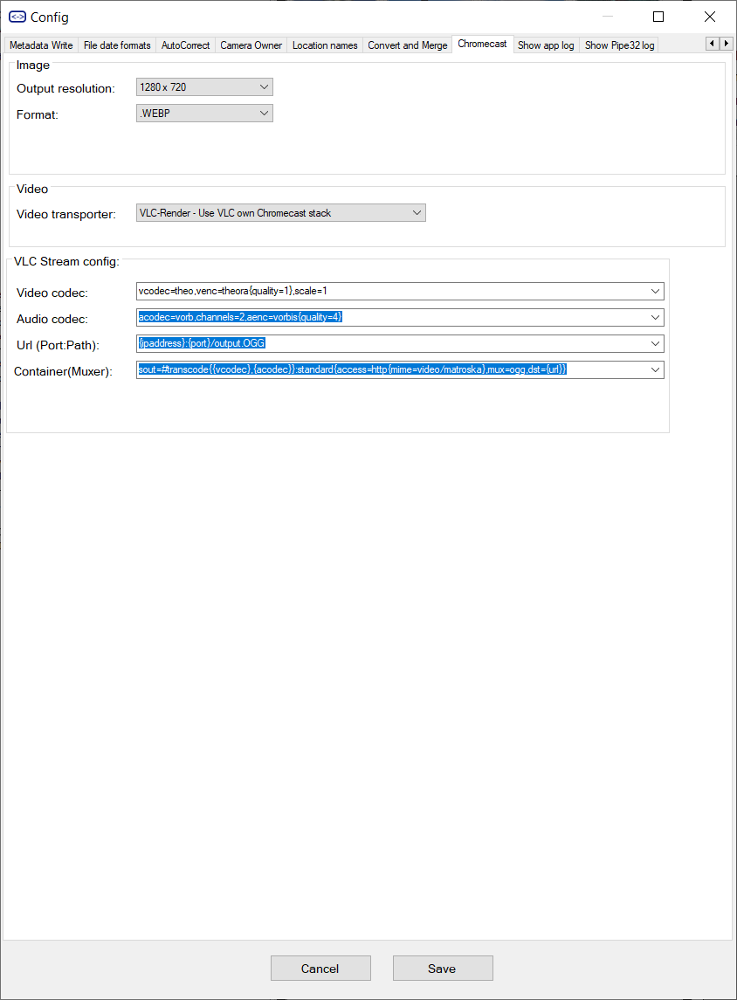

# Config

- Application
- Metadata Read
- WebScraper
- Metadata Write
- File date formats
- AutoCorrect
- Camera owner
- Location names
- Convert and merge
- Chromecast

## Application

## Metadata Read

## WebScraper

## Metadata Write

## File date formats

## AutoCorrect

## Camera owner

## Location names

## Convert and merge

## Chromecast

