

# Config

- Application
- Metadata Read
- WebScraper
- Metadata Write
- File date formats
- AutoCorrect
- Camera owner
- Location names
- Convert and merge
- Chromecast

## Application
Here you can change general settings about the applications.

### Thumbnail 
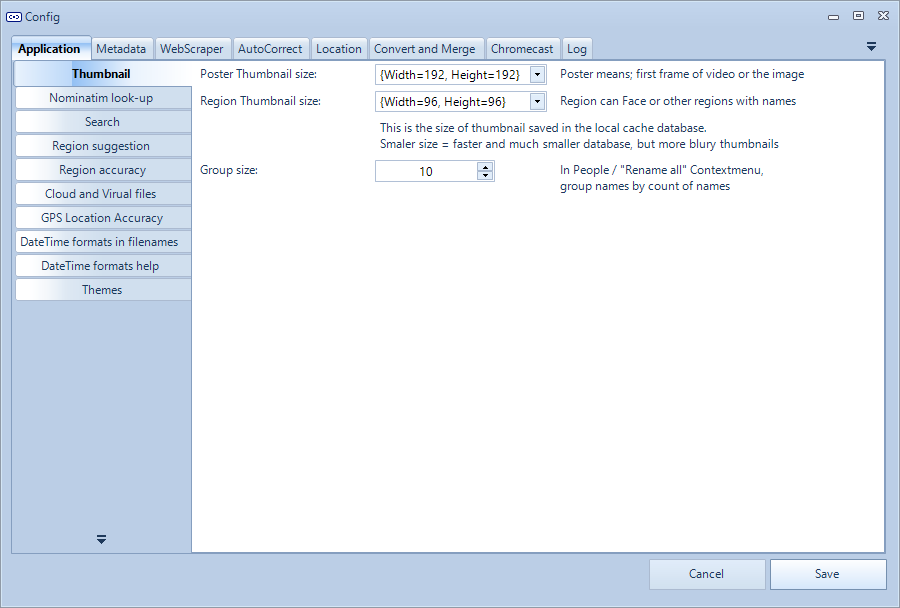
- Thumbnail size. The smaller the thumbnail is, the faster the application will run and the smaller the database will become. But the thumbnail will also become blurry when thumbnail will be upsized. 
- Poster Thumbnail size. Size of media file thumbnail. A small version of the picture, or a small version of a frame from the video.
- Region is often the face of the person inside the picture.

### Nominatim look-up
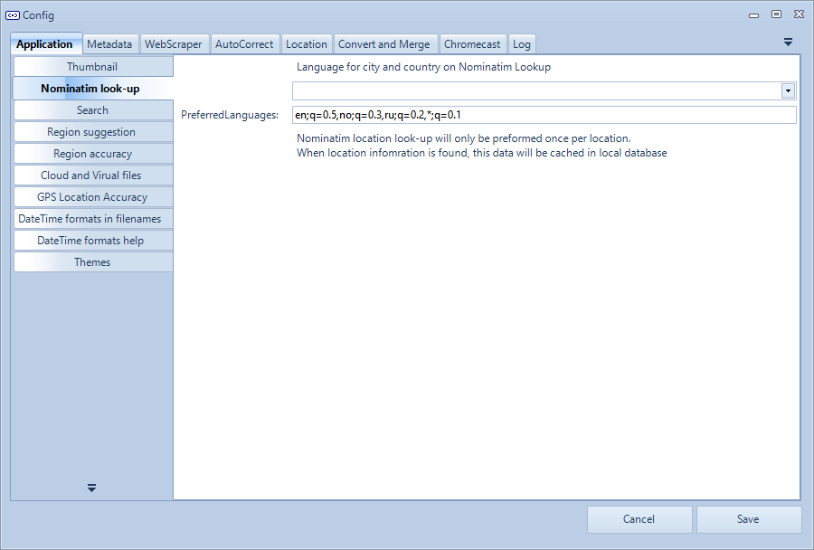
- What language is preferred when looking up location name, region/state, city and country.

### Search result
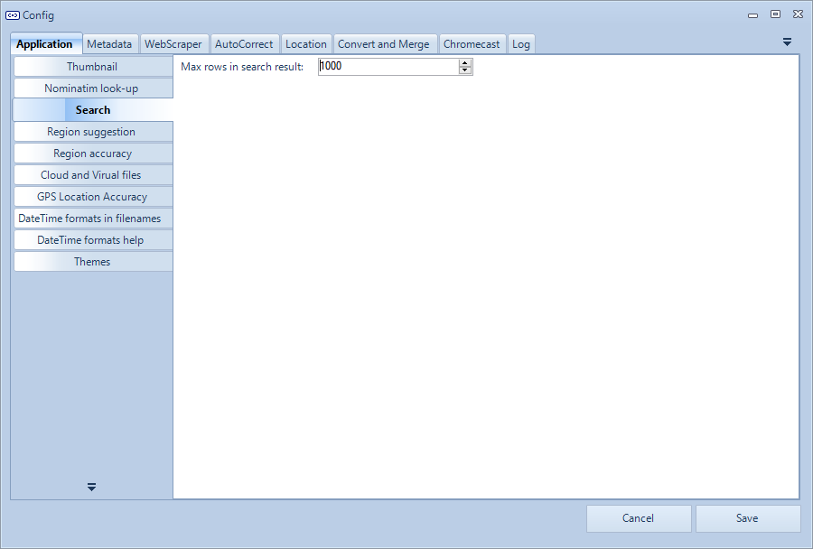
- When searching for media files, this will be the maximum of media files found. This to avoid working with media files at once.

### Region name suggestions. 
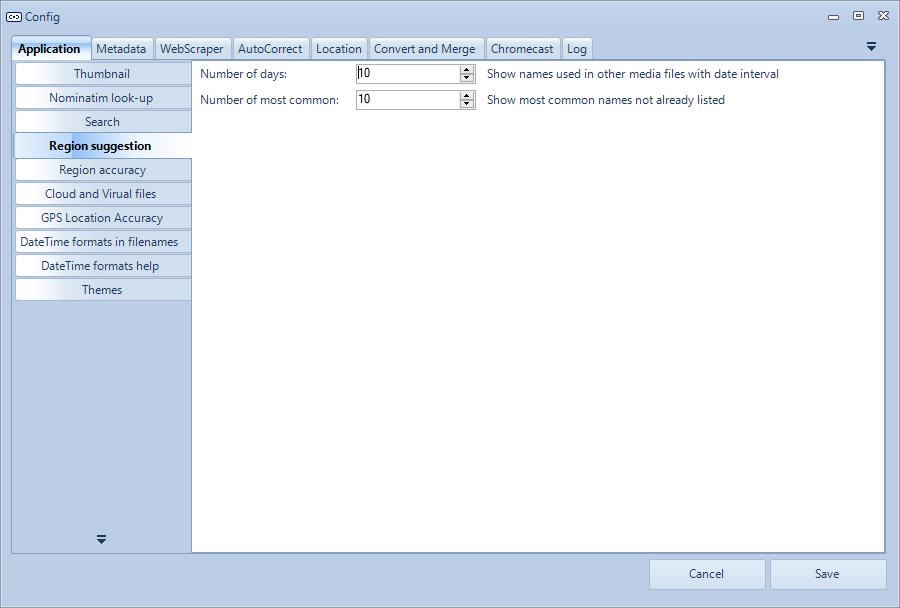
- See [People/Regions](../people/) for more information.
- Number of days. When tagging names for people, a shortcut for most likely names are created. People you been together with during last x days, will appear in this list.
- Number of most common.  When tagging names for people, a shortcut for most used names will appear in this list. Here you can set the maximum number of names you want to see in this list.

### Region accuracy
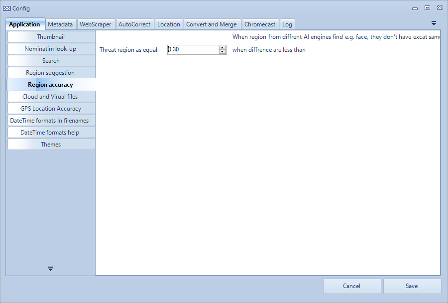

### Cloud And Virtual Files
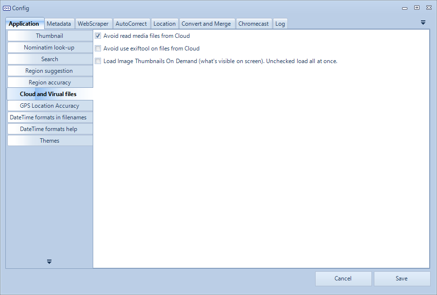
- Avoid reading media files from the Cloud. If media files are only stored in the cloud, when checked, the application will not load the thumbnail, this avoid for example big video files to be download, just to get the get thumbnail.
- Load Image Thumbnails "on demand". When presenting thumbnails in the image view, when checked, the thumbnail will only be loaded when it will be presented on the screen, otherwise, it will continue the work in the background.

### Gps Location Accuracy
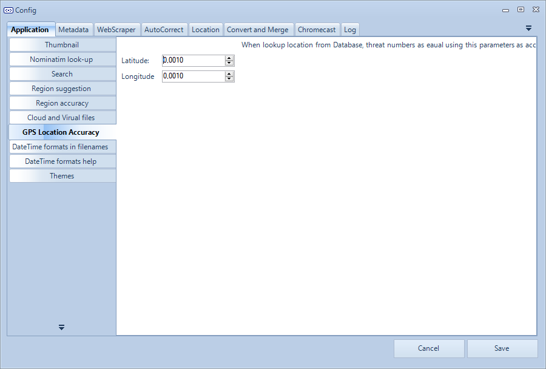
- Accuracy for Latitude
- Accuracy for Longitude

### Datetime Formats In Filenames
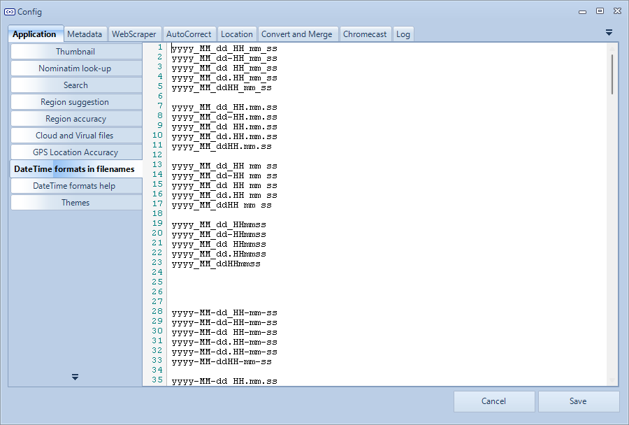

### Datetime Formats Help
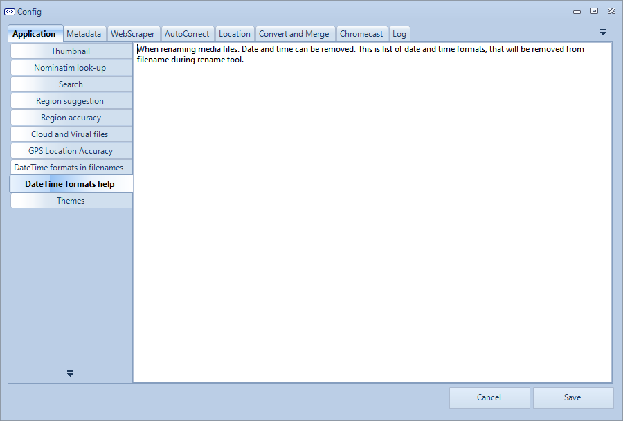

### Themes
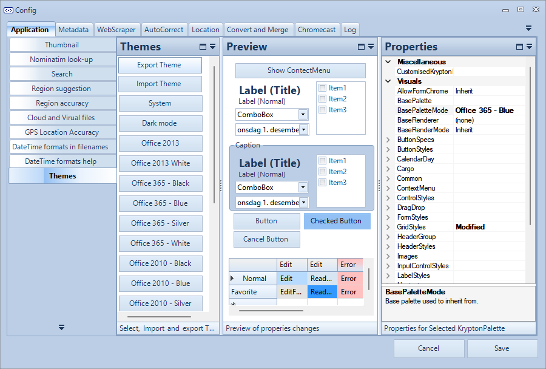
Select new theme, change, load, save and create your own.

## Metadata
All meta information read in this application will be assigned to a value internally in the application.

### Read Help Text
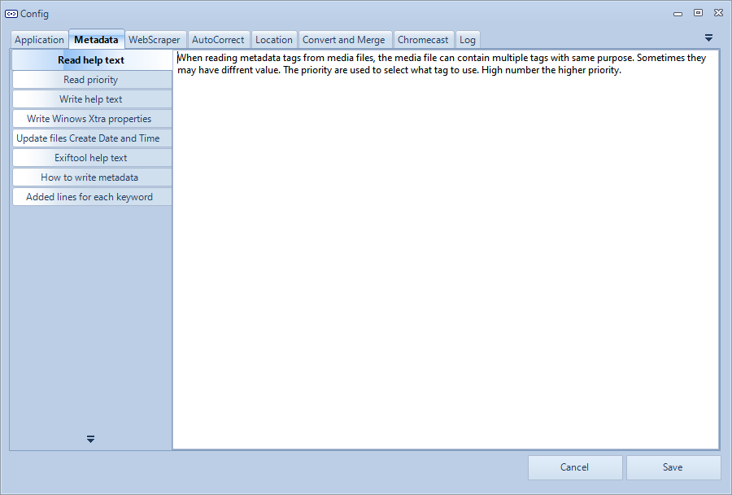

#### Example of different standards

As an example: Athur has a few standards where this meta information can be stored.

- Single
  - EXIF:IFD0, XPAuthor
  - IPTC. By-line
  - QuickTime:ItemList, Artist
  - QuickTime:ItemList, Author
- List
  - PDF, Creator
  - XMP:XMP-dc, Creator

#### PhotoTags Synchronizer internally overview

Here is an overview what the application use internally:

- File
  - FileName
  - FileDirectory
  - FileSize
  - FileDateCreated
  - FileDateModified
  - FileLastAccessed
  - FileMimeType
- Personal
  - PersonalTitle
  - PersonalDescription
  - PersonalComments
  - PersonalRating
  - PersonalRatingPercent
  - PersonalAuthor
  - PersonalAlbum
  - PersonalRegionList
    - Name
    - Type
    - Region Structure Standard
    - AreaX
    - AreaY
    - AreaWidth
    - AreaHeight
    - Thumbnail
  - PersonalTagList
    - Keyword
    - Confidence (Used by Microsoft Photos, how confidence are they about this keyword)
- Camera
  - CameraMake
  - CameraModel
- Media
  - MediaDateTaken
  - MediaWidth
  - MediaHeight
  - MediaOrientation
  - MediaVideoLength
- Location
  - LocationAltitud
  - LocationLatitude
  - LocationLongitude
  - LocationDateTime
  - LocationName
  - LocationCountry
  - LocationCity
  - LocationRegion/State

### Read Priority
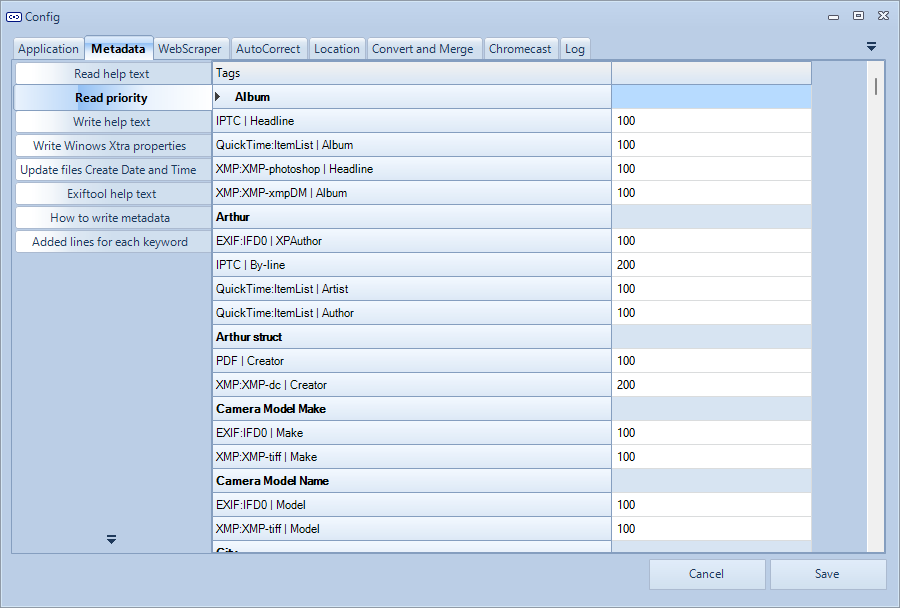
Because of multiple standards, meta information can become out of sync, depending on how camera and software you used saving the meta information.

If the software won't update all meta information that in theory should be "equal", then you will get data out of sync.

Example:
- Software 1: Updates EXIF:IFD0, XPAuthor with Name1
- Software 2: Updates IPTC. By-line with Name2
- Software 3: Updates QuickTime:ItemList, Artist with Name3

By setting all fields as Author, and what priority each meta information has you can solve this.

If you want QuickTime to win, just set high priority than IPTC and EXIF.

#### Change how meta information is read and used

In theory you can use any meta information where you want. Just assign to the fields you want to use.

Please also note that there are few different standards for storing data.

As example:
- Just as as text
- List of texts stored in Structured format
- List of texts stored in XML format

#### Warnings
When there are mismatch between meta information that in theory should be equal, a warning will be saved and you can see all warnings in the [Warnings tab](../warnings/)

#### Assign meta information and priority

Drag and Drop From | Drag and drop to
--|--
 | 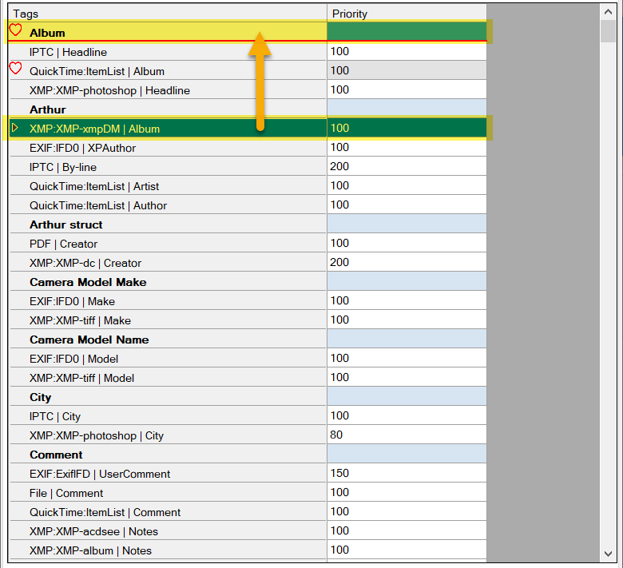

Use context menu | Enter priority
--|--
 |    Bigger number = higher priority

#### Easy access to "Read Priority" in Exiftool tab and Warnings tab
For easy access and set the values where you see them in the Exiftool and Warnings tab.

Exiftool | Warnings
--|--
 | 
 | 

### Write Help Text
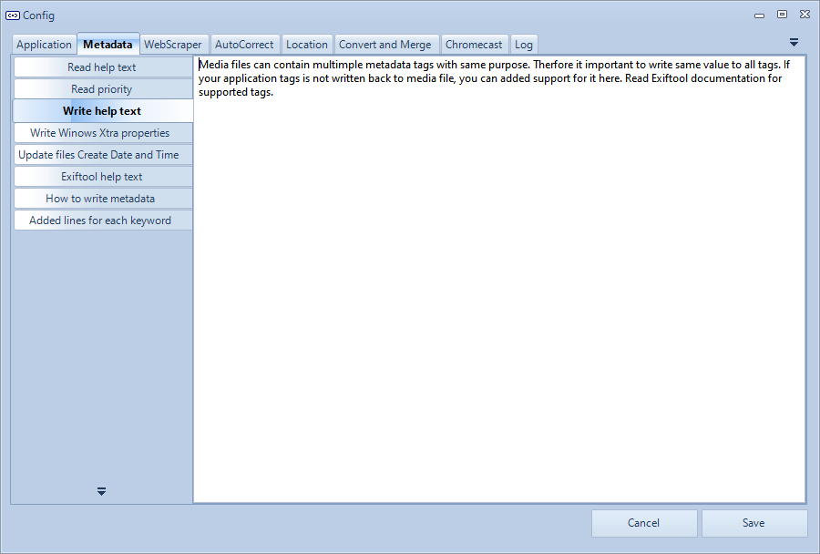

### Write Windows Xtra Properties
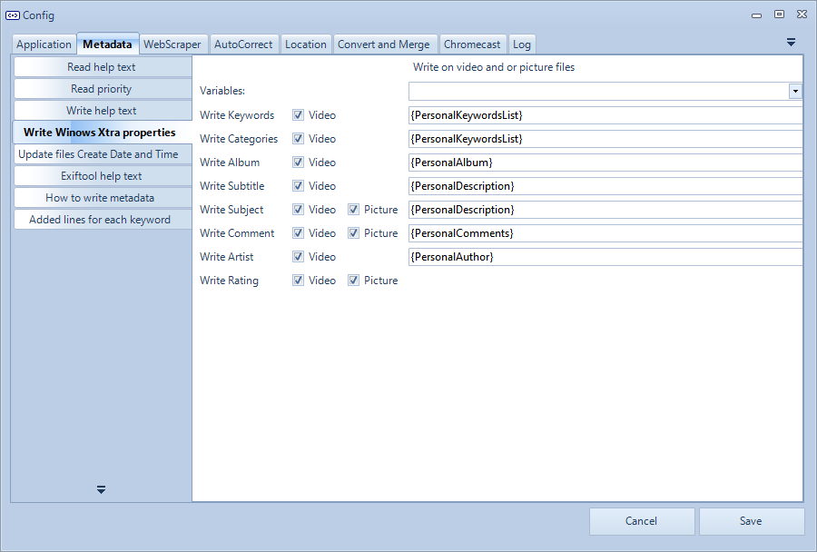

### Update Files Create Date And Time
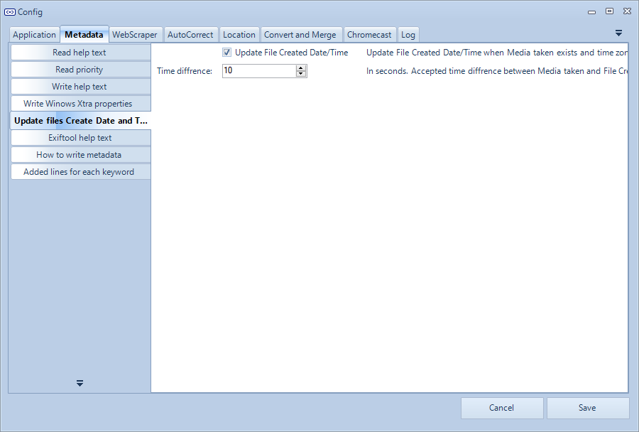

### Exiftool Help Text
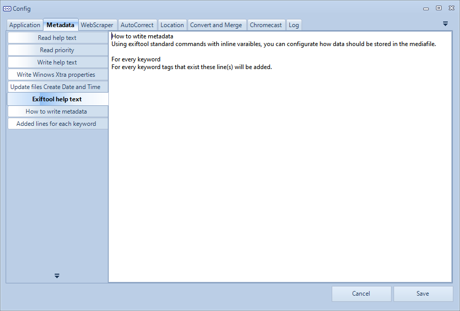

### How To Write Metadata
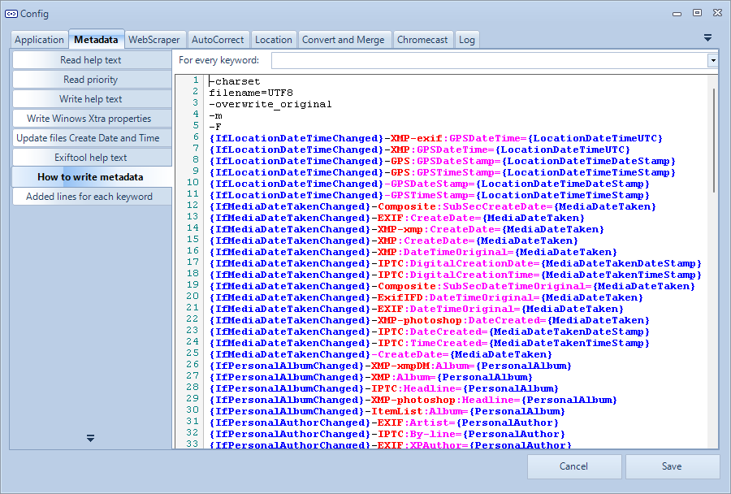

### Added Lines For Each Keyword
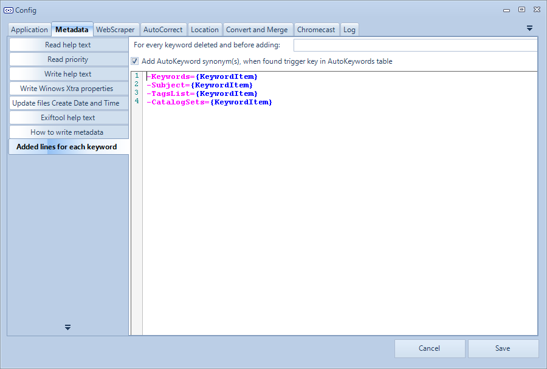

## WebScraper
See also [WebScraping user guide](../webscraping/)

- Web Scraping settings
  - JavaScript Execute Timeout How long time before the injected scraping script should run before timeout. On a slower computer you can increase this number.
  - Web Scraping Delay 1 (Our script to run) A short delay, let existing script to finalize before we run our injected scraping script again. On a slower computer, you can increase this number.
  - Web Scraping Retry Number of retry run the script after an error or timeout.
  - Web Scraping Delay 2 (In-Page script to run) A short delay, let existing script to finalize before we run the scraping script. On slower computer, you can increase this number.
  - Page Start Loading Timeout When trying to open a page, hot long should web browser wait before consider timeout
  - Page Loaded Timeout 
  - Number of PageDown keystroke.  When scraping categories, then the scraper sends PageDown keypress, and checks if new data has been loaded to the web browser. If no new data has been found, the scraper considers we are at the end of the page.
- Start pages for scraping categories
  - A list of page that will be scraped to scrap categories

## Metadata Write

### Variables

A list of variables you can write back in Windows Xtra atoms and back to any meta information fields.

  - System
	  - {SystemDateTime}
	  - {SystemDateTimeDateStamp}
	  - {SystemDateTimeTimeStamp}
	  - {SystemDateTime_yyyy}
	  - {SystemDateTime_MM}
	  - {SystemDateTime_dd}
	  - {SystemDateTime_HH}
	  - {SystemDateTime_mm}
	  - {SystemDateTime_ss}
  - Filesystem
	  - {FileName}
	  - {FileFullPath}
	  - {FileFullPath.8.3}
	  - {FileNameWithoutExtension}
	  - {FileNameWithoutDateTime}
	  - {FileExtension}
	  - {FileDirectory}
	  - {FileSize}
	  - {FileDate}
	  - {FileDateDateStamp}
	  - {FileDateTimeStamp}
	  - {FileDate_yyyy}
	  - {FileDate_MM}
	  - {FileDate_dd}
	  - {FileDate_HH}
	  - {FileDate_mm}
	  - {FileDate_ss}
	  - {FileDateCreatedDateStamp}
	  - {FileDateCreatedTimeStamp}
	  - {FileDateCreated_yyyy}
	  - {FileDateCreated_MM}
	  - {FileDateCreated_dd}
	  - {FileDateCreated_HH}
	  - {FileDateCreated_mm}
	  - {FileDateCreated_ss}
	  - {FileDateModified}
	  - {IfFileDateModifiedChanged}
	  - {FileDateModifiedDateStamp}
	  - {FileDateModifiedTimeStamp}
	  - {FileDateModified_yyyy}
	  - {FileDateModified_MM}
	  - {FileDateModified_dd}
	  - {FileDateModified_HH}
	  - {FileDateModified_mm}
	  - {FileDateModified_ss}
	  - {FileLastAccessed}
	  - {FileLastAccessedDateStamp}
	  - {FileLastAccessedTimeStamp}
	  - {FileLastAccessed_yyyy}
	  - {FileLastAccessed_MM}
	  - {FileLastAccessed_dd}
	  - {FileLastAccessed_HH}
	  - {FileLastAccessed_mm}
	  - {FileLastAccessed_ss}
	  - {FileMimeType}
  - Personal
	  - {PersonalTitle}
	  - {IfPersonalTitleChanged}
	  - {PersonalDescription}
	  - {IfPersonalDescriptionChanged}
	  - {PersonalComments}
	  - {IfPersonalCommentsChanged}
	  - {PersonalRating}
	  - {IfPersonalRatingChanged}
	  - {PersonalRatingPercent}
	  - {PersonalAuthor}
	  - {IfPersonalAuthorChanged}
	  - {PersonalAlbum}
	  - {IfPersonalAlbumChanged}
	  - {PersonalRegionInfoMP}
	  - {PersonalRegionInfo}
	  - {IfPersonalRegionChanged}
  - Keyword
	  - {PersonalKeywordsList}
	  - {PersonalKeywordsXML}
	  - {PersonalKeywordItemsDelete}
	  - {PersonalKeywordItemsAdd}
	  - {IfPersonalKeywordsChanged}
  - Camera
	  - {CameraMake}
	  - {CameraModel}
  - Media
	  - {IfMediaDateTakenChanged}
	  - {MediaDateTakenDateStamp}
	  - {MediaDateTakenTimeStamp}
	  - {MediaDateTaken_yyyy}
	  - {MediaDateTaken_MM}
	  - {MediaDateTaken_dd}
	  - {MediaDateTaken_HH}
	  - {MediaDateTaken_mm}
	  - {MediaDateTaken_ss}
	  - {MediaWidth}
	  - {MediaHeight}
	  - {MediaOrientation}
	  - {MediaVideoLength}
  - Location
	  - {LocationAltitude}
	  - {IfLocationAltitudeChanged}
	  - {LocationLatitude}
	  - {IfLocationLatitudeChanged}
	  - {LocationLongitude}
	  - {IfLocationLongitudeChanged}
	  - {LocationDateTime}
	  - {IfLocationDateTimeChanged}
	  - {LocationDateTimeUTC}
	  - {LocationDateTimeDateStamp}
	  - {LocationDateTimeTimeStamp}
	  - {LocationDateTime_yyyy}
	  - {LocationDateTime_MM}
	  - {LocationDateTime_dd}
	  - {LocationDateTime_HH}
	  - {LocationDateTime_mm}
	  - {LocationDateTime_ss}
	  - {LocationName}
	  - {IfLocationNameChanged}
	  - {LocationCity}
	  - {IfLocationCityChanged}
	  - {LocationState}
	  - {IfLocationStateChanged}
	  - {LocationCountry}
	  - {IfLocationCountryChanged}

### Write Windows Xtra atom properties

Here you can set up what Xtra atoms should be written back to the media file.

When Video is selected, data is written back to video files.

When Picture is selected, data will be written back to image files where supported.

  - Keywords
  - Categories
  - Album
  - Subtitle
  - Subject
  - Comment
  - Artist
  - Rating

## File date formats
When removing date and time from filename, what format will be accepted to remove from file name.

On the [Date and Time tab](../date/) all date and time found in file name, will be present as found date and time.

## AutoCorrect

See [AutoCorrect user guide](../autocorrect/) for more information.

## Camera owner
See [GEOtagging user guide](../map/) for more information.

Camera owner is used when finding the correct owner for GPS location history.

Camera owner can be used to set the Author field.

## Location names
See [GEOtagging user guide](../map/) for more information.

## Convert and merge

## Chromecast


