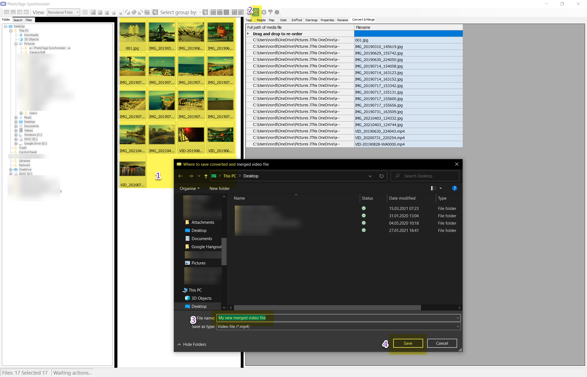

# Convert and merge

With this tool you can convert a set of videos and pictures to create one video file. Kind of slide show video.

Steps
1. Select your media files
2. Click save
3. Enter name of the merged video file
4. Click save and wait

In the [config](../config/) you can set up different parameters and for converting and merging.

In theory you can changes mmpeg to any tools as your prefer to use.

