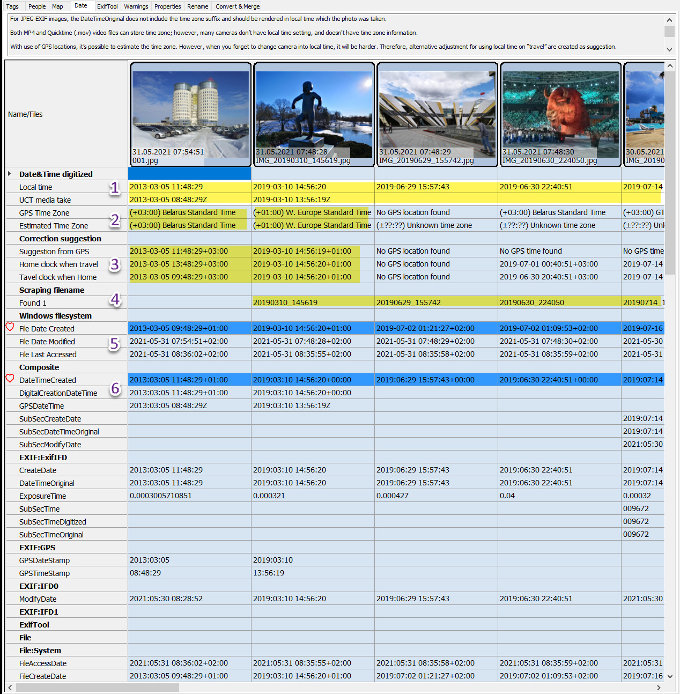



# Date and Time

1. Date&Time digitized
  - Local time Date taken is by default the local time where the photo or video was taken.
  - UTC media taken UTC time is often missing in the meta information for the file. When we have UTC time and GPS location we are able to estimate time zone.   See [AutoCorrect](../autocorrect/) for automate this process using an algorithm.
2. Date&Time digitized
  - GPS Time Zone   Time zone estimated from GPS location.
  - Estimated Time Zone   Time zone estimated based on time difference between Date Taken and GPSs UTC date and time.
3. Correction suggestions
  - Suggestion from GPS   Suggested Date and Time based on GPS locations.
  - Home clock when traveling   If you have taken pictures and videos in a different time zone, and forgot to change the camera date and time. Typical problem for old digital cameras without GPS.
  - Travel clock when home   If you've been in a different time zone, and forgot to change the camera date and time when you are back home. Typical problem for old digital cameras without GPS.
4. Scraping filename
  - Some camra save media files and store the date and time in the file name. The date and time found in the file name will be presented here.
  - See [Config - File Date formats](../config/) what date formats that will be scraped from the filename.
5. Windows file system
  - Information saved in the operations file system
6. Date and Time found in the media files Meta information


