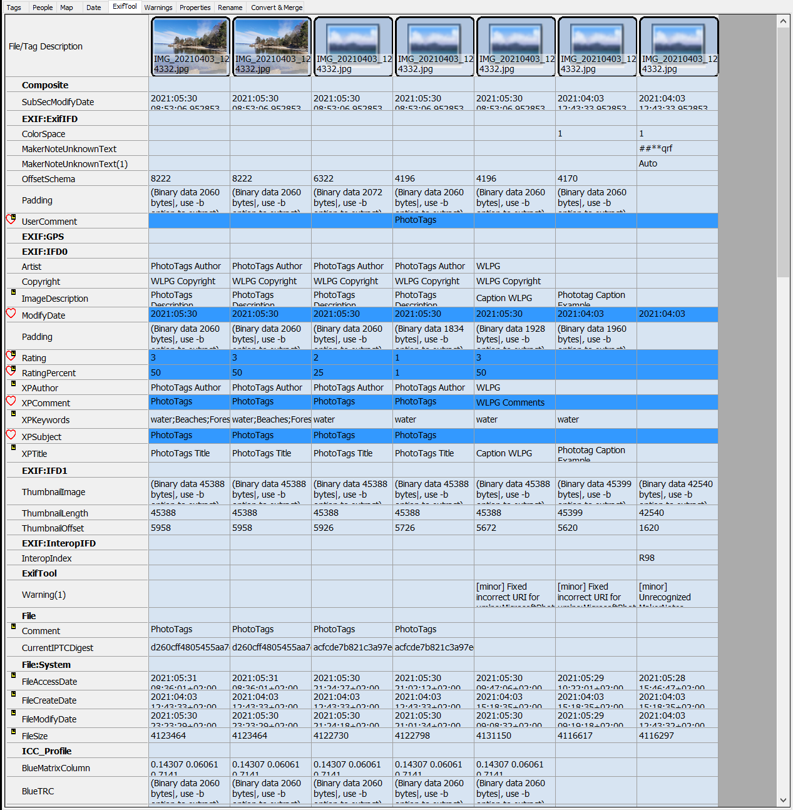
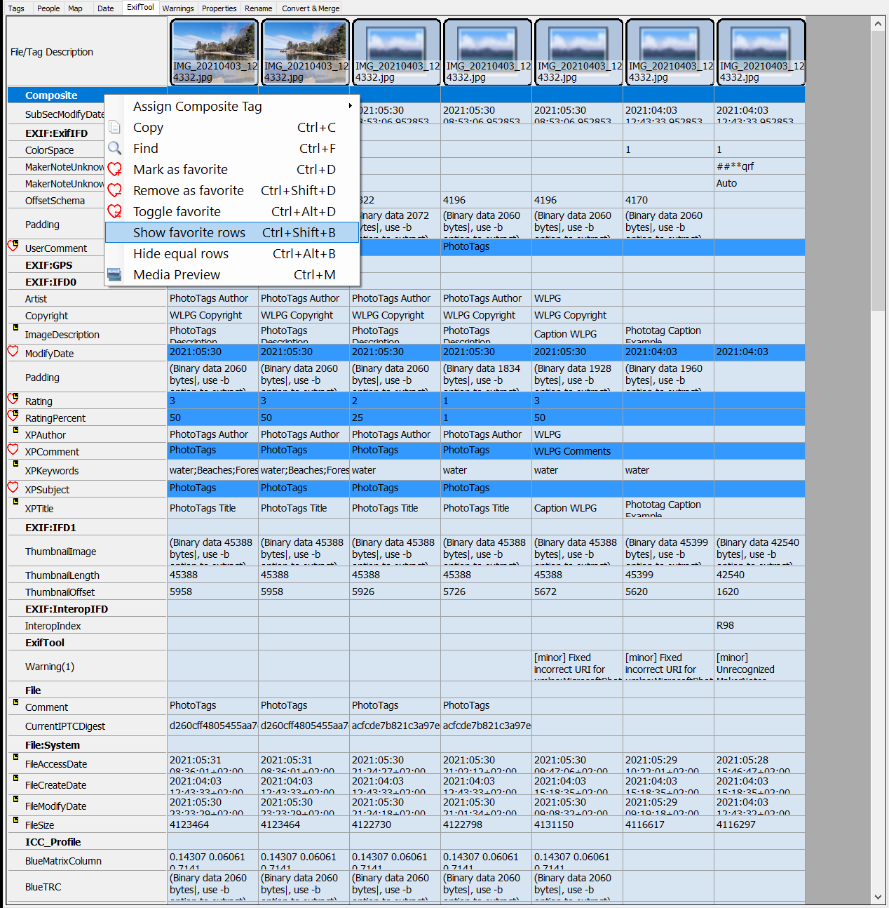
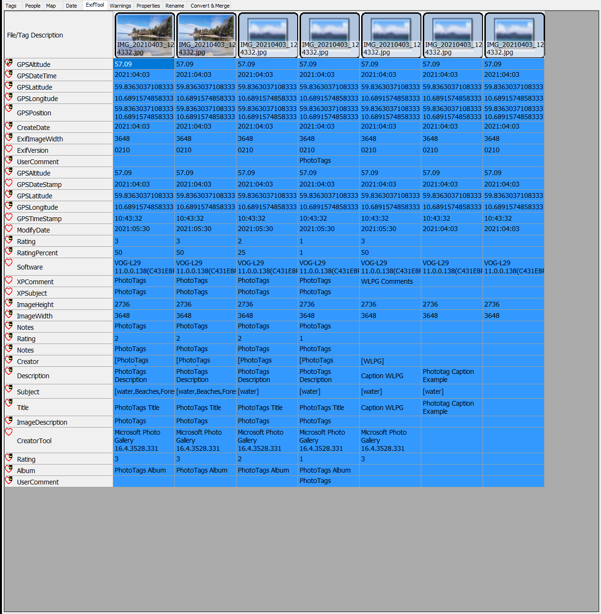
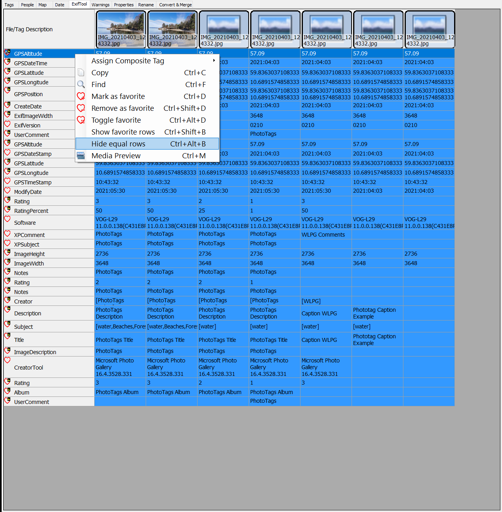
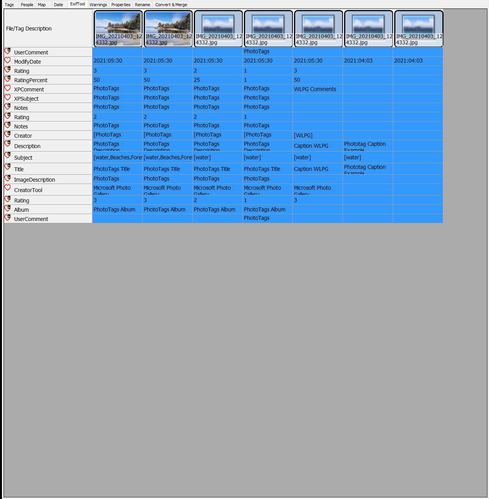

# Exiftool GUI

With this tool you can compare the change history of any meta information done by any software.

PhotoTags Synchronizer uses Exiftool to read any meta information that Exiftool provides.
Some examples of what exiftool are able to read: EXIF, GPS, IPTC, XMP, JFIF, GeoTIFF, ICC Profile, Photoshop IRB, FlashPix, AFCP and ID3, Lyrics3, as well as the maker notes of many digital cameras by Canon, Casio, DJI, FLIR, FujiFilm, GE, GoPro, HP, JVC/Victor, Kodak, Leaf, Minolta/Konica-Minolta, Motorola, Nikon, Nintendo, Olympus/Epson, Panasonic/Leica, Pentax/Asahi, Phase One, Reconyx, Ricoh, Samsung, Sanyo, Sigma/Foveon and Sony. Source of information: [Exiftool](https://exiftool.org/)

## Powerful Exiftool GUI

## Show history and compare content
You can set different rows as favorites to make it easier to focus on what's important for you. In the context menu, you can add, remove and toggle favorite rows.

Show and hide | Result after select
--|--
Show only favorite rows  | Result after selecting 
Hide rows with equal values  | Result after selecting  
