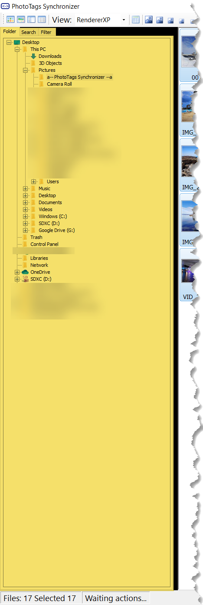
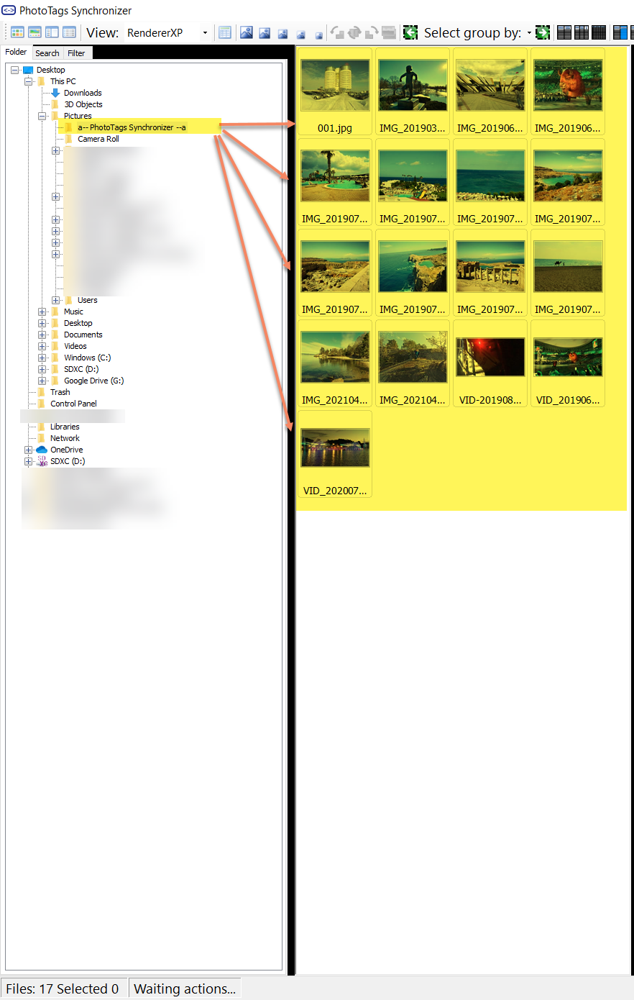
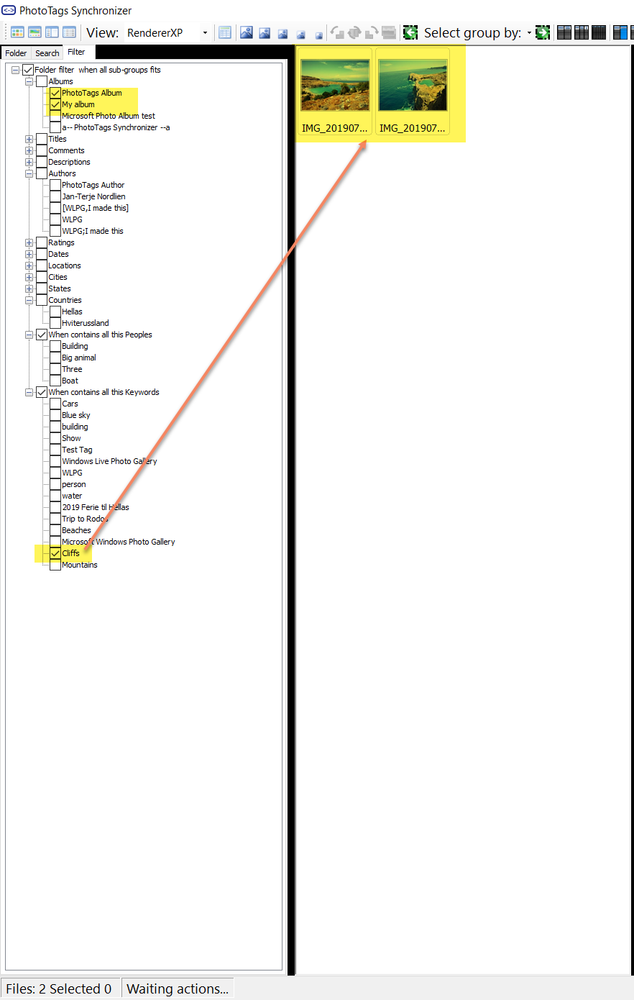
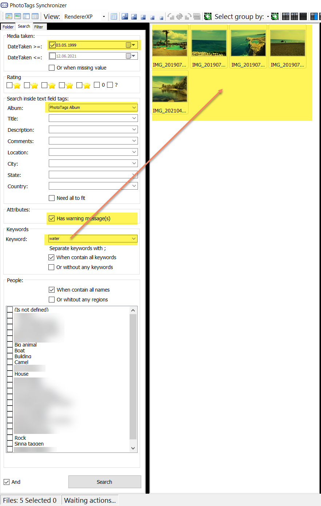
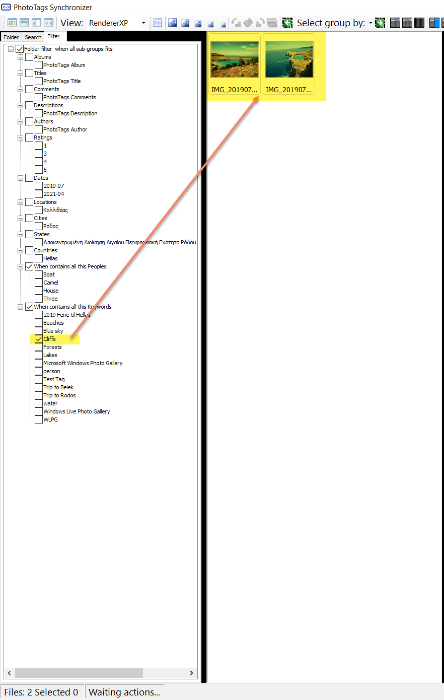



# Filters

There two ways to find your meida files. Select your folder or search for the media files.

You can even filter the result you get in the filter tab.

Find | Filter
--|--
Find in folder    | After filtering what found in folder  
Find with search    | After filter search result   


