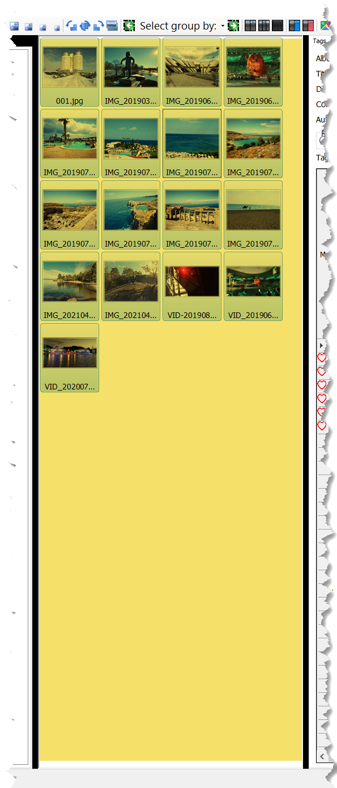
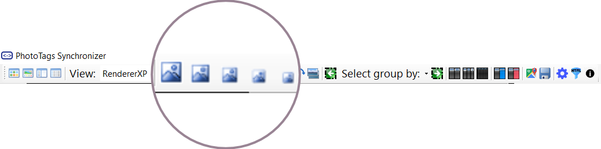
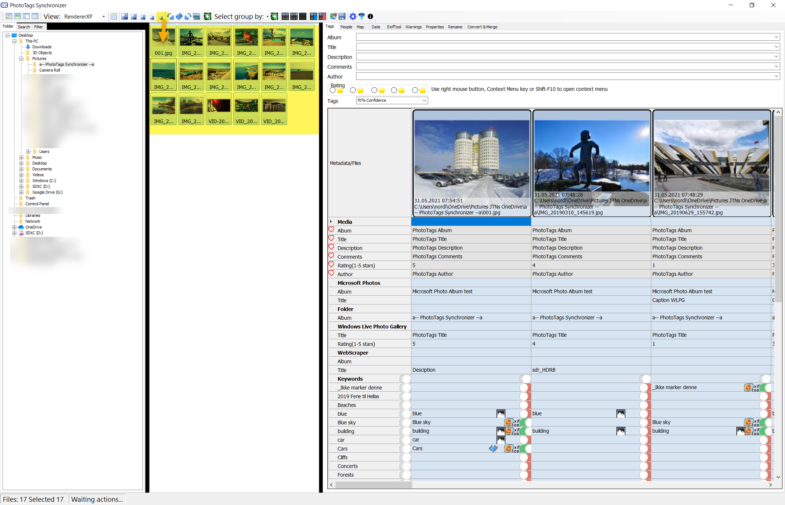
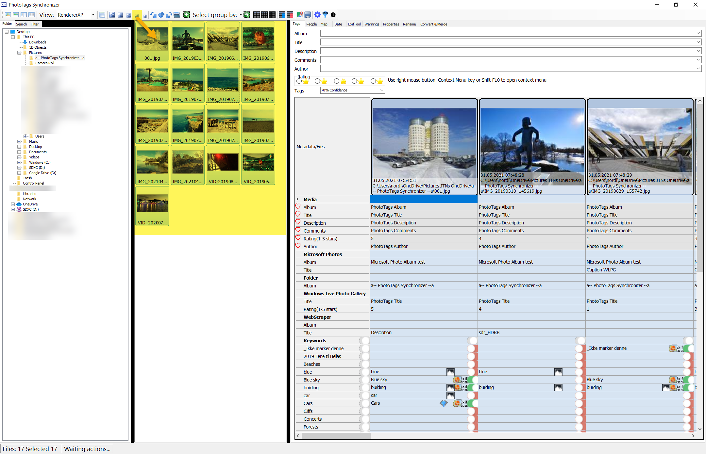
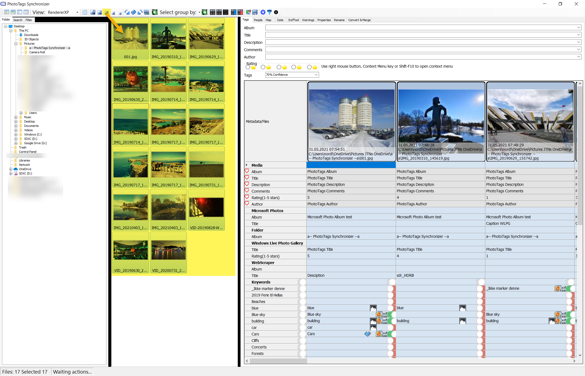
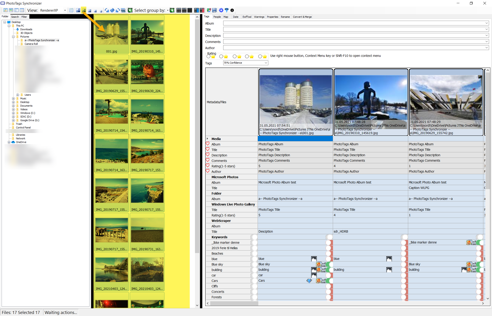
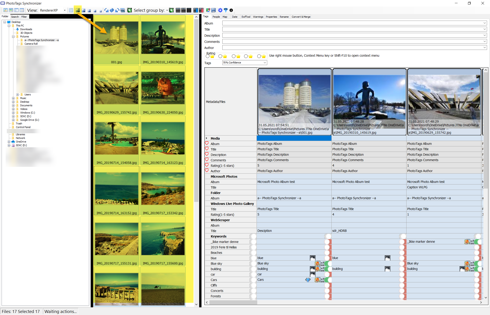
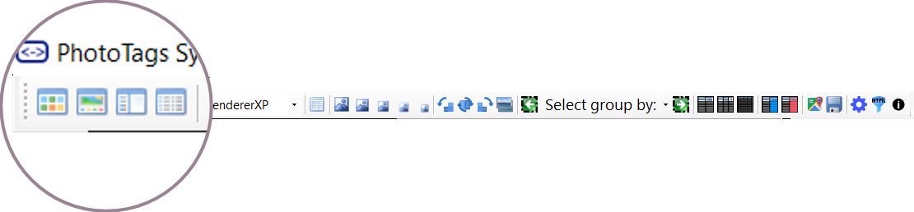



# Image List View

The image list view will present a set of thumbnails for selected folder or result of your search, and if filters are added thumbnails presented will be updated according to the added filter.

## Thumbnail sizes

You can adjust the thumbnail size so it fits your needs. There are 5 different size to choose from.

Example of diffrent thumbnail sizes.

Extra small | Small | Medium | Large | Extra Large
--|--|--|--|--
 |  |  |  | 

## Image List View layout


