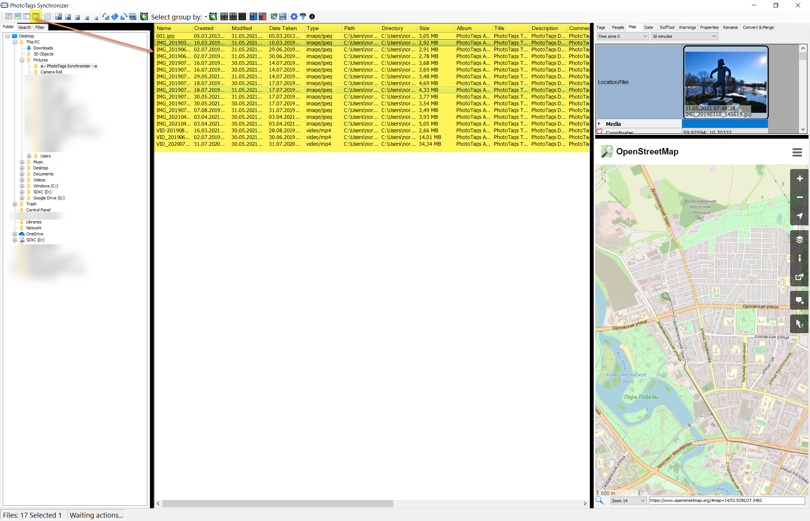
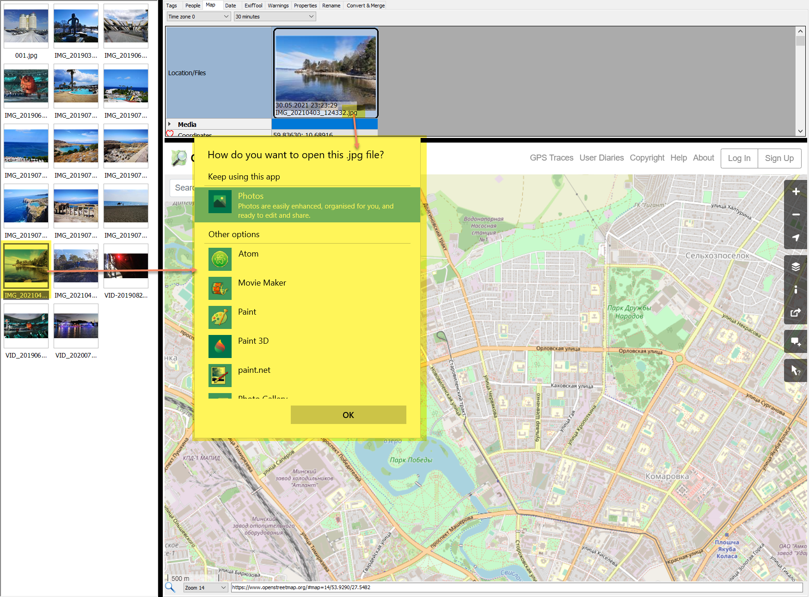



# Image List View

The image list view will present a set of thumbnails for selected folder or result of your search, and if filters are added thumbnails presented will be updated according to the added filter.

## Thumbnail sizes

You can adjust the thumbnail size so it fits your needs. There are 5 different size to choose from.

Example of diffrent thumbnail sizes.

Extra small | Small | Medium | Large | Extra Large
--|--|--|--|--
 |  |  |  | 

## Image List View layout

Layout | Layout
--|--
Thumbnail   | Gallery   
Pane    | Details   

### Thumbnail view layout

## Rotate media file

## Select by group

Fast way to select a group of pictures, so you can edit all at once that most likly are in a group and with more or less same content.

Select group by | Select group by
--|--
 | 
 | 

## Context menu

### Sort media files by...

You can sort your media files by following fields...
- File name
- File created date and time
- File modified date and time
- Media Date Taken
- Media Album
- Media Title
- Media Description
- Media Comments
- Media Author
- Media Rating
- Location name
- Location Region/State
- Location City
- Location Country

### Cut / Copy / Paste
Copy, cut and paste media files. Drag and drop is also possible.

### Delete files
Delete selected media files, from the folder and database.

### Copy filename to clipboard
Copy select filenames to the clipboard, so you can paste it into your favorite applications.

### Refresh Folder
Read all files in the folder again and add found media files in the Image List View.

### Reload thumbnail and metadata
If media information for the selected media files exists in the database with the same “last written date” as the file, then delete this database record, then run the Exiftool again and grab the meta information once more.

### Clear thumbnail and metadata history
Delete all historical meta information in the database, and run ExifTool grabber once more and add the last version into the database.

### Select all
Select all media files.

### AutoCorrect metadata
Run the powerful [AutoCorrect](../autocorrect) tool / algorithm.

### Open
For each selected media file, a Open command with application associated with the file will be run. It can be different applications that can be run depending on file extension.

Open | Result
--|--
 | 

### Open media files with...

For each selected media file, an Open with and selected application will be run for each media file.

Only the applications that are associated with all selected files will be shown, as example pictures below shows.

Associated with jpg | Associated with mp4 | Associated with jpg and mp4
--|--|--
 |  | 

### Edit
For each selected media file, an Edit command with an application associated with the file will be run. There can be different applications that can be run depending on the file extension.

Edit | Result
--|--
 | 

### Run batch; app or command...

### Open and associate dialog...

Associate with | Result
--|--
 | 

### Open file location

Open file location | Result
--|--
 | 

### Rotate 90, 180, 270 degree

Rotate media file 90, 180, 270 degrees. Please note, the media will be rotated physically not with tags.

### Media preview and chromecast

Open the [Mediapreview & Chromecast](../mediapreview-chromecast) window, that also have possibility to play media on chromecast


