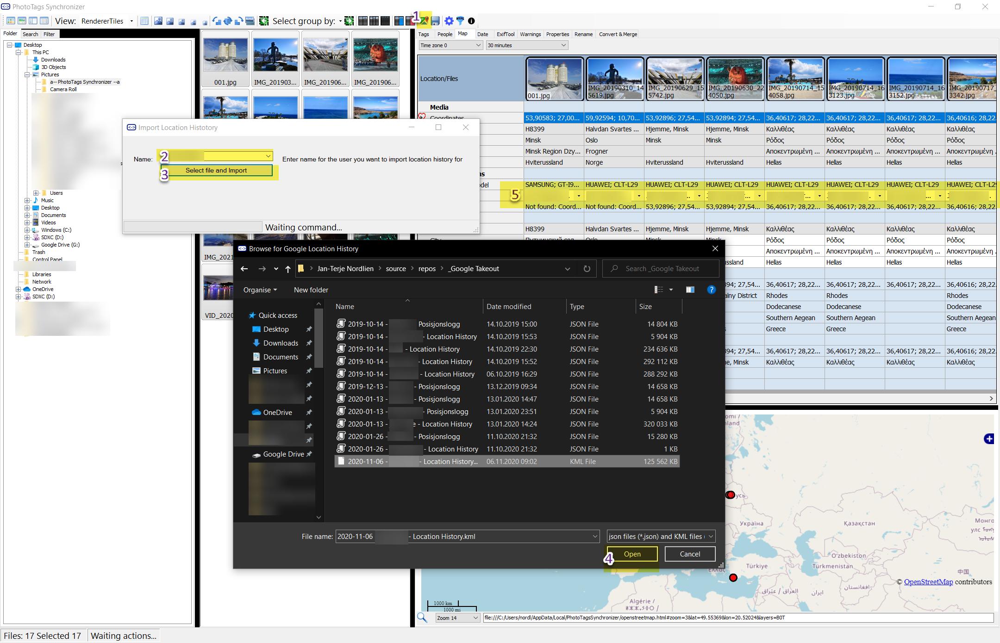



# Import Location History

1. Click Import Location History button
2. Write or Select the person that owns this location history.
3. Open the File Dialog
4. Select the file KML or json file you like to import
5. The Name of the person you enter will become a position for Camera Make and Model. Then different cameras can have different location histories.
6. The Camera Owner will also be used as Author on the Meta information

## Camera Owner

See Camera Owner in [Config](../config).

## Location information

See [GEOtagging user guide](../map/) for more information.
See Location information in [Config](../config)


