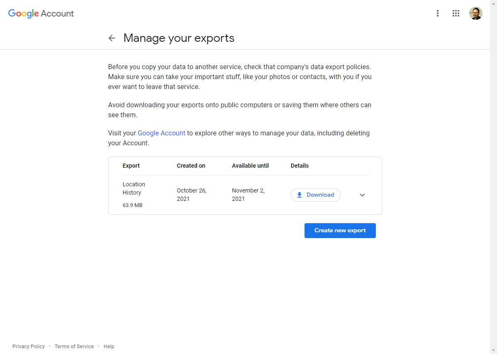



# Import Location History

1. Click Import Location History button
2. Write or Select the person that owns this location history.
3. Open the File Dialog
4. Select the file KML or json file you like to import
5. The Name of the person you enter will become a position for Camera Make and Model. Then different cameras can have different location histories.
6. The Camera Owner will also be used as Author on the Meta information

## Camera Owner

See Camera Owner in [Config](../config).

## Location information

See [GEOtagging user guide](../map/) for more information.
See Location information in [Config](../config)

## Google Takeout - Location history 
To export Google Location History go to [Google Takeout](https://takeout.google.com/) and then follow this steps.

1. Deselect all, if you only need to export Location History

2. Scroll down and select Location History

3. Then scoll down and click Next Step

4. Then click "Create Export", then Google will start create a zip file with the Location History

5. You will get a confirmation screen that the "Takeout" is started. This can take awhile.

6. You will also get a email notification on your gmail account that the process has started.

7. You will also get a security notification email from Google 

8. When the export zip file is ready, a email will also be sent with a link for download. 

9. After clicking the link, your browser will open on this page. Click "download", and save the zip file or files.

10. Use File Explorer or other tools to extract the zip file or files.

11. Location History.json is the file you can import.


