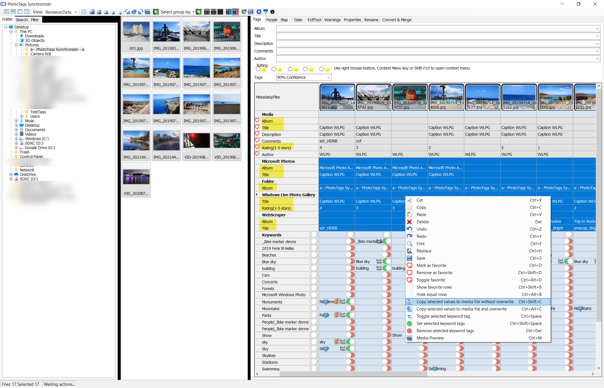
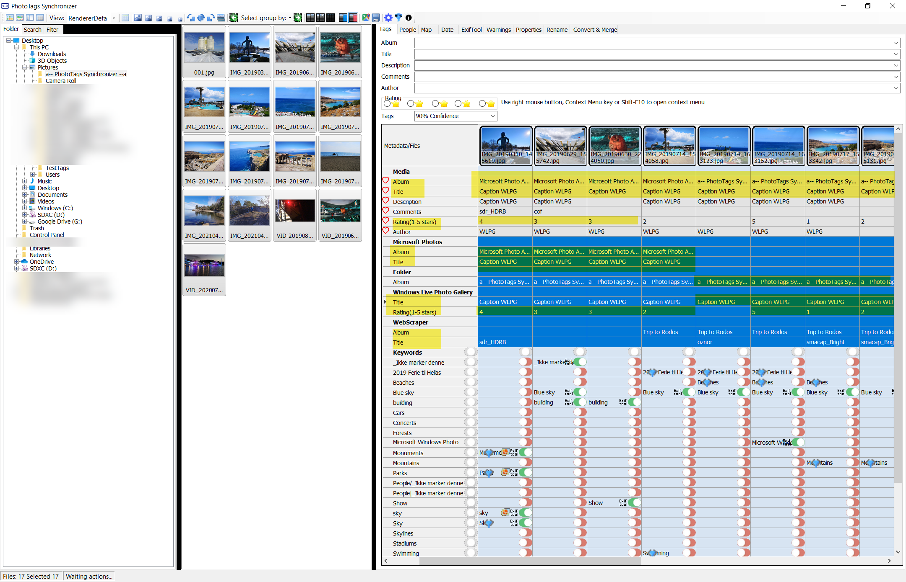
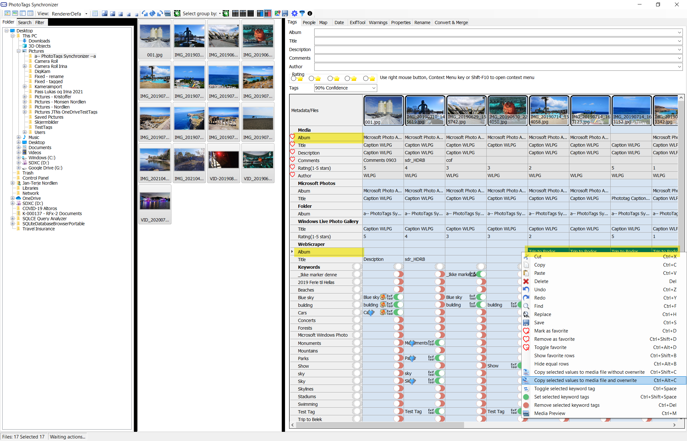
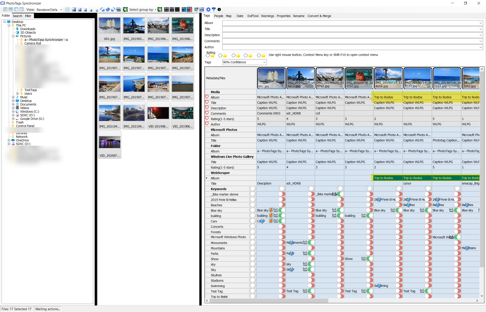
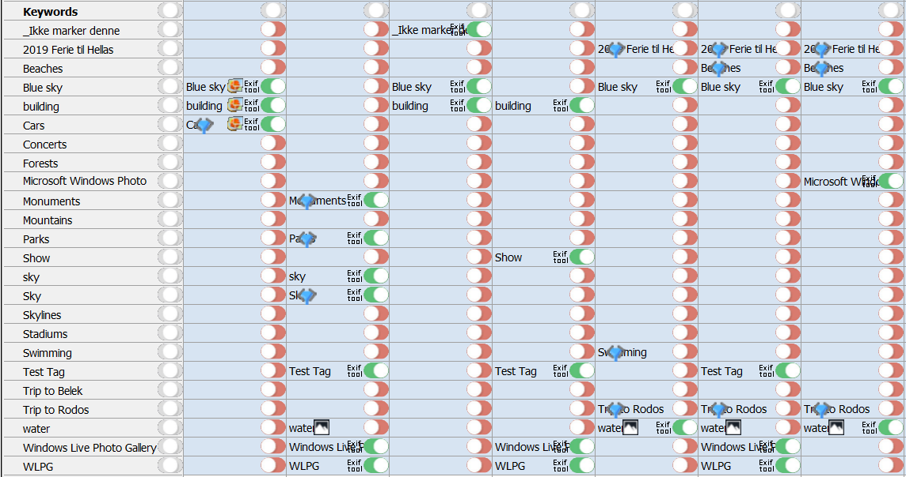
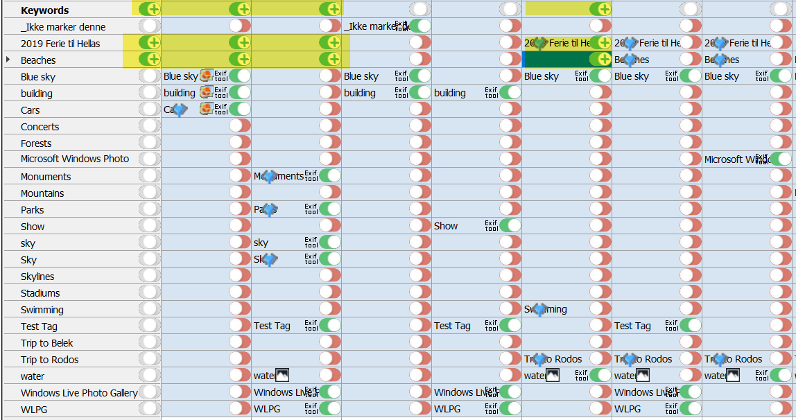
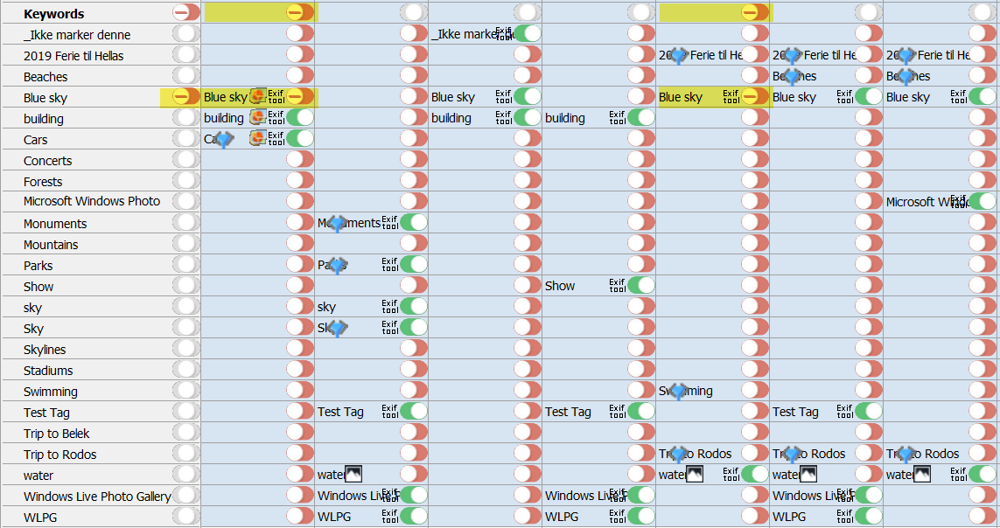
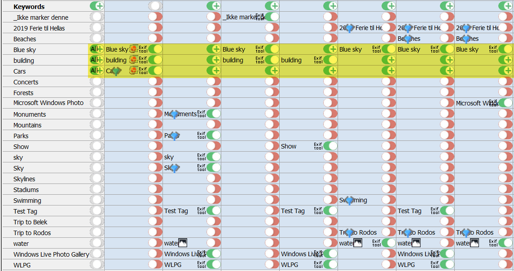
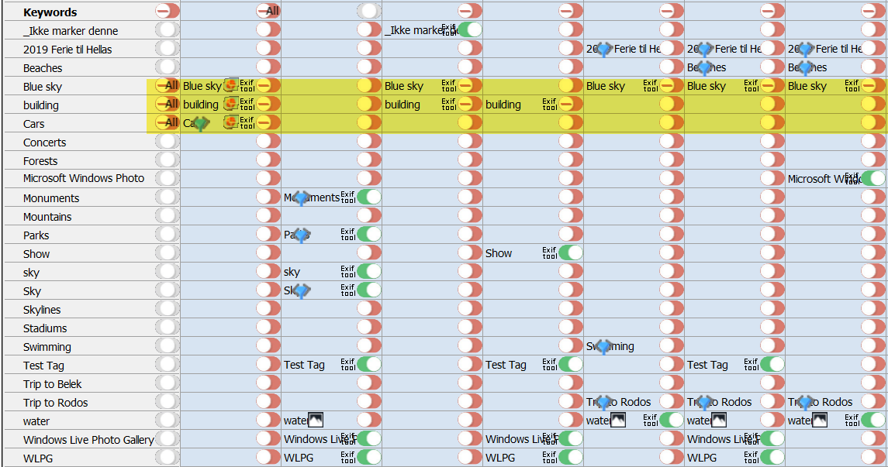
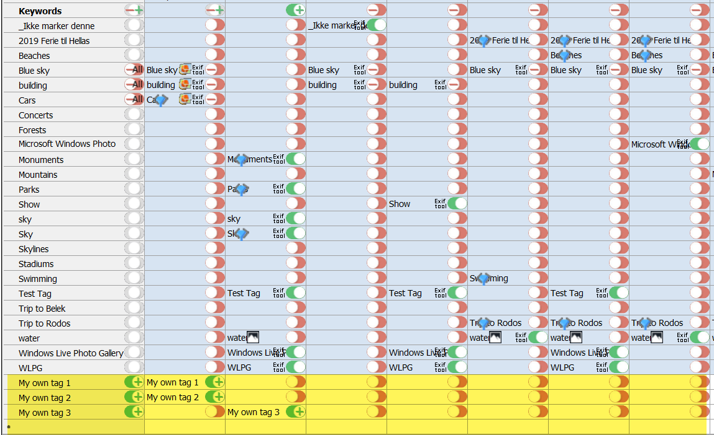

# Keyword Tags

## Media information

- Media information
  - Media
  - Album
  - Title
  - Description
  - Comments
  - Rating(1-5 stars)
  - Author

### Copy selected values to media with or without overwrite
- When source is Album, it will be pasted into Album field.
- When source is Title, it will be pasted into Title field.
- When source is Rating, it will be pasted into Rating field.

Select | Copy & Paste selection
--|--
  Select your soure |    Copy & Paste selection without overwrite exising data
   Select your soure |    Copy & Paste selection and overwrite exising data

## TriState buttons

By clicking on the TriState button you can change the state for a given cell, row, column or even all cells.

### Changing the values

- Click on the TriState button within a cell (4), to change the value for given cell (4).
- Click on the TriState button within column (2) header, to change all cells for given column (2).
- Click on the TriState button within row name (3), to change all cells for given row (3).
- Click on TriState botton on top left cell (1) to change content in all cells.

1 | 2 | 2 | 2 | 2
--|--|--|--|--
3 | 4 | 4 | 4 | 4
3 | 4 | 4 | 4 | 4
3 | 4 | 4 | 4 | 4  

### Description of button states

- TriState switch - On a keyword cells
  -  Keyword do exist exist in media file
  -  Keyword do exist in media but will be removed
  -  Keyword do not exist in media file
  -  Keyword do not exist in media file but will be added
- TriState switch - On a column or row
  -  Row and column are unchanged
  -  Something added and deleted in row or column
  -  Some keywords are removed in row or column
  -  The keyword are added for all cells in row or column
  -  The keyword are delete for all cells in row or column

### This view show what keywords are currenly saved in the media files
This you can easily see on top row and left column on the TriState switch: 

### Example of TriState switch in used
Added tags | Deleted tags
--|--
 Keyword(s) are added   |  Keyword(s) are deleted 
 All keywords are added  |  All keywords are deleted 

## Add your own keywords
In the last empty row, you can enter a new keyword you want to add.

