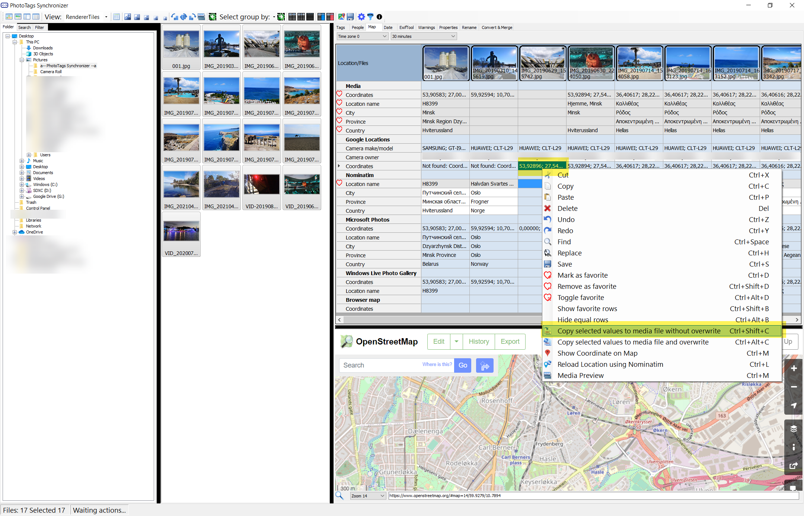
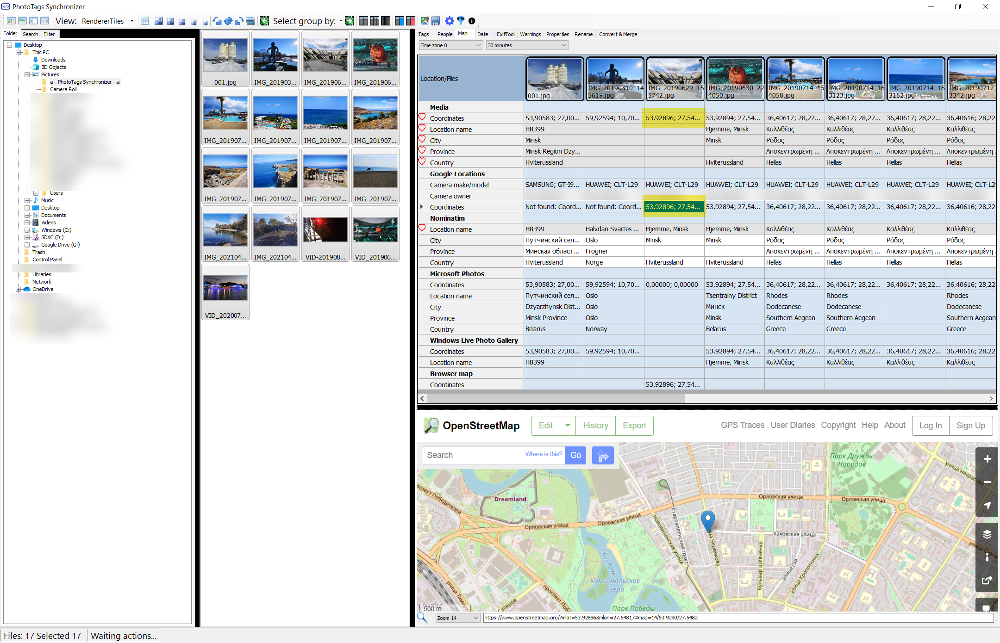
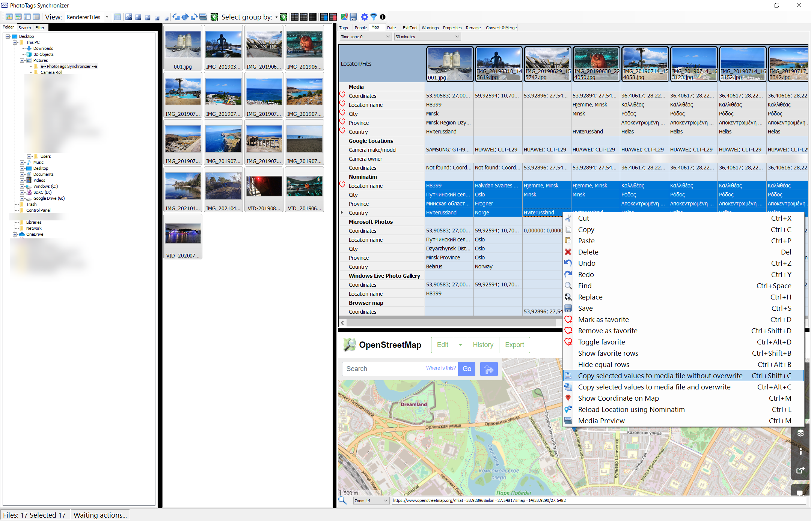
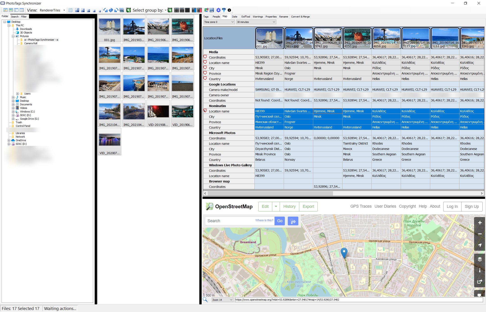
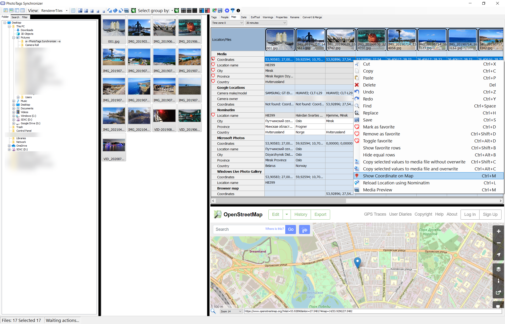
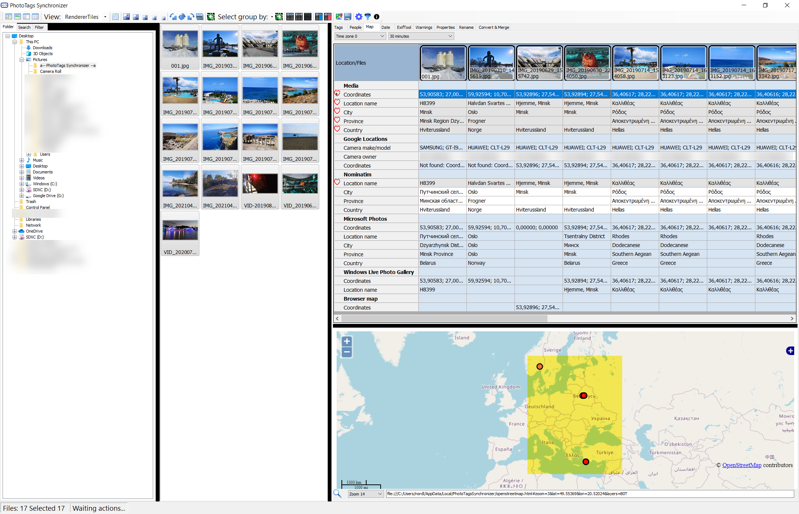
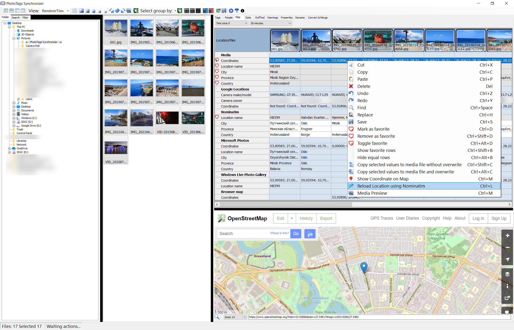
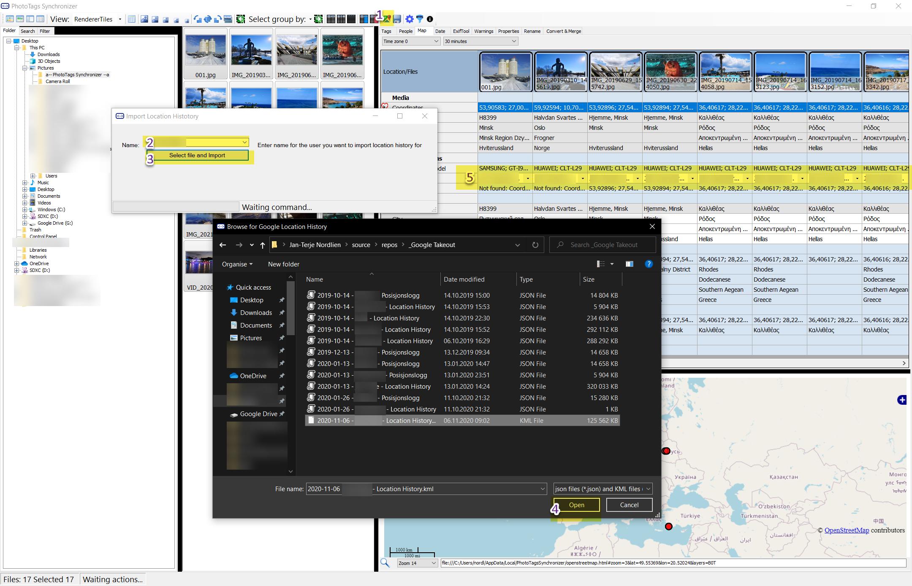
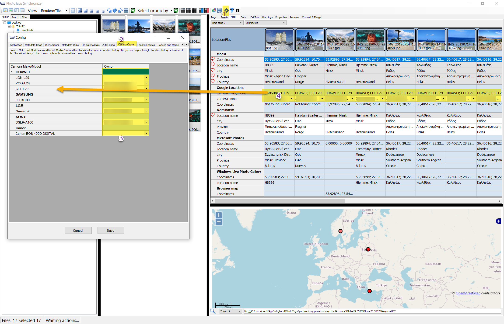
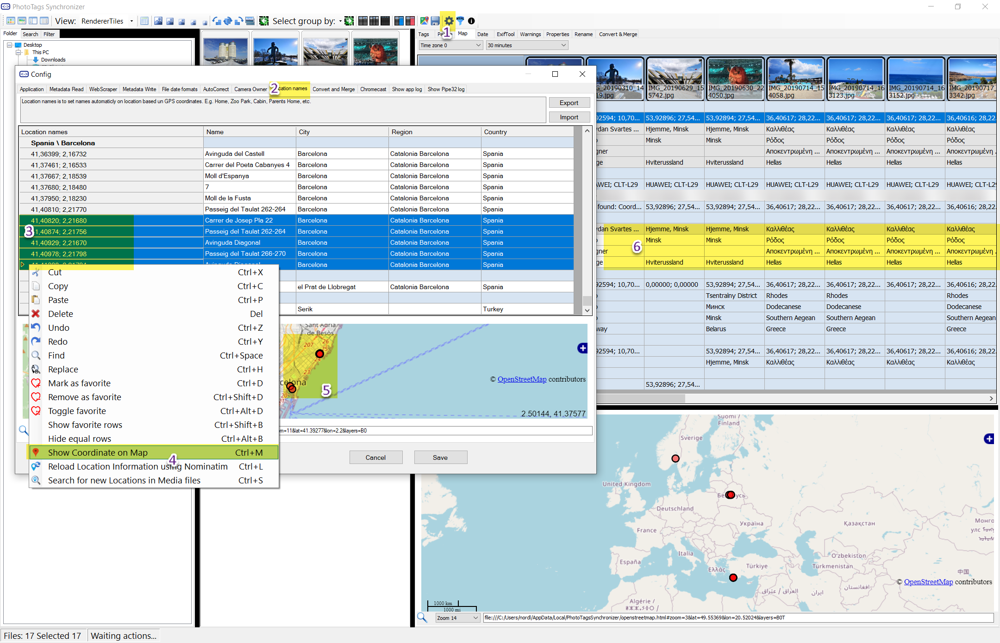

# GEOtagging

## How to GEOtag your media files

1. Meta information about GPS locations stored in the media file. When empty, no GPS location was found.
2. GPS location found in the GPS locations history you have imported for a person or persons. The person you select for camera make and model will be used what person's GPS locations history will be used.
3. Present result for GPS location found, if found in GPS locations history.
4. Using the media file GPS location coordinates a suggested location name, region/state, city and country will be presented. If you haven't create any names for given coordinates, the system will look up a suggestion using [nominatim.API](https://nominatim.org/)
5. GPS location, Location name, region/state, city and country that Microsoft Photos suggest.
6. GPS location, Location name that Windows Live Photo Gallery suggests.
7. When selecting some point in the map, the coordinates from the map will be updated and suggested in this row.
8. Here's where you can import KML or json files with UTC timestamp and GPS locations.
9. Adjust time zone and accept time difference between data and time in media file and timestamp in the imported GPS locations history.

## Copy a cell and with or without overwrite values

Select one or more cells with GPS coordinates that you want to use in your media file. Depending on what you select, all existing coordinates will be overwritten or only on media files that are missing GPS coordinates.

Select cell or cells | Result
--|--
 | 
 | 

## Show GPS locations / coordinates on the map

Select one or more GPS location coordinates that you want to show in the map.

Select cell or cells | Result
--|--
 | 

## Reload Name, Region/State, City and Contry suggestion
Select you media files coordinates for what you want to reload, and then select Reload Location information using Nominatim in the dropdown menu.

# Import Location history

# Import Location History

1. Click Import Location History button
2. Write or Select the person that owns this location history.
3. Open the File Dialog
4. Select the file KML or json file you like to import
5. The Name of the person you enter will become a position for Camera Make and Model. Then different cameras can have different location histories.
6. The Camera Owner will also be used as Author on the Meta information

# Config

## Camera Owner

1. Select config
2. Select Camera owner
3. Here you can assign all cameras with the correct name of the person who owns this camera.
4. The Camera owner can be set as Author on the media files meta information.

## Location information

1. Select config
2. Select Location Information tab
3. Select what you what to present on the map
4. Right click to get up "popup menu" and select "Show coordinates on map"
5. Here you see location on map for selected coordinates
6. The Name, Region, City and Country to have entered here will be suggested when you update your meta information for your media files.
