

# Media Preview and Chromecast

## Show Previous or Next media file

## Video only, Play or pause video file
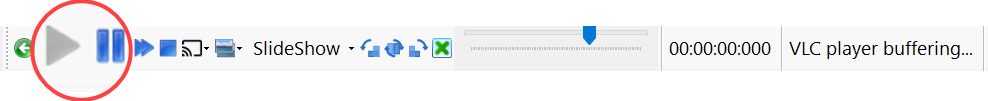

## Video only, skip -10 / +10 secounds
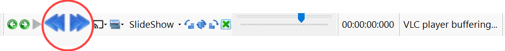

## Video only, stop playing video file
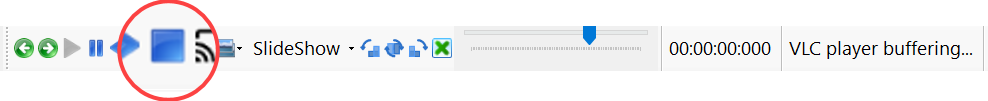

## Select and start chromecast
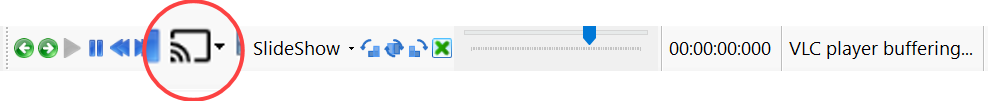

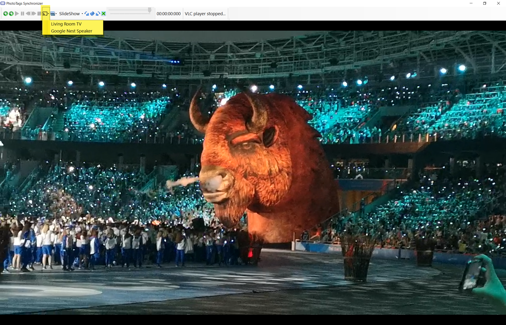

## Select what media to show

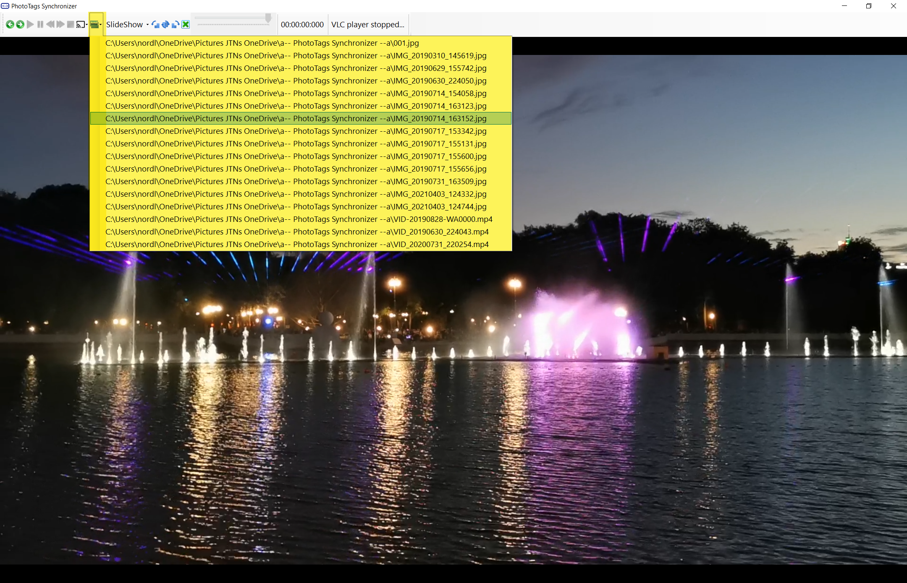

## Start slideshow
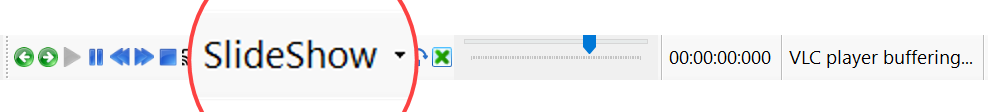

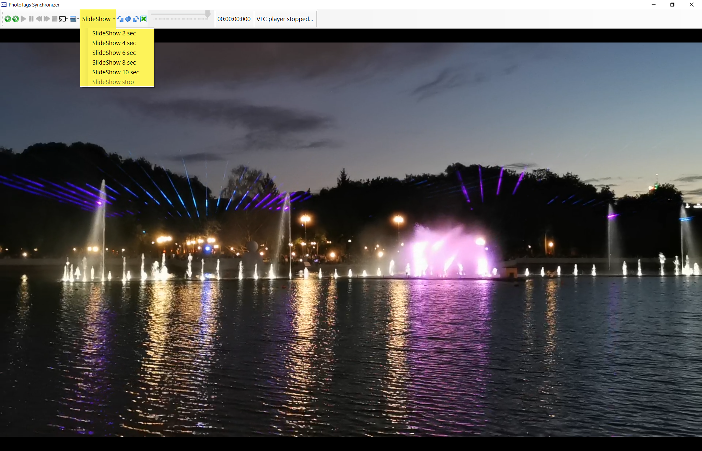

## Rotate media file without saving
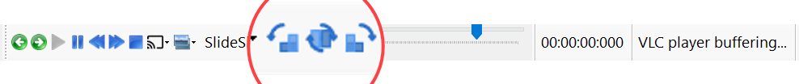

## Close the preview media mode

## Set position in video file
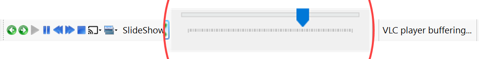

## Status and information
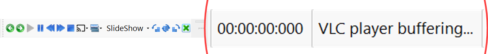


