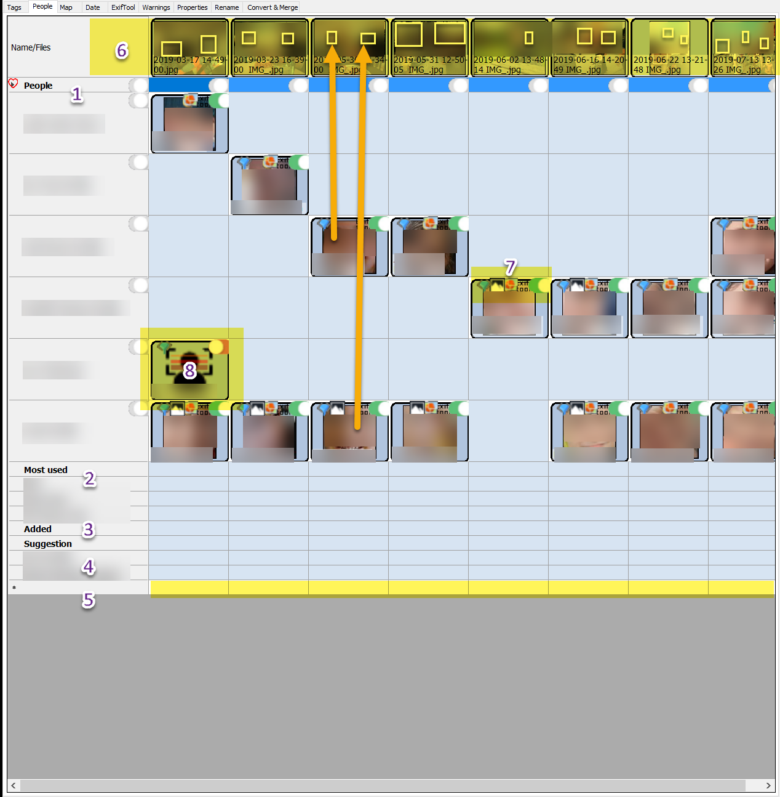
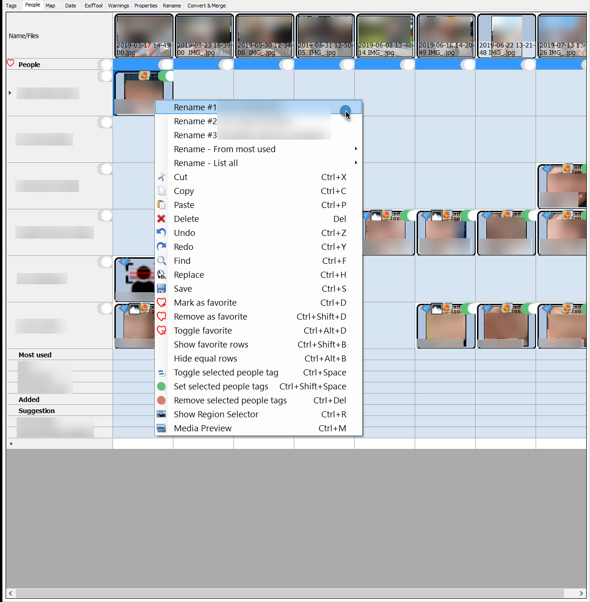
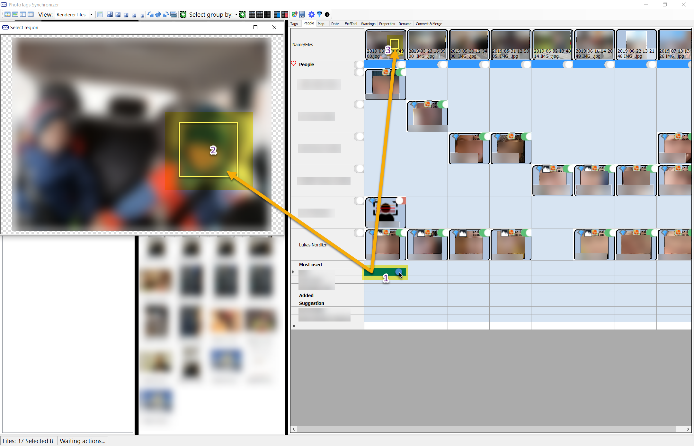

# People and Region

## People and Region user interface
1. Pepole of region names
2. Most used names
3. Added names
4. Suggestion of names
5. Free line for add new names
6. Thumbnails of picture or video files
7. Icons showing where the region are from
  - WebScraping
  - Microsoft Photos
  - Windows Live Photo Gallery
  - Meta information from Exiftool
  - TriState button

## Contect menu

## Select a region


 
{{ ../keywords/index.md }}
 
{{ ../keywords/index.html }}
