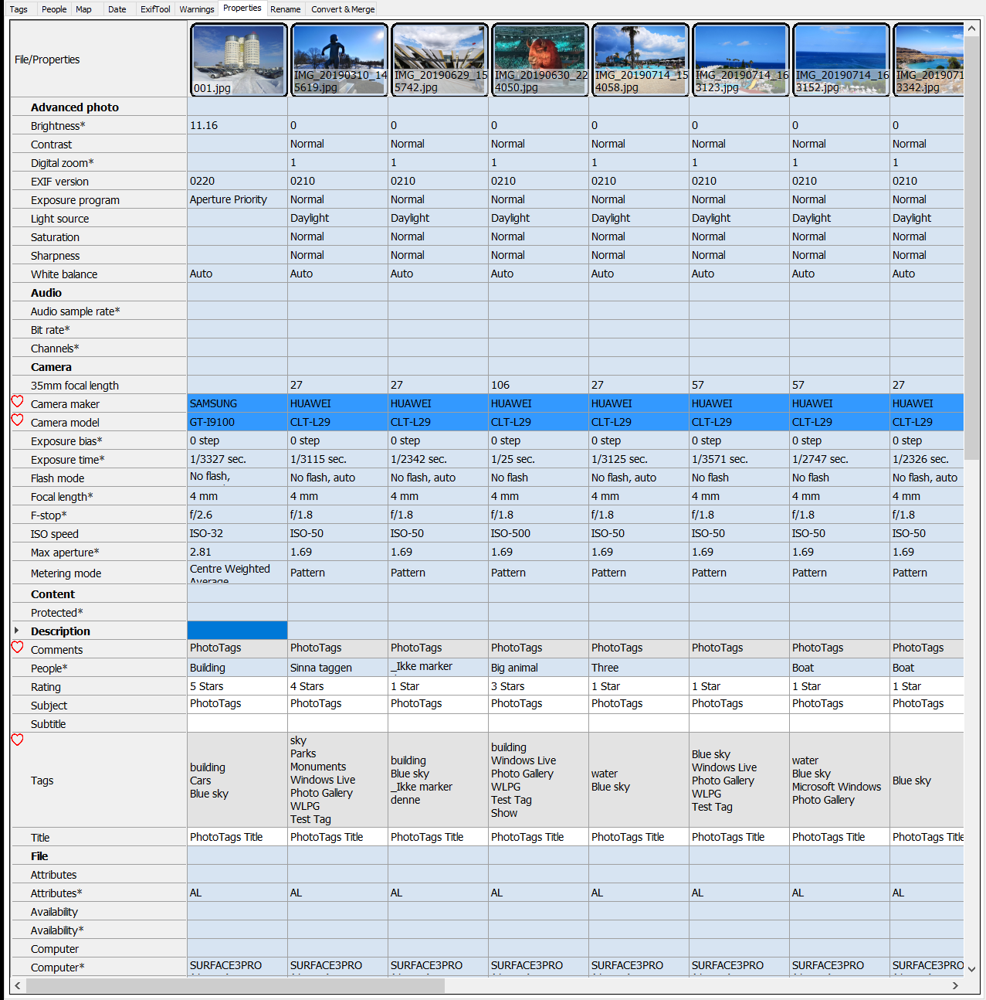



# Properties
Here you can see and edit some of Microsoft Windows Properties.

In this [User interface](../userinterface) you can aslo
- Highlight favorites
- Show and hide favorites rows
- Hide rows that has equal content


