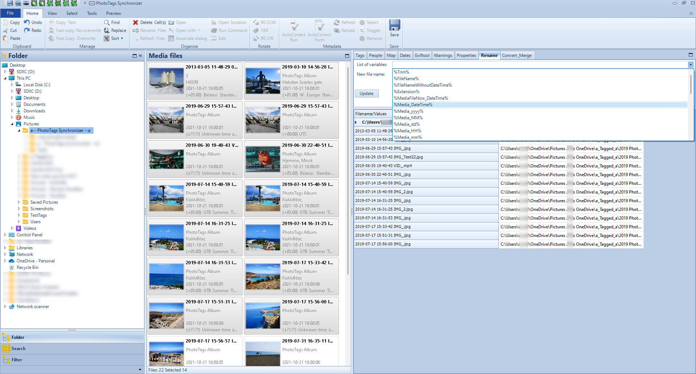

# Rename tool



## Examples:

```
Original filename:
C:\Pictures\  1999-01-01 08:35   My picture 1999-02-01 .jpg

Metadata:
Album: My album
Date Taken: 1999-01-01 08:35

Rename tool config:
%Trim%%MediaFileNow_DateTime% %FileNameWithoutDateTime%%Extension%

Result:
C:\Pictures\1999-01-01 08:35 My picture.jpg

```

```
Original filename:
C:\Pictures\My Camera\Camera rool\1999-01-01 08:35   My picture 1999-02-01 .jpg

Metadata:
Album: My album
Date Taken: 1999-01-01 08:35

Rename tool config:
..\..\%Media_yyyy%\%MediaAlbum%\%Trim%%GPS_DateTimeUTC%%MediaFileNow_DateTime% %FileNameWithoutDateTime%%Extension%

Result:
Folder change 1: ..\ -> C:\Pictures\My Camera\
Folder change 2: ..\..\ ->  -> C:\Pictures\
Folder change 3: ..\..\%Media_yyyy%\%MediaAlbum%\ -> C:\Pictures\1999\My Album\
Final: C:\Pictures\1999\My Album\1999-01-01 08:35 My picture.jpg

```

## Variables

- %Trim%
  - Removes all leading and trailing white-space characters from the file name
  - Removes double spaces
  - Removes spaces before and after _
  - Removes spaces before  .
- %FileName%
  - Original file name
- %FileNameWithoutDateTime%
  - Original filename but dates and times are removed from the original filename
- %Extension%
  - Original extension from file
- %MediaFileNow_DateTime%
  - Pick the first available date and time that exists using this format yyyy-MM-dd HH-mm-ss
  - Date and Time media taken
  - Date and Time when File is created
  - Data and time right now
- %Media_DateTime%
  - Date and Time media was taken using this format: yyyy-MM-dd HH-mm-ss
- %Media_yyyy%
  - Year when media was taken using this format: yyyy
- %Media_MM%
  - Month when media was taken using this format: MM
- %Media_dd%
  - Day when media was taken using this format: dd
- %Media_HH%
  - The hour when media was taken using this format: HH
- %Media_mm%
  - The minute when media was taken using this format: mm
- %Media_ss%
  - The second when media was taken using this format: ss
- %File_DateTime%
  - Date and Time when the file was created using this format: yyyy-MM-dd HH-mm-ss
- %File_yyyy%
  - The year when the file was created using this format: yyyy
- %File_MM%
  - The month when the file was created using this format: MM
- %File_dd%
  - The day when the file was created using this format: dd
- %File_HH%
  - The hour when the file was created using this format: HH
- %File_mm%
  - The minute when the file was created using this format: mm
- %File_ss%
  - The second when the file was created using this format: ss
- %Now_DateTime%
  - Date and Time right now using this format: yyyy-MM-dd HH-mm-ss
- %Now_yyyy%
  - The year right now using this format: yyyy
- %Now_MM%
  - The month right now using this format: MM
- %Now_dd%
  - The day right now using this format: dd
- %Now_HH%
  - The hour right now using this format: HH
- %Now_mm%
  - The minute right now using this format: mm
- %Now_ss%
  - The second right now using this format: ss
- %GPS_DateTimeUTC%
  - The GPS UTC Date and Time using this format:  yyyy-MM-dd HH-mm-ssZ
- %MediaAlbum%
  - The album name stored in the media file
- %MediaTitle%
  - The title stored in the media file
- %MediaDescription%
  - The description stored in the media file
- %MediaAuthor%
  - The author stored in the media file
- %LocationName%
  - The location name stored in the media file
- %LocationCountry%
  - The location country stored in the media file
- %LocationRegion%
  - The location state / region stored in the media file
- %LocationCity%
  - The location city stored in the media file
