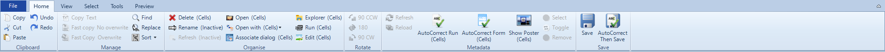
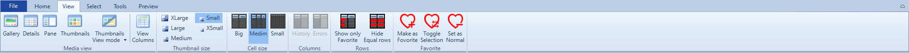
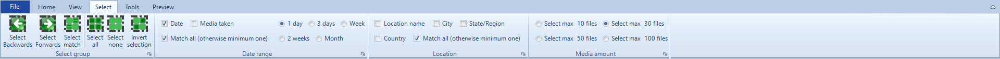
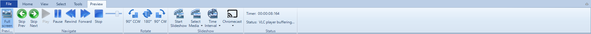



# Ribbon

## Home

### Clipboard 

Function|Folder|Files|Cells|Text
--|--|--|--|--
Cut   | x | x | x | x
Copy  | x | x | x | x
Paste | x | x | x | x
Undo  | - | - | x | x
Redo  | - | - | x | x

### Manage

Function | Folder | Files | Cells | Text
--|--|--|--|--
Copy text                   | - | x | - | -
Fast copy No overwrite      | - | - | x | -
Fast copy with overwrite    | - | - | x | -
Find                        | - | x | x | x
Replace (Cells)             | - | - | - | x
Sort                        | - | x | - | -

- Copy text: 
  - Copy folder or media file path/name, 
- Fast copy with/no overwrite
  - Copy set of cells from one location to correct media location
  - Example: If selected many album names, and titles from every selection will be paste on album -> album, title -> title

### Organise 

Function | Folder | Files | Cells | Text
--|--|--|--|--
Delete | x | x | x | -
Rename | x | x | x | -
Refresh | x | x | - | -
Open | - | x | - | -
Open with... | - | x | - | -
Associate dialog | - | x | x | -
Explorer | - | x | - | -
Run | - | x | - | -
Edit | x | x | x | -

### Rotate

Function | Folder | Files | Cells | Text
--|--|--|--|--
90 | x | x | - | -
180 | x | x | - | -
270 | x | x | - | -

### Metadata

Function | Folder | Files | Cells | Text
--|--|--|--|--
Refresh             | x | x | x | -
Reload              | x | x | x | -
AutoCorrect Run     | x | x | x | -
AutoCorrect Form    | x | x | x | -
Show Poster         | x | x | x | -
Select              | - | - | x | -
Toggle              | - | - | x | -
Remove              | - | - | x | -

### Save

Function | Folder | Files | Cells | Text
--|--|--|--|--
Save                    | - | - | x | -
AutoCorrect then save   | - | - | x | -

## View

### Media view

Function | Folder | Files | Cells | Text
--|--|--|--|--
Gallery                 | - | x | - | -
Details                 | - | x | - | -
Pane                    | - | x | - | -
Thumbnails              | - | x | - | -
Thumbnails View mode    | - | x | - | -
View Columns            | - | x | - | -

View Columns set fields for
- Details view
- Thumbnails title view

### Thumbnail size

Function | Folder | Files | Cells | Text
--|--|--|--|--
XLarge  | - | x | - | -
Large   | - | x | - | -
Medium  | - | x | - | -
Small   | - | x | - | -
XSmall  | - | x | - | -

### Cell size

Function | Folder | Files | Cells | Text
--|--|--|--|--
Big     | - | - | X | -
Medium  | - | - | X | -
Small   | - | - | X | -

### Columns

Function | Folder | Files | Cells | Text
--|--|--|--|--
History | - | - | X | -
Errors  | - | - | X | -

### Rows
Function | Folder | Files | Cells | Text
--|--|--|--|--
Show only Favorite  | - | - | X | -
Hide equal rows     | - | - | X | -

### Favorite

Function | Folder | Files | Cells | Text
--|--|--|--|--
Mark as Favorite    | - | - | X | -
Toggle as Favorite  | - | - | X | -
Set as Normal       | - | - | X | -

## Select

### Select group

Function | Folder | Files | Cells | Text
--|--|--|--|--
Select backwards    | - | x | - | -
Select forwards     | - | x | - | -
Select match        | - | x | - | -
Select all          | - | x | - | -
Select none         | - | x | - | -

### Date Range
Function | Folder | Files | Cells | Text
--|--|--|--|--
Date            | - | x | - | -
Media taken     | - | x | - | -
Macth all       | - | x | - | -
1 day           | - | x | - | -
3 days          | - | x | - | -
Week            | - | x | - | -
2 weeks         | - | x | - | -
Month           | - | x | - | -

### Location 

Function | Folder | Files | Cells | Text
--|--|--|--|--
Location name   | - | x | - | -
City            | - | x | - | -
State/Region    | - | x | - | -
Country         | - | x | - | -      
Mach all        | - | x | - | -

### Media amount

Function | Folder | Files | Cells | Text
--|--|--|--|--
Select max 10 files     | - | x | - | -
Select max 30 files     | - | x | - | -
Select max 50 files     | - | x | - | -
Select max 100 files    | - | x | - | -

## Tools

### Import Tools

- Import locations
- Location Analytics
- Web Scraping
- Database Cleaning

### Help

- Config 
- About

### Processes and workload statuses

- Task list

## Preview

### Preview

- Fullscreen 

### Navigate

- Skip Prev
- Skip Next
- Play
- Pause
- Rewind
- Forward
- Stop

### Rotate
- 90
- 180
- 270

### Slideshow
- Start slideshow
- Select media
- Time interval
- Chromecast

### Status
- Time
- Status

## See also
- See also [Image List View](../imagelistview)
- See also [Grid view](../gridview)
- See also [Import GPS locations](../import-gps-locations)
- See also [Save](../save)
- See also [Config](../config)
- See also [WebScraping](../webscraping)


