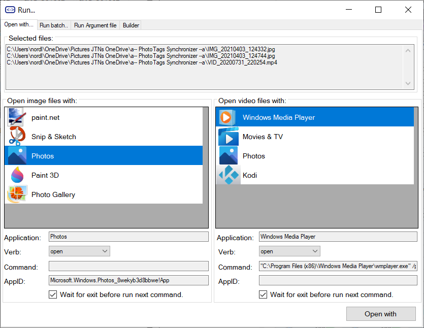
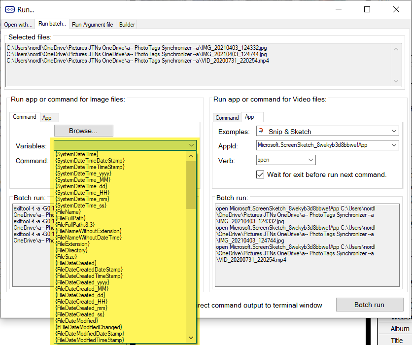



# Run batch

## Open with...

In this tab you can select a command, or app you want to run for each media file.

Open with | Select verb
--|--
Select what to open the media file with <br>  | Select what verb to use when opening a media file. Often used Verbs are 'Open' or 'Edit' <br>

## Run batch...

In this tab you can browse for your command tools, or select the app from a list that you want to run for each media file.

Command or App  | What to run | How to run
--|--|--
Command line to run <br>  | Enter path for command tool or browser for it <br>  | Select or enter your variables for your command 
App to run  | Enter your app id or select from list <br>  | Select verb for running the app <br> 

### Example command with parameter variables

When using parameter variables, the parameter variables will be exchanged with the information from meta information inside the media file.

```
exiftool -t -a -G0:1 -s -n -P -struct "{FileFullPath}"
"C:\Program files\Exiftool\exiftool" -t -a -G0:1 -s -n -P -struct "{FileFullPath}"
cmd.exe /K exiftool -t -a -G0:1 -s -n -P -struct "{FileFullPath}"
cmd.exe /K /C exiftool -t -a -G0:1 -s -n -P -struct "{FileFullPath}"
explorer ms-photos?filename="{FileFullPath}"
```

### Example of tools

Using your favorite tools in your batch process:

- Video
  - [ffmpeg](https://www.ffmpeg.org/) / [Documentation](https://ffmpeg.org/ffmpeg.html)
  - [handbrake](https://handbrake.fr/) / [CLI Options](https://handbrake.fr/docs/en/latest/cli/cli-options.html)
  - [MP4Box](https://github.com/gpac/gpac/wiki/MP4Box) / [Wiki](https://github.com/gpac/gpac/wiki/MP4Box)
  - [mkvtoolnix](https://mkvtoolnix.download/) / [mkvmerge](https://mkvtoolnix.download/doc/mkvmerge.html)
- Photo
  - [ImageMagick](https://imagemagick.org/) / [Command line](https://imagemagick.org/script/command-line-tools.php)
  - [Gimp](https://www.gimp.org/tutorials/Basic_Batch/) / [Command line](https://www.gimp.org/tutorials/Basic_Batch/)
  - [IrfanView](https://www.irfanview.com/) / [Command line](https://www.etcwiki.org/wiki/IrfanView_Command_Line_Options)
  - [XnView](https://www.xnview.com/) / [Command line](https://www.xnview.com/wiki/index.php/Command_Line_Operations)

## Exiftool Argument file

### Run Exiftool with argument file

Created from [Config](../config) and [edited fields](../gridview) | Created from [Config](../config) and [AutoCorrect](../autocorrect)
--|--
 | 

### Compare result between data from [Grid View](../gridview) and [AutoCorrect](../autocorrect)


## Exiftool Argument file builder


### Example of variables that can be used as parameter

```

FileName/Folder/Path - Values Original i the media file
{IfFileNameChanged}
{FileName}
{IfFilePathChanged}
{FileFullPath}
{FileFullPath.8.3}
{FileNameWithoutExtension}
{FileNameWithoutExtensionDateTime}
{FileNameWithoutExtensionDateTimeComputerName}
{FileNameWithoutExtensionDateTimeGPStag}
{FileNameWithoutExtensionDateTimeComputerNameGPStag}
{FileNameWithoutExtensionComputerName}
{FileNameWithoutExtensionComputerNameGPStag}
{FileNameWithoutExtensionGPStag}
{FileNameWithoutDateTime}
{FileNameWithoutDateTimeComputerName}
{FileNameWithoutDateTimeGPStag}
{FileNameWithoutDateTimeComputerNameGPStag}
{FileNameWithoutComputerName}
{FileNameWithoutComputerNameGPStag}
{FileNameWithoutGPStag}
{FileExtension}
{IfFileDirectoryChanged}
{FileDirectory}

FileAttributes - Values Original i the media file
{FileSize}
{FileMimeType}

FileName/Folder/Path - Values Original i the media file
{IfFileNameChanged}
{OriginalFileName}
{IfFilePathChanged}
{OriginalFileFullPath}
{OriginalFileFullPath.8.3}
{OriginalFileNameWithoutExtension}
{OriginalFileNameWithoutExtensionDateTime}
{OriginalFileNameWithoutExtensionDateTimeComputerName}
{OriginalFileNameWithoutExtensionDateTimeGPStag}
{OriginalFileNameWithoutExtensionDateTimeComputerNameGPStag}
{OriginalFileNameWithoutExtensionComputerName}
{OriginalFileNameWithoutExtensionComputerNameGPStag}
{OriginalFileNameWithoutExtensionGPStag}
{OriginalFileNameWithoutDateTime}
{OriginalFileNameWithoutDateTimeComputerName}
{OriginalFileNameWithoutDateTimeGPStag}
{OriginalFileNameWithoutDateTimeComputerNameGPStag}
{OriginalFileNameWithoutComputerName}
{OriginalFileNameWithoutComputerNameGPStag}
{OriginalFileNameWithoutGPStag}
{OriginalFileExtension}
{IfFileDirectoryChanged}
{OriginalFileDirectory}

FileDate - New values to be stored in media file
{FileDate}
{FileDateDateStamp}
{FileDateTimeStamp}
{FileDate_yyyy}
{FileDate_MM}
{FileDate_dd}
{FileDate_HH}
{FileDate_mm}
{FileDate_ss}

FileDate - Values Original i the media file
{OriginalFileDate}
{OriginalFileDateDateStamp}
{OriginalFileDateTimeStamp}
{OriginalFileDate_yyyy}
{OriginalFileDate_MM}
{OriginalFileDate_dd}
{OriginalFileDate_HH}
{OriginalFileDate_mm}
{OriginalFileDate_ss}

FileDateCreated - New values to be stored in media file
{FileDateCreated}
{FileDateCreatedDateStamp}
{FileDateCreatedTimeStamp}
{FileDateCreated_yyyy}
{FileDateCreated_MM}
{FileDateCreated_dd}
{FileDateCreated_HH}
{FileDateCreated_mm}
{FileDateCreated_ss}

FileDateCreated - Values Original i the media file
{OriginalFileDateCreated}
{OriginalFileDateCreatedDateStamp}
{OriginalFileDateCreatedTimeStamp}
{OriginalFileDateCreated_yyyy}
{OriginalFileDateCreated_MM}
{OriginalFileDateCreated_dd}
{OriginalFileDateCreated_HH}
{OriginalFileDateCreated_mm}
{OriginalFileDateCreated_ss}

FileDateModified - New values to be stored in media file
{IfFileDateModifiedChanged}
{FileDateModified}
{FileDateModifiedDateStamp}
{FileDateModifiedTimeStamp}
{FileDateModified_yyyy}
{FileDateModified_MM}
{FileDateModified_dd}
{FileDateModified_HH}
{FileDateModified_mm}
{FileDateModified_ss}

FileDateModified - Values Original i the media file
{IfFileDateModifiedChanged}
{OriginalFileDateModified}
{OriginalFileDateModifiedDateStamp}
{OriginalFileDateModifiedTimeStamp}
{OriginalFileDateModified_yyyy}
{OriginalFileDateModified_MM}
{OriginalFileDateModified_dd}
{OriginalFileDateModified_HH}
{OriginalFileDateModified_mm}
{OriginalFileDateModified_ss}

Personal - New values to be stored in media file
{PersonalTitle}
{IfPersonalDescriptionChanged}
{PersonalDescription}
{IfPersonalCommentsChanged}
{PersonalComments}
{IfPersonalRatingChanged}
{PersonalRating}   
{PersonalRatingPercent}
{PersonalAuthor}
{IfPersonalAuthorChanged}
{IfPersonalAlbumChanged}
{PersonalAlbum}

Personal - Values Original i the media file
{IfPersonalTitleChanged}
{OriginalPersonalTitle}
{IfPersonalDescriptionChanged}
{OriginalPersonalDescription}
{IfPersonalCommentsChanged}
{OriginalPersonalComments}
{IfPersonalRatingChanged}
{OriginalPersonalRating}
{OriginalPersonalRatingPercent}
{IfPersonalAuthorChanged}
{OriginalPersonalAuthor}
{IfPersonalAlbumChanged}
{OriginalPersonalAlbum}

Region - New values to be stored in media file
{IfPersonalRegionChanged}");
{PersonalRegionInfoMP}
{PersonalRegionInfo}

Region - Values Original i the media file
{IfPersonalRegionChanged}
{OriginalPersonalRegionInfoMP}
{OriginalPersonalRegionInfo}

Keyword - New values to be stored in media file
{KeywordItem}
{IfPersonalKeywordsChanged}
{PersonalKeywordsList}
{PersonalKeywordsXML}
{PersonalKeywordItemsDelete}
{PersonalKeywordItemsAdd}

Keyword - Values Original i the media file
{OriginalKeywordItem}
{IfPersonalKeywordsChanged}
{OriginalPersonalKeywordsList}
{OriginalPersonalKeywordsXML}");
{OriginalPersonalKeywordItemsDelete}
{OriginalPersonalKeywordItemsAdd}

Camera - New values to be stored in media file
{CameraMake}
{CameraModel}

Camera - Values Original i the media file
{OriginalCameraMake}
{OriginalCameraModel}

Media - New values to be stored in media file
{IfMediaDateTakenChanged}
{MediaDateTaken}
{MediaDateTakenDateStamp}
{MediaDateTakenTimeStamp}
{MediaDateTaken_yyyy}
{MediaDateTaken_MM}
{MediaDateTaken_dd}
{MediaDateTaken_HH}
{MediaDateTaken_mm}
{MediaDateTaken_ss}
{MediaHeight}
{MediaOrientation}
{MediaVideoLength}

Media - Values Original i the media file
{IfMediaDateTakenChanged}
{OriginalMediaDateTaken}
{OriginalMediaDateTakenDateStamp}
{OriginalMediaDateTakenTimeStamp}
{OriginalMediaDateTaken_yyyy}
{OriginalMediaDateTaken_MM}
{OriginalMediaDateTaken_dd}
{OriginalMediaDateTaken_HH}
{OriginalMediaDateTaken_mm}
{OriginalMediaDateTaken_ss}
{OriginalMediaWidth}
{OriginalMediaHeight}
{OriginalMediaOrientation}
{OriginalMediaVideoLength}

Location - New values to be stored in media file
{IfLocationChanged}"
{IfLocationAltitudeChanged}
{LocationAltitude}"
{IfLocationLatitudeChanged}
{LocationLatitude}
{IfLocationLongitudeChanged}
{LocationLongitude}
{IfLocationDateTimeChanged}
{LocationDateTime}
{LocationDateTimeUTC}
{LocationDateTimeDateStamp}
{LocationDateTimeTimeStamp}
{LocationDateTime_yyyy}
{LocationDateTime_MM}
{LocationDateTime_dd}
{LocationDateTime_HH}
{LocationDateTime_mm}
{LocationDateTime_ss}
{IfLocationNameChanged}
{LocationName}
{IfLocationCityChanged}
{LocationCity}
{IfLocationStateChanged}
{LocationState}
{IfLocationCountryChanged}
{LocationCountry}

Location - Values Original i the media file
{IfLocationChanged}
{IfLocationAltitudeChanged}
{OriginalLocationAltitude}
{IfLocationLatitudeChanged}
{OriginalLocationLatitude}
{IfLocationLongitudeChanged}
{OriginalLocationLongitude}
{IfLocationDateTimeChanged}
{OriginalLocationDateTime}
{OriginalLocationDateTimeUTC}
{OriginalLocationDateTimeDateStamp}
{OriginalLocationDateTimeTimeStamp}
{OriginalLocationDateTime_yyyy}
{OriginalLocationDateTime_MM}
{OriginalLocationDateTime_dd}
{OriginalLocationDateTime_HH}
{OriginalLocationDateTime_mm}
{OriginalLocationDateTime_ss}
{IfLocationNameChanged}
{OriginalLocationName}
{IfLocationCityChanged}
{OriginalLocationCity}
{IfLocationStateChanged}
{OriginalLocationState}
{IfLocationCountryChanged}
{OriginalLocationCountry}


```



