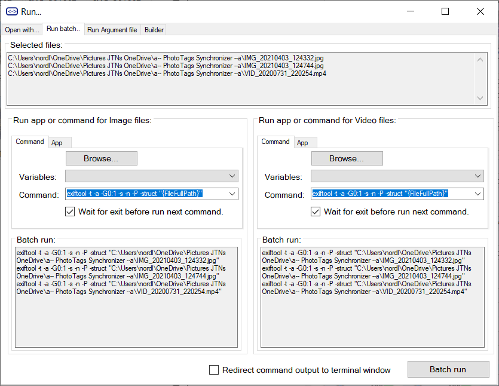



# Run batch

## Open with...

In this tab you can select a command, or app you want to run for each media file.

Open with | Select verb
--|--
Select what to open the media file with <br>  | Select what verb to use when opening a media file. Often used Verbs are 'Open' or 'Edit' <br>

## Run batch...

In this tab you can browse for your command tools, or select the app from a list that you want to run for each media file.

Command or App  | What to run | How to run
--|--|--
Command line to run <br>  | Enter path for command tool or browser for it <br>  | Select or enter your variables for your command 
App to run  | Enter your app id or select from list <br>  | Select verb for running the app <br> 

### Example command with parameter variables

When using parameter variables, the parameter variables will be exchanged with the information from meta information inside the media file.

```
exiftool -t -a -G0:1 -s -n -P -struct "{FileFullPath}"
"C:\Program files\Exiftool\exiftool" -t -a -G0:1 -s -n -P -struct "{FileFullPath}"
cmd.exe /K exiftool -t -a -G0:1 -s -n -P -struct "{FileFullPath}"
cmd.exe /K /C exiftool -t -a -G0:1 -s -n -P -struct "{FileFullPath}"
explorer ms-photos?filename="{FileFullPath}"
```

### Example of tools

Using your favorite tools in your batch process:

- Video
  - [ffmpeg](https://www.ffmpeg.org/) / [Documentation](https://ffmpeg.org/ffmpeg.html)
  - [handbrake](https://handbrake.fr/) / [CLI Options](https://handbrake.fr/docs/en/latest/cli/cli-options.html)
  - [MP4Box](https://github.com/gpac/gpac/wiki/MP4Box) / [Wiki](https://github.com/gpac/gpac/wiki/MP4Box)
  - [mkvtoolnix](https://mkvtoolnix.download/) / [mkvmerge](https://mkvtoolnix.download/doc/mkvmerge.html)
- Photo
  - [ImageMagick](https://imagemagick.org/) / [Command line](https://imagemagick.org/script/command-line-tools.php)
  - [Gimp](https://www.gimp.org/tutorials/Basic_Batch/) / [Command line](https://www.gimp.org/tutorials/Basic_Batch/)
  - [IrfanView](https://www.irfanview.com/) / [Command line](https://www.etcwiki.org/wiki/IrfanView_Command_Line_Options)
  - [XnView](https://www.xnview.com/) / [Command line](https://www.xnview.com/wiki/index.php/Command_Line_Operations)

## Exiftool Argument file

### Run Exiftool with argument file

Created from [Config](../config) and [edited fields](../gridview) | Created from [Config](../config) and [AutoCorrect](../autocorrect)
--|--
 | 

### Compare result between data from [Grid View](../gridview) and [AutoCorrect](../autocorrect)


## Exiftool Argument file builder


### Example of variables that can be used as parameter

```
System
{SystemDateTime}
{SystemDateTimeDateStamp}
{SystemDateTimeTimeStamp}
{SystemDateTime_yyyy}
{SystemDateTime_MM}
{SystemDateTime_dd}
{SystemDateTime_HH}
{SystemDateTime_mm}
{SystemDateTime_ss}

Filesystem
{FileName}
{FileFullPath}
{FileFullPath.8.3}
{FileNameWithoutExtension}
{FileNameWithoutDateTime}
{FileExtension}
{FileDirectory}
{FileSize}
{FileDate}
{FileDateDateStamp}
{FileDateTimeStamp}
{FileDate_yyyy}
{FileDate_MM}
{FileDate_dd}
{FileDate_HH}
{FileDate_mm}
{FileDate_ss}
{FileDateCreated}
{FileDateCreatedDateStamp}
{FileDateCreatedTimeStamp}
{FileDateCreated_yyyy}
{FileDateCreated_MM}
{FileDateCreated_dd}
{FileDateCreated_HH}
{FileDateCreated_mm}
{FileDateCreated_ss}
{FileDateModified}
{FileDateModifiedDateStamp}
{FileDateModifiedTimeStamp}
{FileDateModified_yyyy}
{FileDateModified_MM}
{FileDateModified_dd}
{FileDateModified_HH}
{FileDateModified_mm}
{FileDateModified_ss}
{FileLastAccessed}
{FileLastAccessedDateStamp}
{FileLastAccessedTimeStamp}
{FileLastAccessed_yyyy}
{FileLastAccessed_MM}
{FileLastAccessed_dd}
{FileLastAccessed_HH}
{FileLastAccessed_mm}
{FileLastAccessed_ss}
{FileMimeType}

Personal
{PersonalTitle}
{PersonalDescription}
{PersonalComments}
{PersonalRating}
{PersonalRatingPercent}
{PersonalAuthor}
{PersonalAlbum}

Region
{PersonalRegionInfoMP}
{PersonalRegionInfo}

Keyword
{KeywordItem}
{PersonalKeywordsList}
{PersonalKeywordsXML}
{PersonalKeywordItemsDelete}
{PersonalKeywordItemsAdd}

Camera
{CameraMake}
{CameraModel}

Media
{MediaDateTaken}
{MediaDateTakenDateStamp}
{MediaDateTakenTimeStamp}
{MediaDateTaken_yyyy}
{MediaDateTaken_MM}
{MediaDateTaken_dd}
{MediaDateTaken_HH}
{MediaDateTaken_mm}
{MediaDateTaken_ss}
{MediaWidth}
{MediaHeight}
{MediaOrientation}
{MediaVideoLength}

Location
{LocationAltitude}
{LocationLatitude}
{LocationLongitude}
{LocationDateTime}
{LocationDateTimeUTC}
{LocationDateTimeDateStamp}
{LocationDateTimeTimeStamp}
{LocationDateTime_yyyy}
{LocationDateTime_MM}
{LocationDateTime_dd}
{LocationDateTime_HH}
{LocationDateTime_mm}
{LocationDateTime_ss}
{LocationName}
{LocationCity}
{LocationState}
{LocationCountry}
```



