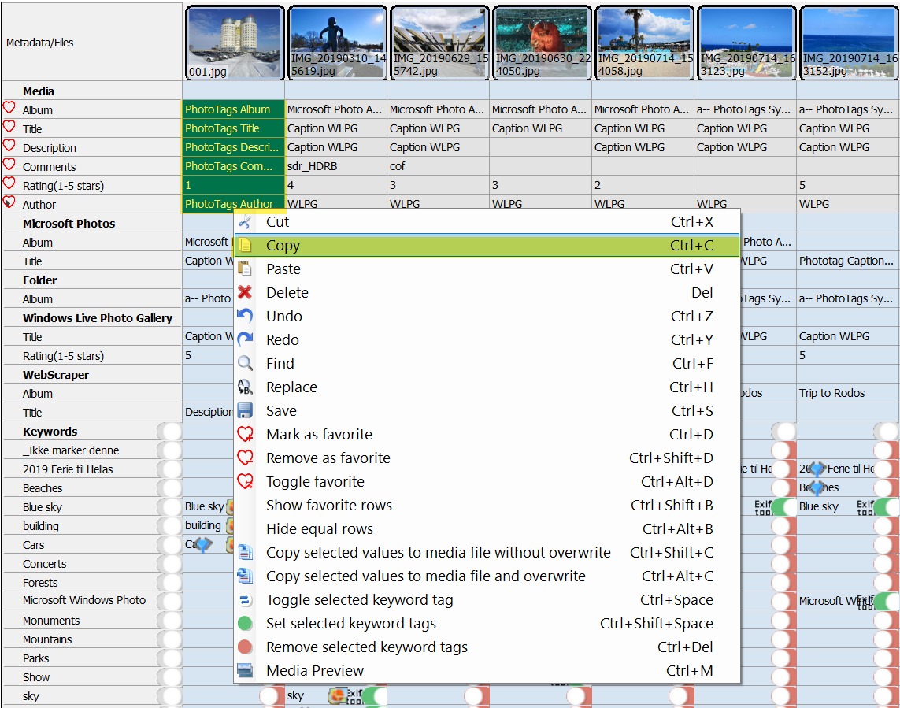
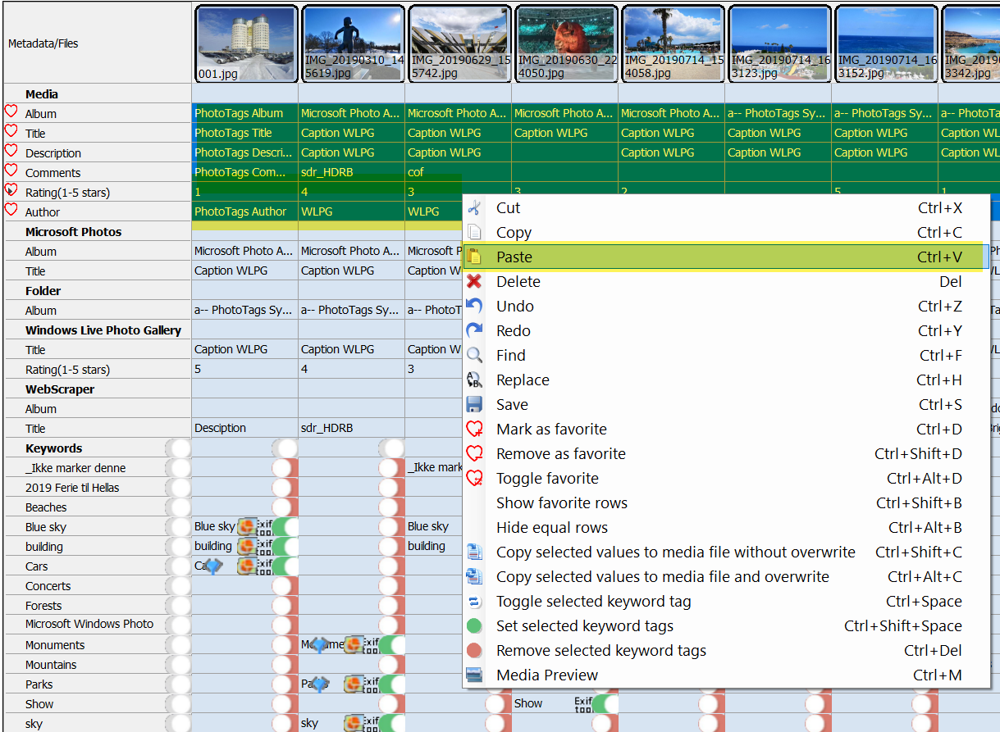



# User interface

## Fast copy and paste between media Files
You are able to copy blocks and paste them for many blocks, as long as number of row or columns are equal.

Select what to copy | Select where to paste | Result
--|--|--
 |  | 

## Show and hide historical columns

  - meta information

## Show and hide error column

- If for some reason mata data was not written, the data will be store in the database as an historical column and marked as error

## Mark favorites

- Show only favorites

## Hide equale rows
Hide all rows where values for each columns are equal
- Easy compare meta infromation between media files or find changes in historical meta information.


