

# User interface

## Bulding blocks

ToolStrip

Filters  | Result from filter   | Details view and edit for selected media files  
--|--|--

Statusbar

## Fast copy and paste between media files
You are able to copy blocks and paste them for many blocks, as long as number of row or columns are equal.

Select what to copy | Select where to paste | Result
--|--|--
 |  | 

## Show and hide historical and errors columns
Every time meta information is read the ole information will be keep in the database and new infomration will be created in the database.

If for some reason meta information was not written correctly, the data will be store in the database as an historical column and marked as error

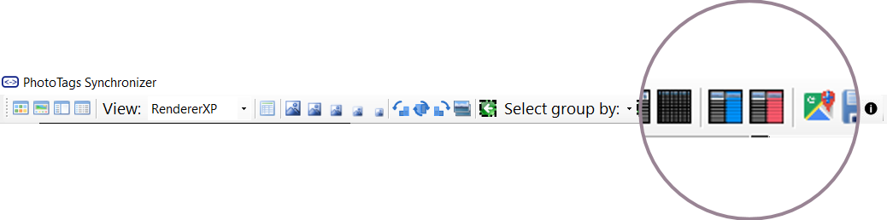

History | Errors | History and errors
--|--|--
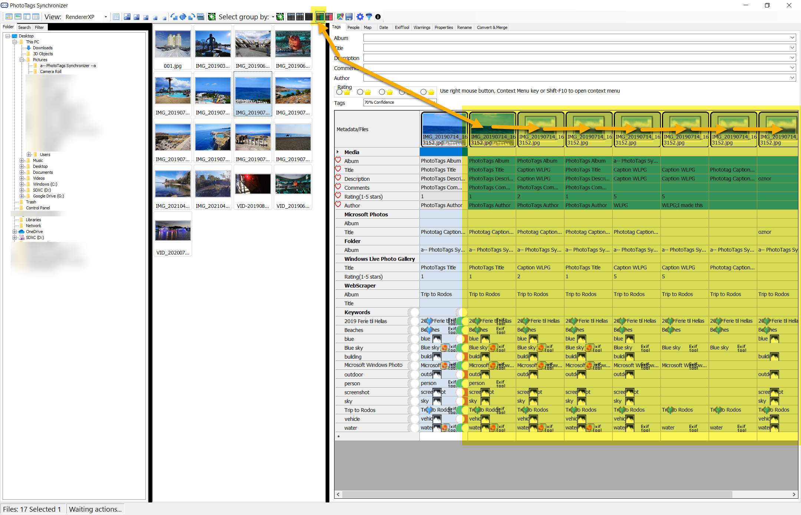 | 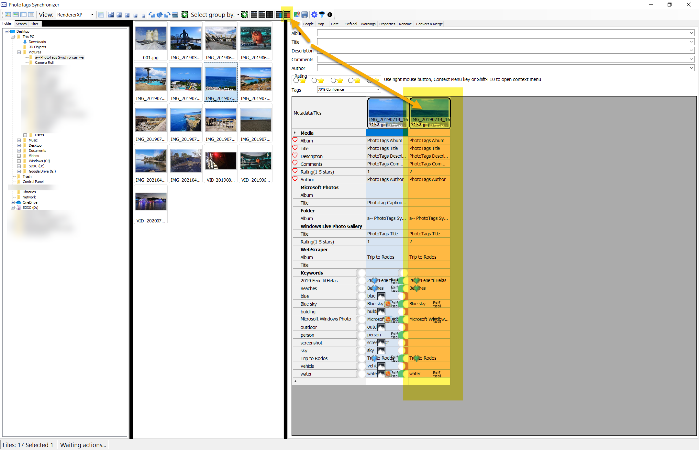 | 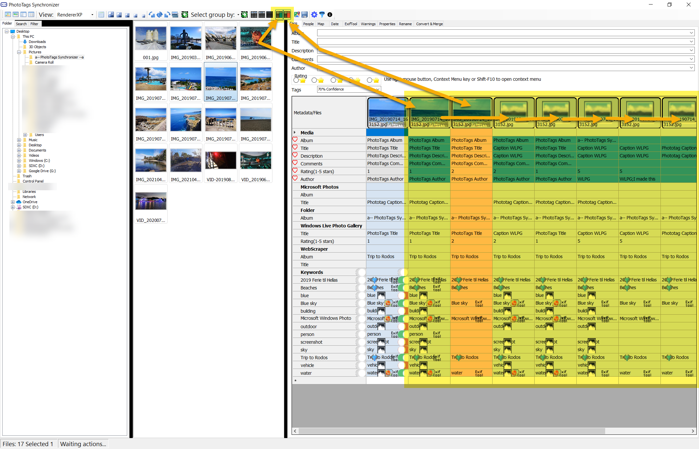

## Mark favorites and hide rows with Equal values
Hide all rows where values for each columns are equal
- Easy compare meta infromation between media files or find changes in historical meta information.

## Grid size

There is 3 diffrent grid view sizes that can easly switch between. Small for getting an overview or larg to see more details, and medium for a combine overview and details.

Small | Medium | Large
--|--|--
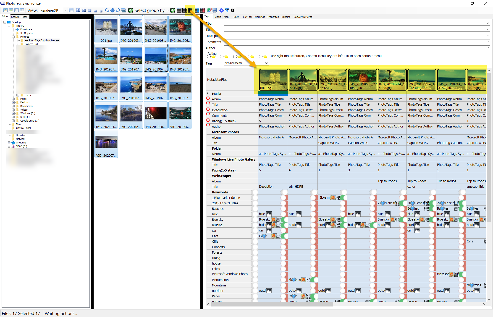 | 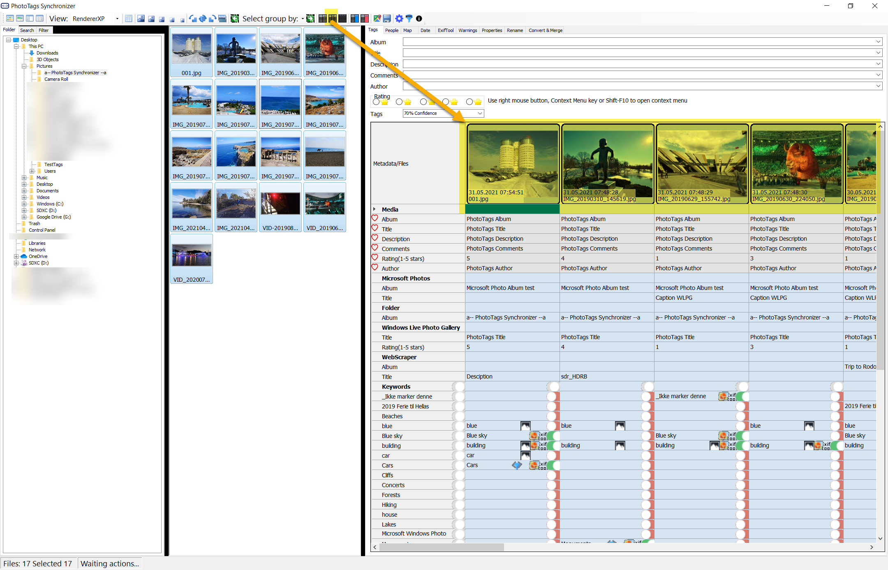 | 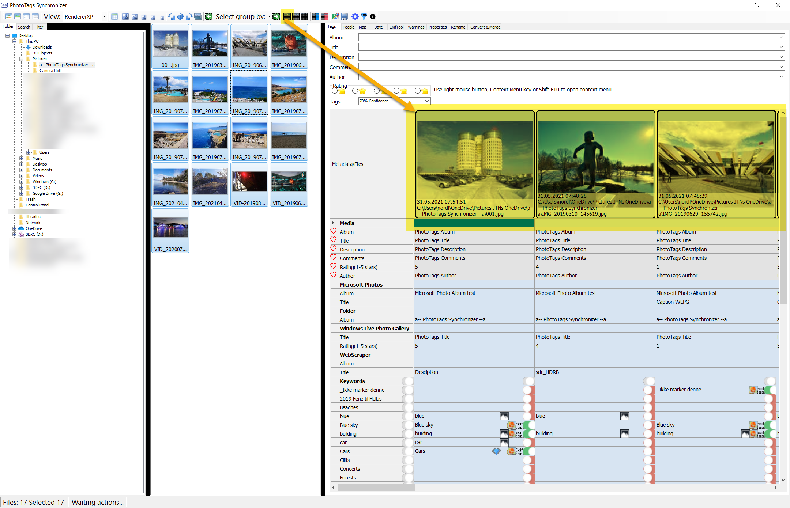

## Thumbnail sizes

You can adjust the thumbnail size so it fits your needs. There are 5 different size to choose from.

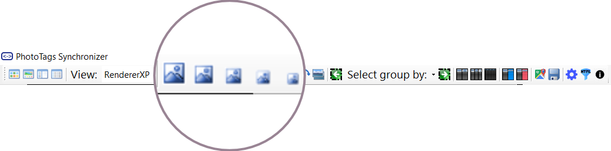

Example of diffrent thumbnail sizes.

Extra small | Small | Medium | Large | Extra Large
--|--|--|--|--
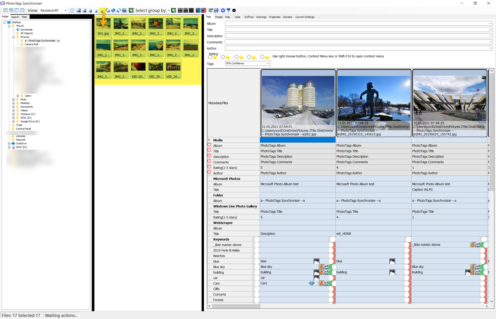 | 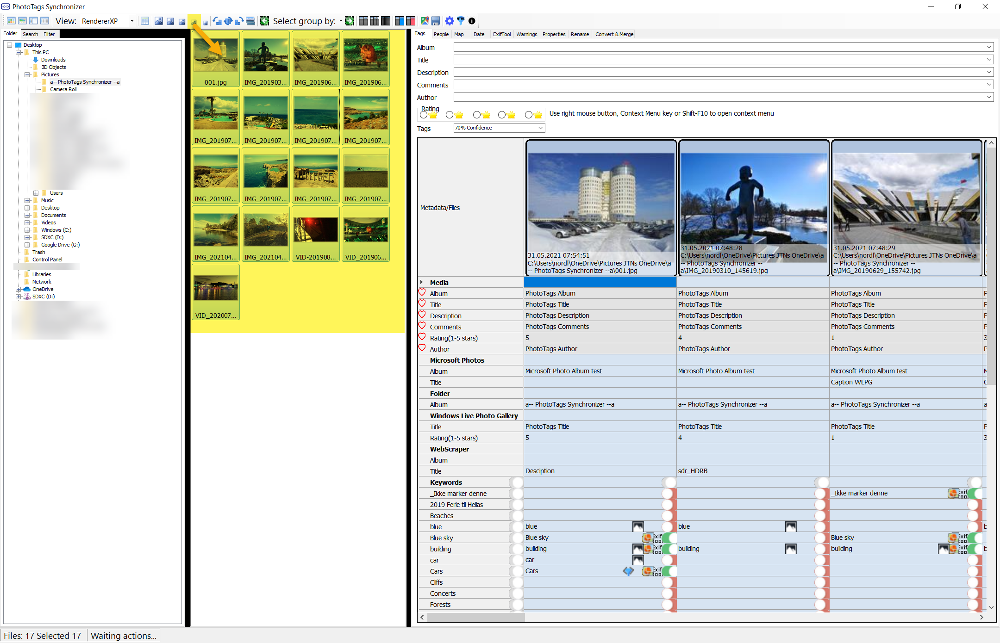 | 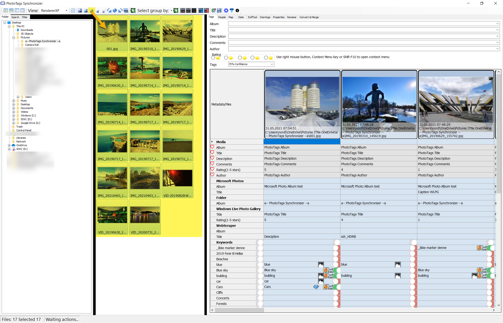 | 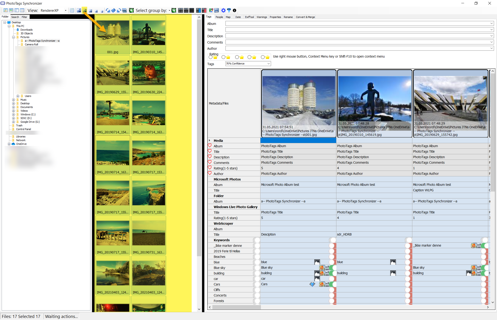 | 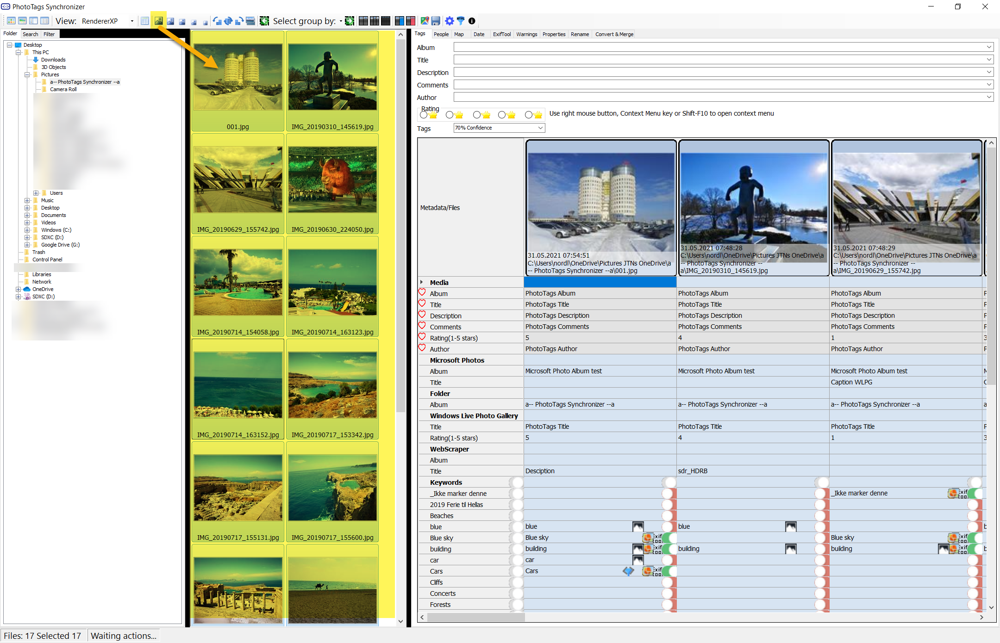

## Image List View layout


