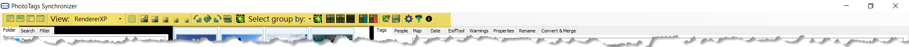
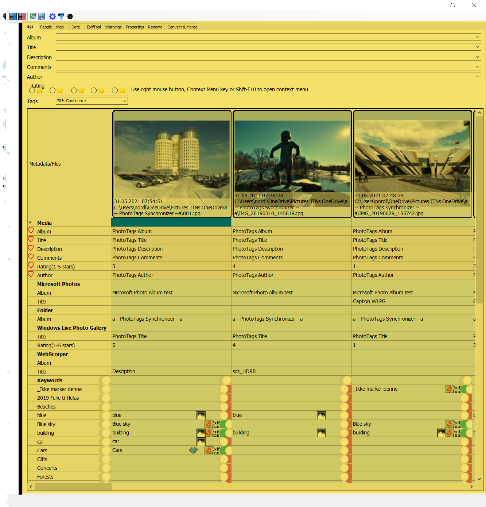
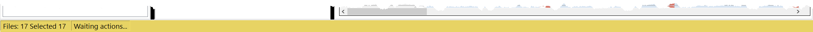



# User interface

## Bulding blocks

1. ToolStrip
2. [Filters](..\filters)
3. [Image List View](..\imagelistview)
4. [Grid view](..\gridview)
5. Statusbar

### 1. ToolStrip

### 2., 3. , 4. Filters, Image List View and Grid view

[Filters](..\filters) | [Image List View](..\imagelistview) | [Grid view](..\gridview)
--|--|--
Start here. Select your filer. Folder or database search.    | A view of the result from filter   | After select files in the List View, then they will presented in this Details view  

### 5. Statusbar


