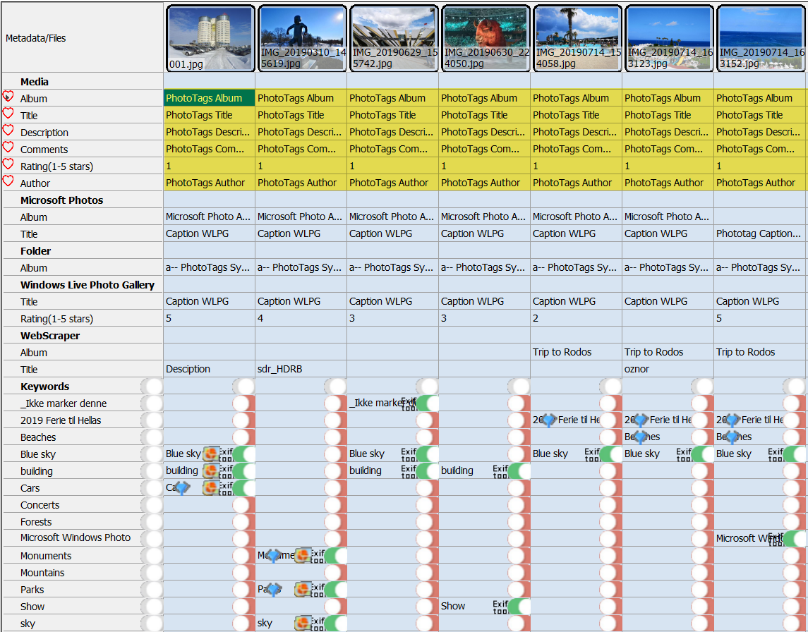
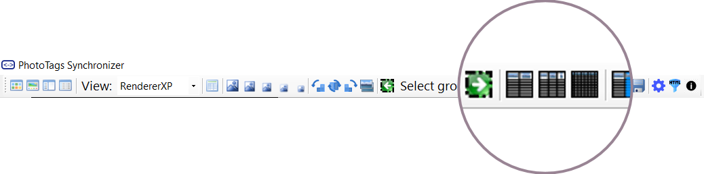



# User interface

## Bulding blocks

ToolStrip

1. Filters | 2. Image List View | 3. Grid view
--|--|--
1. Start here. Select your filer. Folder or database search.    | 2. A view of the result from filter   | 3. After select files in the List View, then they will presented in this Details view  

Statusbar

## 1. Filters

There two ways to find your meida files. Select your folder or search for the media files.

You can even filter the result you get in the filter tab.

Find | Filter
--|--
Find in folder    | After filtering what found in folder  
Find with search    | After filter search result   

## 2. Image List View

The image list view will present a set of thumbnails for selected folder or result of your search, and if filters are added thumbnails presented will be updated according to the added filter.

### Thumbnail sizes

You can adjust the thumbnail size so it fits your needs. There are 5 different size to choose from.

Example of diffrent thumbnail sizes.

Extra small | Small | Medium | Large | Extra Large
--|--|--|--|--
 |  |  |  | 

### Image List View layout

## 3. Grid View (For all Grid Views thruout the application)

When select what media files you want to work with, it will presented in this view. In some tabs you can edit and view information, in other tabs you can only view information.

List of tabs to select from:
- [Tag](..\keywords)
- [People](..\people)
- [Map](..\map)
- [Date](..\date)
- [ExifTool](..\exiftool)
- [Warnings](..\warnings)
- [Properties](..\properties)
- [Rename](..\renametool)
- [Convert & Merge](..\convert-and-merge)

### Fast copy and paste between media files
You are able to copy blocks and paste them for many blocks, as long as number of row or columns are equal.

Select what to copy | Select where to paste | Result
--|--|--
 |  | 

### Show and hide historical and errors columns
Every time meta information is read the ole information will be keep in the database and new infomration will be created in the database.

If for some reason meta information was not written correctly, the data will be store in the database as an historical column and marked as error

History | Errors | History and errors
--|--|--
 |  | 

### Mark favorites and hide rows with Equal values
Hide all rows where values for each columns are equal
- Easy compare meta infromation between media files or find changes in historical meta information.

Menu | Result
--|--
1. Mark as favorite   2. Remove as favorite   3. Toggle favorite   4. Show only favorite rows    | The favorite rows has a heart symbol and are highlighted   
If you want to compare content between columns, you can select "Hide equal rows".  | When you hide equal rows, only rows with diffrent value are shown. 

### Grid size

There is 3 diffrent grid view sizes that can easly switch between. Small for getting an overview or larg to see more details, and medium for a combine overview and details.

Small | Medium | Large
--|--|--
 |  | 


