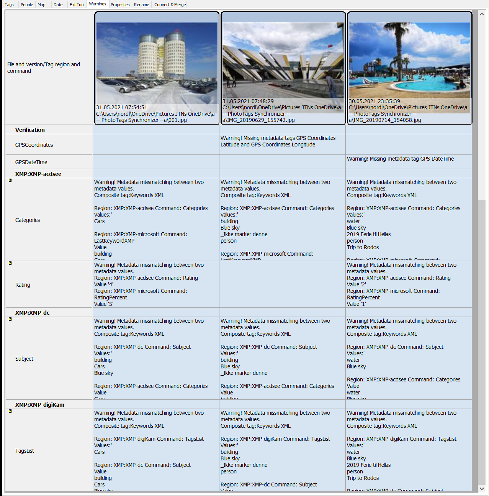



# Warnings

With this tool you can find mismatches between meta information stored by different applications.

This is because not all application updates and synchronize the meta information from todays most common standards:

- International Press Telecommunications Council [IPTC Photo Metadata](https://iptc.org/standards/photo-metadata/)
- The Extensible Metadata Platform [XMP](https://en.wikipedia.org/wiki/Extensible_Metadata_Platform)
- Exchangeable image file format [Exif](https://en.wikipedia.org/wiki/Exif)

If applications only use one or two of the standards, then often other information will be unchanged with old information when you update information.


