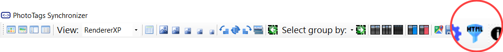
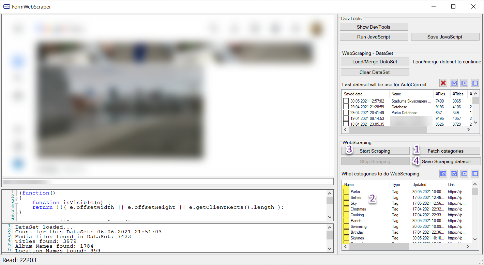
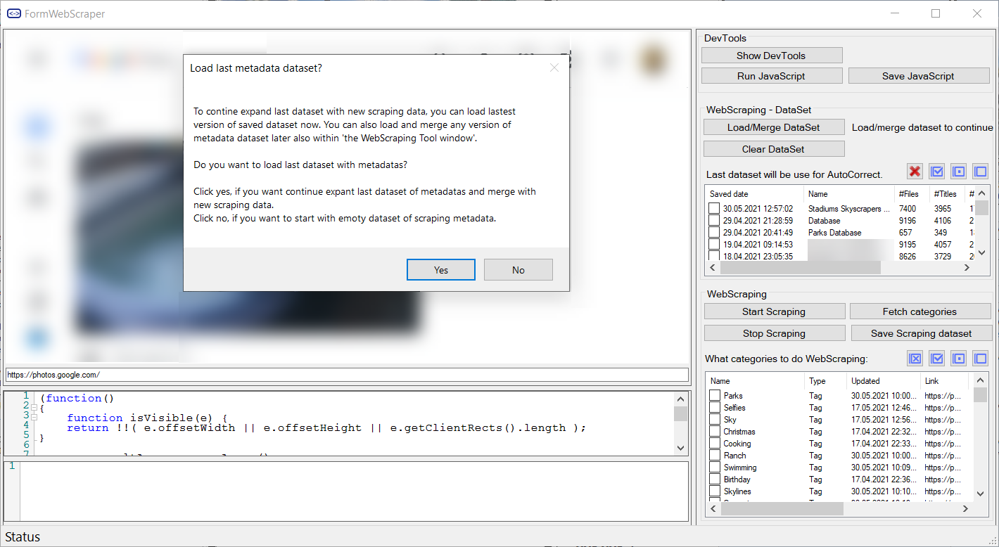
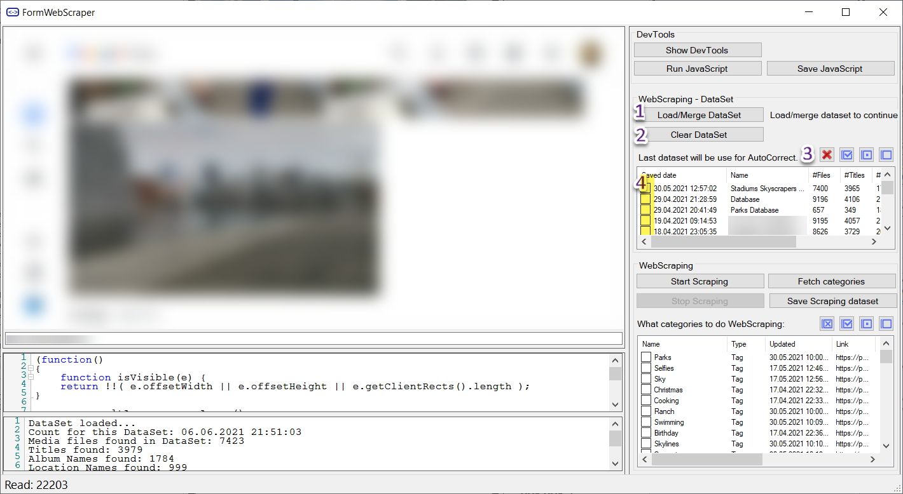
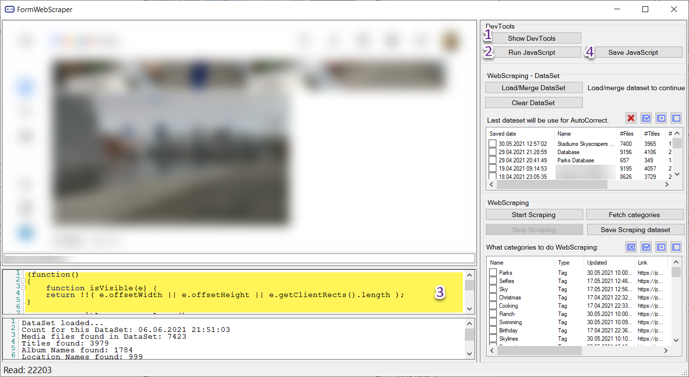



# WebScraping

When storing photos and videos using a cloud provider. All or most of the information is only stored in the cloud and not the media file. With this tool, you can try to fetch the data using web scraping. It's not a perfect solution, however it's better than nothing.

## Start WebScraping

1. Fetch the categories
  - People
  - Keywords
  - Album
  - Title
2. Select what categories you like to start WebScraping for
3. Start WebScraping.
  - If you want to start WebScraping on more categories. Repeat points 2 and 3.
4. Save the result dataset

The result will be presented in Grid View tags as [Keywords](../keywords) and in [People](../people)

If you already have a Dataset in database you will be asked to load it, when open WebScraping tool.

## Dataset

When you save a Dataset, the full result will be saved as a Dataset for current date and time.

If you want, you can save the delta dataset and combine it later. Please not only the last dataset will be used.

1. Load Datasets selected in point 4
2. Clear loaded Dataset and start with empty dataset. In case you want to load it in bulk.
3. Set of buttons for perform different action on Datasets.
  - Delete selected Datasets
  - Select all Datasets
  - Toggle select
  - Remove selection
4. List of Datasets for use and Select

## WebScraping DevTool - For advanced users that knows JavaScript

With this DevTool you can adjust the WebScraping tool to manage Scraping any cloud provider.

1. Show Source on the Cloud Provider Web page
2. Run the script from point 3
3. JavaScript that will be injected into the Web page you gonna do WebScraping on.
4. When you are happy with your JavaScript, Save your JavaScript for use

## Warning

Please note. According to GDPR, data stored about you is your property. However, please check your country laws and cloud provider before starting WebScraping to make sure you are allowed.

PhotoTags Synchronizer is not responsible for how you used it. Use the application according to the law. It's your responsibility.


