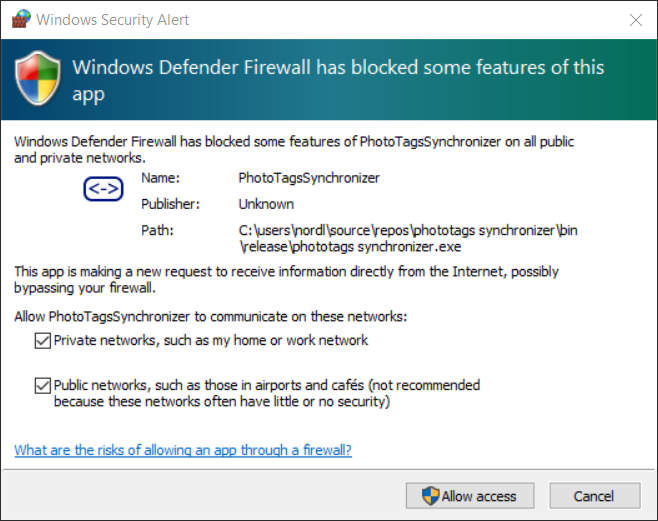



# Windows Security Alert

Because the application use Internet access to
- Show Maps from OpenStreetMap
- Lockup locations Name, City, Region/State and Country
- Build in webservers for Chromecast


